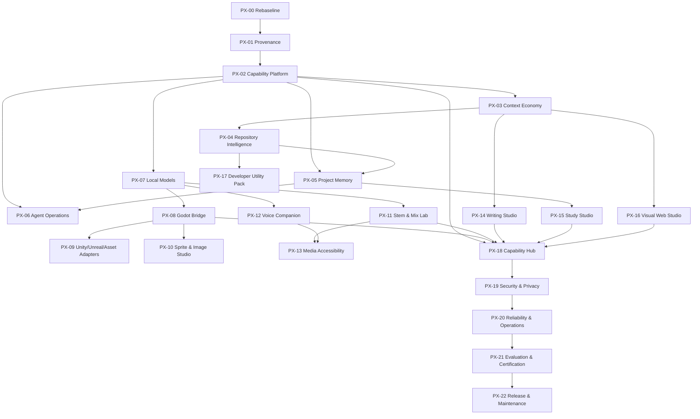

# AI Chatbot Hub — Profile-Wide Capability Expansion Implementation Plan

**Repository:** `DocDamage/chatbot`
**Repository URL:** `https://github.com/DocDamage/chatbot`
**Authoritative branch:** `main`
**Observed `main` head when this plan was prepared:** `266068db0c1ce4c8723e3e6fe1f851f07c37fe0f`
**Plan prepared:** 2026-08-24
**Program name:** Profile-Wide Capability Expansion (`PX`)
**Target:** Implement every worthwhile profile-derived capability through governed native modules, clean-room implementations, or isolated adapters without turning AI Chatbot Hub into an unsafe monolith.
**Primary execution model:** one milestone branch and draft PR per phase; one new Codex thread per task; mandatory evidence and handoff updates after every task.

> **Planning status only.** This document does not certify that any capability is implemented, verified, production-ready, or legally cleared.

---

## 1. Purpose

This plan turns the profile-wide repository review into an executable engineering program. It adds the high-value capabilities that were not fully represented in the original production-completion plan or the first Capability Fusion roadmap, while preserving the existing product’s security, evidence, accessibility, deployment, and promotion requirements.

The program covers:

1. context economy and reversible compression;
2. repository intelligence and code-health expansion;
3. governed capability packs and plugin lifecycle;
4. branch-aware, provenance-preserving project memory;
5. multi-agent operations, communication, and workspace coordination;
6. local-model and resource adapters;
7. real Godot editor/runtime control and later Unity/Unreal adapters;
8. sprite, image, and game-asset processing;
9. local stem separation and mix analysis;
10. a local desktop voice companion;
11. subtitle OCR, dubbing, narration, and media accessibility;
12. a lossless writing and review studio;
13. a source-grounded study studio;
14. a visual website and click-to-code studio;
15. developer utilities such as mock APIs and source-preserving skill export;
16. one unified Capability Hub, setup experience, job console, and release-certification system.

The goal is **capability fusion**, not application accumulation. External repositories are research and implementation inputs. They are not a queue of applications to merge wholesale.

---

## 2. Authority and Relationship to Existing Plans

This plan is subordinate to the project’s existing production-completion governance. The authority order is:

1. accepted security, privacy, data, and architecture decisions;
2. `docs/implementation/MASTER_PRODUCTION_COMPLETION_TRACKER.md`;
3. `docs/implementation/PRODUCTION_FEATURE_MANIFEST.md`;
4. `docs/implementation/FINAL_COMPLETION_IMPLEMENTATION_PLAN.md`;
5. `docs/implementation/CAPABILITY_FUSION_ROADMAP.md`;
6. this profile-wide expansion plan;
7. task issues, handoffs, and implementation notes.

When two sources conflict, the more restrictive security, evidence, licensing, accessibility, or production-support requirement wins.

The uploaded **AI Chatbot Hub — 100% Production Completion Implementation Plan** remains the governing definition of production completion. Its original baseline is historical; implementation must begin by re-baselining against the current `main` head and current evidence.

### 2.1 Existing Capability Fusion mapping

This expansion does not replace `CF-00` through `CF-10`. It extends them:

| Existing workstream | Expanded by this plan |
|---|---|
| `CF-00` approved repository boundary | `PX-00`, `PX-01`, `PX-02` |
| `CF-01` architecture graph | `PX-04` |
| `CF-02` lexical/hybrid retrieval | `PX-03`, `PX-04`, `PX-05` |
| `CF-03` risk, SARIF, SBOM | `PX-04`, `PX-19`, `PX-21` |
| `CF-04` local model/resource adapters | `PX-07` |
| `CF-05` typed agent teams/worktrees | `PX-06` |
| `CF-06` transparent browser jobs | `PX-16`, `PX-19` |
| `CF-07` media localization | `PX-11`, `PX-12`, `PX-13` |
| `CF-08` game-development package | `PX-08`, `PX-09`, `PX-10` |
| `CF-09` Capability Hub | `PX-18` |
| `CF-10` evaluation/promotion | `PX-19`, `PX-20`, `PX-21`, `PX-22` |

### 2.2 Scope rule

No new capability automatically becomes a blocker for the first production release merely because it appears in this plan. Each capability starts as `DISABLED` or `LOCAL_ONLY_EXPERIMENTAL` and is promoted independently. The core release may proceed when the authoritative production tracker permits it, while this program continues through later release trains.

---

## 3. Program Outcomes

At full completion, AI Chatbot Hub will provide:

- a server-authoritative registry of installable and built-in capability packs;
- a common job, artifact, approval, resource-budget, health, and audit runtime;
- token-efficient, reversible context handling for tools, code, logs, documents, and conversations;
- repository architecture, symbol, dependency, history, risk, and test-impact intelligence;
- project memory tied to repositories, branches, worktrees, commits, files, symbols, evidence, and freshness;
- visible multi-agent task operations with isolated worktrees and scoped communication;
- controlled adapters for local model servers and hardware-aware routing;
- real, undoable Godot editor/runtime operations and gameplay verification;
- optional isolated Unity, Unreal, and asset-cooking adapters after legal and technical gates;
- local music, voice, writing, study, web, image, and media-production studios;
- understandable setup, permission, data-egress, cost, health, job, and support surfaces;
- a release-certification system that proves every promoted capability on an exact commit.

---

## 4. Non-Negotiable Design Principles

### 4.1 No monolithic merge

Do not merge entire external applications, duplicate their databases, import their full UI shells, or copy broad agent frameworks. Extract contracts, algorithms, adapters, fixtures, or narrowly bounded modules only when provenance and licensing permit it.

### 4.2 Three integration modes

Every source must be assigned exactly one implementation mode:

1. **Native adaptation** — project-owned TypeScript/Rust/Python code derived from permissively licensed source after file-level provenance review.
2. **External-service adapter** — the user installs and operates the external system; the chatbot speaks a stable HTTP, OpenAI-compatible, MCP, WebSocket, stdio, or CLI protocol.
3. **Clean-room implementation** — functionality is implemented independently from published specifications, public algorithms, behavior observations, and project-owned tests; source code is not copied.

A fourth status, **reference only**, is allowed for rejected or legally unresolved sources but is not an implementation mode.

### 4.3 Server-authoritative availability

The client never decides that a capability exists merely because a panel is bundled. The authenticated server returns capabilities allowed by:

- deployment profile;
- role;
- feature maturity;
- permissions;
- source and license status;
- dependency health;
- policy;
- user configuration;
- organization configuration;
- resource availability.

### 4.4 Disabled by default

New capabilities begin disabled. Local execution, editor control, browser mutation, screen capture, microphone use, voice synthesis, media upload, workspace mutation, and external data egress require explicit setup and approval.

### 4.5 Exact-scope approval

Approval is bound to a digest of exact inputs and actions. Changing a file, command, URL, model, voice, target project, engine action, media source, destination, or proposed patch invalidates prior approval.

### 4.6 Reversible and inspectable operations

Prefer preview, diff, undo, rollback, source anchors, immutable artifacts, and human review. Destructive or irreversible behavior must be isolated and explicitly confirmed.

### 4.7 Local and hosted profiles remain distinct

`HOSTED` may expose safe server-side capabilities. It must reject desktop control, arbitrary local filesystem access, local shell/process management, editor control, microphone/screen capture, and loopback-only integrations.

`LOCAL_TRUSTED` may expose those capabilities only behind root confinement, role controls, explicit approvals, audit, cancellation, and resource limits.

### 4.8 Evidence before promotion

Implementation is not promotion. A capability cannot move to preview or supported status without complete tests, runtime evidence, documentation, recovery behavior, accessibility, security review, and exact source/license records.

---

## 5. Source Basis, Confidence, and License Boundary

Repository features below were identified primarily from repository documentation and selected source inspection. Every implementation task must re-check the exact revision, root license, file headers, notices, dependencies, models, assets, and datasets. README claims are not treated as proof of security, correctness, performance, or production readiness.

### 5.1 Existing Capability Fusion sources

The original Capability Fusion program already covers `RepoRelay`, `RepoDNA`, `SearchEngineSuite`, `GitGalaxy`, `Guaardvark`, `Warpdrv`, `dev-house`, `Pydoll`, `video-dubbing-translator`, and `Lattice`. This plan keeps their existing boundaries and adds the sources below.

### 5.2 New primary sources

| Source | Capability contribution | Observed boundary | Planned use |
|---|---|---|---|
| Headroom | content-aware compression, reversible retrieval, cache alignment, failure learning | Apache-2.0 was observed; re-check exact revision and model terms | Native concepts/modules after provenance review; optional external adapter for ML compressor |
| Graft | semantic architecture cards, crux excerpts, typed links, source-hash staleness | MIT was observed | Native architecture-card provider; never replace deterministic source graph with model summaries |
| Basemind | code/git/document intelligence, memory, agent communication, workspace claims, context deltas | MIT was observed | Adapt narrow contracts; do not import unrestricted shell authority |
| RepoCortex | capability packs, governance, golden tasks, evidence, healing, certification | MIT was observed | Native pack/governance concepts and selected tooling after file-level review |
| Knowledge Work Plugins | skills/commands/connectors/agents package shape | Apache-2.0 was observed | Clean project-owned `CapabilityPack` schema; adapt file-based packaging concepts |
| ContextLattice | durable memory orchestration, staged retrieval, continuation, local-first profiles | Apache-2.0 was observed | External adapter first; selected contracts may be adapted after provenance review |
| Remembrandt | human-readable project memory, decisions/gotchas/changelog categories | MIT was observed | Native transparent memory export and simple portable format |
| MemPalace | verbatim source retention and structured memory navigation | MIT was observed | Experimental retrieval benchmark/reference only until security and dependency issues are independently reviewed |
| Omni-Memory | Git/branch/symbol-aware memory, staleness, team shards | Proprietary source | Clean-room concepts or official service/package adapter only; no source copying |
| Agent Quest | session discovery and live agent activity UI | MIT was observed | Adapt event ingestion and operator UX concepts; not the fantasy UI shell by default |
| Godot MCP X | token-efficient Godot editor/runtime tools and gameplay assertions | MIT was observed | External MCP/CLI adapter first; selectively adapt protocol contracts after review |
| Forge CLI | Godot manifest, safe transactions, path policy, reconciliation | MIT was observed | Native transaction/reconciliation concepts; no duplicate AI shell |
| MAST | Unity modular placement, occupancy, material painting, prefab assembly | MIT was described; sample assets have separate terms | Later Unity adapter and workflow reference after exact asset/code review |
| UE5 MCP Bridge | extensive Unreal editor, PIE, Blueprint, material, source-control, and test control | No root license was confirmed in review | Blocked pending license resolution; protocol observation only |
| StemDeck | local six-stem separation, mixer, BPM/key/LUFS analysis | Apache-2.0 was observed | Isolated local media worker and UI concepts; model/dependency terms reviewed separately |
| Monoleaf | lossless Markdown WYSIWYG, comments, tracked changes, portable export | MIT was observed | Native writing-document format and editor concepts |
| Lexicon | local proofreading, suggestion review, local model transforms | MIT was observed | Local proofreading/AI adapter and review UX concepts |
| SpeakoFlow | local dictation, assistant panel, screen-aware voice workflow | MIT was described | Separate desktop companion using shared chatbot APIs; exact source review required |
| Jarvis | clipboard actions, telemetry, reminders, briefings | License file exists but exact terms require task review | Concepts only; broad OS autonomy is excluded |

### 5.3 New secondary and specialist sources

| Source | Capability contribution | Boundary | Planned use |
|---|---|---|---|
| PageLM | notes, flashcards, quizzes, podcasts, exams, debate | community/noncommercial terms | Clean-room Study Studio only; no source copying into commercial/MIT product |
| Airship | live visual editor, device frames, source-linked agent edits | exact license must be reviewed | External tool adapter or clean-room concepts; no unsandboxed default execution |
| OpenForge | browser-local block editor and HTML export | MIT was observed | Native block/project schema and editor concepts |
| SubtitleYC | burned-in subtitle OCR, crop, cue review, SRT/ASS export | MIT was observed | Local media worker stages and subtitle editor concepts |
| pdf2audio | chaptered narration, read-along, document chat, transforms | PolyForm Noncommercial | External personal-use adapter or clean-room implementation only |
| PixelRefiner | pixel-art cleanup, grid detection, palette/dither/outline, batching | MIT was observed | Native worker algorithms after file-level review |
| AssetCooker | incremental game-asset builds and dependency tracking | MPL-2.0 | Separately installed Windows adapter; MPL files remain isolated and compliant |
| TwentyFiveSlicer | advanced sprite slicing and desktop/Unity handoff | exact repository/package boundary must be reviewed | Adapter/reference after license and commercial-product separation review |
| CodeMunch Pro | byte-offset symbol retrieval, incremental index, call graph, diff symbols | MIT was observed | Native index concepts or external MCP adapter |
| DevLens Agent | complexity, duplication, churn, hotspots, health scoring | MIT was observed | Native repository-risk provider after language-expansion work |
| Picchio | disk-streamed local MoE inference with OpenAI-compatible endpoint | exact license and model terms require review | Separately operated local provider adapter only |
| Capsule | JSON/CSV mock API, deterministic seeding, latency/error simulation | MIT was observed | Expand existing Mock API capability natively or through an external adapter |
| Book-to-Skill | document-to-skill layout and extraction workflow | MIT was observed | Existing source-preserving workflow audit and capability-pack integration |

### 5.4 Explicit exclusions

The following are outside the approved program:

- CAPTCHA bypass, stealth, fingerprint spoofing, bot-detection evasion, or proxy rotation for evasion;
- credential theft, access-control bypass, paywall bypass, cracks, unlockers, or unauthorized downloading;
- global unsandboxed keyboard/mouse automation or autonomous OS control;
- watermark removal from content the user does not own or have permission to modify;
- voice cloning or impersonation without documented consent;
- silent external upload of files, audio, screens, conversations, or code;
- production copying of noncommercial, proprietary, AGPL, unlicensed, or unresolved source into the project’s MIT tree;
- automatic downloading or executing of external binaries, models, plugins, or assets in the first supported release;
- arbitrary shell, Git mutation, browser mutation, editor mutation, or filesystem write authority in hosted mode.

---

## 6. Target Architecture

### 6.1 Layered model

```text
Authenticated client
    |
    v
Capability Hub / Studio surfaces
    |
    v
Route policy + role/profile checks
    |
    v
Capability Registry ---- Capability Pack Registry
    |                           |
    +------------+--------------+
                 v
        Capability Job Runtime
        - queue / stage / progress
        - cancellation / pause / resume
        - approval digests
        - resource budgets
        - artifacts / provenance
        - audit / telemetry
                 |
       +---------+----------+------------------+
       |                    |                  |
 Native providers     External adapters   Clean-room modules
       |                    |                  |
       +--------------------+------------------+
                            |
             Context Economy + Memory Layer
                            |
             Database / artifact store / logs
```

### 6.2 Recommended source layout

```text
src/
  core/
    capabilities/
      registry/
      packs/
      jobs/
      permissions/
      approvals/
      artifacts/
      health/
      resources/
    context-economy/
      router/
      compressors/
      reversible-store/
      budgets/
      checkpoints/
    repository-intelligence/
      indexes/
      architecture/
      git/
      risk/
      impact/
    project-memory/
      capture/
      retrieval/
      freshness/
      reconciliation/
      export/
    agent-operations/
      sessions/
      events/
      threads/
      claims/
      evidence/
  integrations/
    local-models/
    godot/
    unity/
    unreal/
    asset-cooker/
    stemdeck/
    voice-desktop/
    subtitle-ocr/
    media-localization/
    proofreading/
    web-studio/
  studios/
    game/
    sprite/
    music/
    writing/
    study/
    web/
  policies/
  evaluations/
client/src/
  features/
    capability-hub/
    context-inspector/
    memory-center/
    agent-operations/
    game-studio/
    sprite-studio/
    music-studio/
    writing-studio/
    study-studio/
    web-studio/
  components/
    jobs/
    approvals/
    artifacts/
    health/
    permissions/
workers/
  media/
  audio/
  image/
  documents/
  engine/
```

Existing project conventions take precedence. New directories must not duplicate an existing subsystem merely to match this diagram.

### 6.3 Capability pack contract

```ts
interface CapabilityPackManifest {
  schemaVersion: string;
  id: string;
  displayName: string;
  version: string;
  description: string;
  source: {
    repository?: string;
    revision?: string;
    license: string;
    integration: 'native' | 'external_service' | 'clean_room';
    notices: string[];
  };
  maturity: 'disabled' | 'experimental' | 'preview' | 'supported';
  profiles: Array<'HOSTED' | 'LOCAL_TRUSTED'>;
  capabilities: CapabilityDeclaration[];
  tools: ToolDeclaration[];
  commands: CommandDeclaration[];
  skills: SkillDeclaration[];
  agents: AgentRoleDeclaration[];
  connectors: ConnectorDeclaration[];
  permissions: PermissionDeclaration[];
  requirements: RequirementDeclaration[];
  configurationSchema?: Record<string, unknown>;
  healthChecks: HealthCheckDeclaration[];
  tests: CapabilityTestDeclaration[];
  evaluations: CapabilityEvaluationDeclaration[];
  rollback: RollbackDeclaration;
}
```

### 6.4 Common job contract

```ts
interface CapabilityJob {
  id: string;
  capabilityId: string;
  packId: string;
  ownerId: string;
  projectId?: string;
  state:
    | 'queued'
    | 'preflight'
    | 'awaiting_approval'
    | 'running'
    | 'paused'
    | 'succeeded'
    | 'failed'
    | 'cancelled';
  stage: string;
  progress?: number;
  inputDigest: string;
  approvalDigest?: string;
  resourceBudget: ResourceBudget;
  dataEgress: DataEgressDeclaration;
  artifacts: JobArtifact[];
  createdAt: string;
  startedAt?: string;
  finishedAt?: string;
  error?: SafeJobError;
}
```

### 6.5 Permission taxonomy

At minimum:

- `repository.read`
- `repository.write`
- `git.read`
- `git.worktree.create`
- `git.commit.propose`
- `filesystem.read.approved_root`
- `filesystem.write.approved_root`
- `process.execute.allowlisted`
- `browser.navigate.allowlisted`
- `browser.mutate.approved`
- `engine.read`
- `engine.mutate.approved`
- `microphone.capture`
- `screen.capture`
- `clipboard.read`
- `clipboard.write`
- `media.process.local`
- `network.egress.approved`
- `provider.remote.use`
- `model.local.use`
- `secrets.configure`
- `admin.capability.manage`

Permissions describe authority. They are not UI labels alone; every route and adapter must enforce them server-side.

### 6.6 Artifact and provenance contract

Every generated artifact records:

- owner and project;
- capability and pack version;
- source asset/document/repository digest;
- exact external provider, model, binary, or tool version;
- parameters and seed where relevant;
- job ID and approval digest;
- created timestamp;
- content type and byte size;
- license/rights metadata where applicable;
- parent artifact references;
- retention and deletion state;
- integrity hash;
- sanitized human-readable summary.

### 6.7 Storage model

Recommended durable entities:

- `capability_sources`
- `capability_packs`
- `capability_pack_versions`
- `capability_installations`
- `capability_permissions`
- `capability_health_snapshots`
- `capability_jobs`
- `capability_job_events`
- `capability_approvals`
- `capability_artifacts`
- `context_objects`
- `context_compressions`
- `project_memories`
- `project_memory_links`
- `agent_sessions`
- `agent_events`
- `agent_threads`
- `agent_messages`
- `workspace_claims`
- `engine_connections`
- `engine_actions`
- `media_assets`
- `media_cues`
- `writing_documents`
- `writing_revisions`
- `study_items`
- `study_attempts`
- `web_projects`
- `visual_edit_proposals`

All user-owned entities require `owner_id`; project-scoped entities require `project_id`; hosted storage must enforce tenant isolation. Secrets are never stored in these general tables in plaintext.

---

## 7. Delivery and Branch Model

### 7.1 One phase, one milestone branch and PR

Each phase uses one coherent branch and draft PR:

```text
dev/px-00-program-rebaseline
dev/px-01-source-provenance
dev/px-02-capability-platform
...
```

The PR remains draft during implementation. It becomes ready only after all phase tasks are complete and an independent verification thread has reviewed the exact head.

### 7.2 One task, one new Codex thread

Each task ID below runs in a new thread. A thread may not silently begin another task. Every task updates:

- the master tracker;
- feature manifest where applicable;
- route policy where applicable;
- source/license register where applicable;
- evidence bundle;
- current handoff;
- archived task handoff.

### 7.3 Larger milestone preference

Do not create one PR per tiny subtask. Multiple sequential task threads may commit to the same phase branch. Parallel work must use isolated worktrees and dedicated sub-branches, then be integrated deliberately into the milestone branch.

### 7.4 Evidence path

```text
docs/implementation/evidence/profile-expansion/
  PX-00/
    PX00-T01/
      YYYY-MM-DD_<SHORT-SHA>/
        summary.md
        commands.md
        results.json
        changed-files.txt
        test-output.txt
        runtime-checklist.md
        security-review.md
        provenance.md
        screenshots/
        artifacts/
```

### 7.5 Additional handoff fields

Profile-expansion task handoffs must add:

- exact external source revision;
- license file path and digest;
- integration mode;
- copied/adapted files with provenance or clean-room declaration;
- external models/assets/dependencies and terms;
- new permissions;
- data-egress behavior;
- disable/rollback procedure;
- maturity status after the task.

---

## 8. Program Dependency Graph



Cross-cutting security, accessibility, observability, and tests are implemented during every phase. `PX-19` and `PX-20` are final integrated hardening passes, not permission to defer basic controls.

---

# PHASE PX-00 — Rebaseline, Plan Reconciliation, and Program Authorization

## Objective

Establish an accurate current baseline and insert the profile-wide expansion into the project’s authoritative trackers without retroactively changing prior evidence.

## Dependencies

None. This is the first authorized phase.

## Required maturity state

All new capabilities remain `DISABLED`.

## PX00-T01 — Verify current repository state

### Implementation

- Read the authoritative `main` head and signed merge history.
- Record current CI checks, branch protection, open production blockers, current handoff, active milestone, feature manifest, route policy, and evidence index.
- Confirm which Capability Fusion phases are merged, which are only documented, and which remain unverified.
- Compare the observed state to the historical baseline in the uploaded production plan.
- Generate `docs/implementation/PROFILE_EXPANSION_BASELINE.md` with exact commit SHA and date.

### Acceptance criteria

- The baseline cites exact GitHub commit, CI runs, and repository settings.
- No historical “complete” claim is accepted without current evidence.
- Branch protection status is read from GitHub rather than inferred.
- Every discrepancy is assigned a blocker or reconciliation task.

### Evidence

- GitHub metadata and CI links.
- Generated baseline document.
- Exact read-only commands and connector calls.

## PX00-T02 — Reconcile the four planning layers

Reconcile:

- the uploaded 100% production-completion plan;
- `FINAL_COMPLETION_IMPLEMENTATION_PLAN.md`;
- `CAPABILITY_FUSION_ROADMAP.md`;
- this profile-wide expansion plan.

### Required output

Create `docs/implementation/PLAN_AUTHORITY_AND_SCOPE.md` containing:

- authority order;
- duplicate-task mapping;
- superseded statements;
- retained historical evidence;
- tasks that remain release blockers;
- tasks that are optional expansion work;
- release-train placement;
- exact owner of every unresolved conflict.

### Acceptance criteria

No task is silently duplicated, dropped, pre-verified, or changed from required to optional without a signed decision.

## PX00-T03 — Extend the master tracker

Add every `PX` task to `MASTER_PRODUCTION_COMPLETION_TRACKER.md` with:

- task ID;
- phase;
- status;
- dependency;
- branch;
- PR;
- commit;
- evidence path;
- capability maturity;
- production-release applicability;
- legal/security blocker;
- current owner.

### Acceptance criteria

- Every task in this document appears exactly once.
- Initial status is `NOT_STARTED`, except verified governance facts.
- The tracker can distinguish core release blockers from later capability releases.

## PX00-T04 — Extend feature and route manifests

Add top-level feature families as disabled entries:

- Context Economy;
- Project Memory;
- Agent Operations;
- Local Model Adapters;
- Game Engine Bridge;
- Sprite and Image Studio;
- Stem and Mix Lab;
- Desktop Voice Companion;
- Media Accessibility and Localization;
- Writing Studio;
- Study Studio;
- Visual Web Studio;
- Developer Utility Pack;
- Capability Pack Management.

Do not add public routes yet. Reserve route namespaces and required policy metadata.

## PX00-T05 — Create ADR for profile-wide expansion

Create an ADR documenting:

- why capability fusion is preferred to bulk merging;
- integration modes;
- local/hosted boundary;
- source and model licensing rules;
- capability maturity lifecycle;
- milestone branch/PR strategy;
- evidence and rollback requirements;
- excluded capabilities.

## PX00-T06 — Create GitHub milestones and issues

Create one milestone per phase and one issue per task. Each issue must contain:

- scope;
- dependencies;
- exact permitted integration mode;
- security and privacy impact;
- source revisions to inspect;
- acceptance criteria;
- tests and runtime evidence;
- rollback/disable requirements;
- one-task/one-thread rule.

## PX00-T07 — Create release-train boundaries

Define four release trains:

### Train A — Intelligence Foundation

`PX-00` through `PX-07`.

### Train B — Local Creation and Game/Media Studios

`PX-08` through `PX-13`.

### Train C — Knowledge and Visual Creation

`PX-14` through `PX-18`.

### Train D — Integrated Certification and Release

`PX-19` through `PX-22`.

Each train may ship capabilities at different maturity levels. Nothing becomes supported solely because the train completes.

## Phase PX-00 exit gate

- [ ] Current repository state is re-baselined.
- [ ] Plan authority and duplicate mapping are committed.
- [ ] Every `PX` task is tracked.
- [ ] New features are present only as disabled manifest entries.
- [ ] Expansion ADR is accepted.
- [ ] Milestones/issues exist.
- [ ] The current handoff authorizes only `PX01-T01`.

---

# PHASE PX-01 — Source Provenance, Licensing, and Integration Decisions

## Objective

Create a defensible legal and technical boundary for every external source before code adaptation begins.

## Dependencies

`PX-00` verified.

## Required maturity state

All capabilities remain `DISABLED`.

## PX01-T01 — Build the exact source register

Create `docs/implementation/CAPABILITY_SOURCE_REGISTER.md` with one record per repository:

- canonical upstream owner/repository;
- profile fork/mirror repository;
- reviewed default branch;
- exact commit;
- fork relationship;
- root license path and digest;
- file-level license exceptions;
- NOTICE and attribution files;
- dependency licenses;
- model/checkpoint licenses;
- asset/dataset licenses;
- commercial-use restrictions;
- network/service terms;
- known security advisories;
- proposed integration mode;
- review date and reviewer.

Profile forks must not be mistaken for project-owned original work merely because they appear under `DocDamage`.

## PX01-T02 — Perform file-level provenance review for native candidates

Prioritize:

- RepoCortex;
- CodeMunch Pro;
- DevLens Agent;
- Graft;
- PixelRefiner;
- Forge CLI;
- Monoleaf;
- Lexicon;
- OpenForge;
- Remembrandt;
- selected Headroom modules.

For every file considered for adaptation, record:

- source path;
- source commit;
- license;
- copied, modified, translated, or concept-only status;
- destination path;
- retained copyright/notice requirements;
- test provenance.

No code enters the chatbot before this mapping exists.

## PX01-T03 — Decide integration mode for every source

Create one ADR or source-register decision per source:

- `NATIVE_ADAPTATION`;
- `EXTERNAL_SERVICE_ADAPTER`;
- `CLEAN_ROOM_IMPLEMENTATION`;
- `REFERENCE_ONLY`;
- `REJECTED`.

### Mandatory decisions

- Omni-Memory: proprietary, therefore clean-room concepts or official adapter only.
- PageLM: noncommercial/community terms, therefore clean-room Study Studio only.
- pdf2audio: noncommercial, therefore external personal-use adapter or clean-room implementation.
- AssetCooker: MPL, therefore isolated adapter or MPL-compliant file boundary.
- UE5 MCP Bridge: blocked until exact license is resolved.
- Picchio: adapter only until code and model terms are confirmed.
- Jarvis: concepts only unless exact reusable permissive files are identified.

## PX01-T04 — Separate code, models, assets, and service terms

A permissive repository license does not automatically clear:

- model weights;
- pretrained checkpoints;
- voices;
- icon sets;
- sample game assets;
- datasets;
- fonts;
- FFmpeg builds;
- browser downloads;
- API/service terms.

Create a dependency-level register and block packaging when notices or redistribution rights are incomplete.

## PX01-T05 — Implement notice and attribution generation

Add a reproducible script that generates:

- `THIRD_PARTY_NOTICES.md`;
- capability-specific notice bundles;
- model and asset notices;
- release SBOM references;
- in-app license/notice data.

CI fails when a source registry entry used by production code lacks required notice metadata.

## PX01-T06 — Add source-integrity checks

CI checks must detect:

- source revision drift;
- missing license files;
- changed license digests;
- unregistered vendored files;
- copied code without provenance headers;
- unexpected submodules;
- binary/model additions without manifest records;
- conflicting package licenses.

## PX01-T07 — Create clean-room protocol

Create `docs/implementation/CLEAN_ROOM_IMPLEMENTATION_PROTOCOL.md` defining:

1. source-review and implementation roles;
2. behavioral specification format;
3. public algorithm/reference sources;
4. test-first acceptance criteria;
5. prohibition on copying implementation text/code;
6. clean-room declaration in evidence;
7. independent review before merge.

## PX01-T08 — Resolve or block ambiguous sources

For sources with missing, conflicting, or commercial boundaries:

- contact upstream or inspect package metadata where appropriate;
- record resolution;
- default to blocked;
- do not implement around uncertainty by omitting attribution.

## Phase PX-01 exit gate

- [ ] Every source has an exact revision and integration decision.
- [ ] Native candidates have file-level provenance.
- [ ] Models/assets/services are separately reviewed.
- [ ] Notice generation and source-integrity checks pass.
- [ ] Clean-room protocol is accepted.
- [ ] Ambiguous sources are resolved or explicitly blocked.

---

# PHASE PX-02 — Capability Pack, Registry, Job, Permission, and Artifact Platform

## Objective

Build the shared platform once so every later capability uses the same policy, health, approval, job, artifact, audit, and recovery model.

## Dependencies

`PX-01` verified. Relevant production-plan security and database foundations must be green before promotion beyond local experimental.

## Required maturity state

Platform may be `LOCAL_ONLY_EXPERIMENTAL`; domain capabilities remain disabled.

## PX02-T01 — Version the Capability Pack schema

Implement a JSON Schema and TypeScript types for `CapabilityPackManifest`.

Requirements:

- schema versioning;
- forward-compatible unknown-field policy;
- stable IDs;
- semantic versions;
- source/provenance metadata;
- profiles and maturity;
- permissions;
- tools, commands, skills, agents, and connectors;
- requirements and health checks;
- configuration schema;
- tests and evaluations;
- rollback/disable instructions.

Add golden valid and invalid manifests.

## PX02-T02 — Implement server-authoritative registry

Create `CapabilityRegistry` with:

- built-in and installed pack discovery;
- duplicate-ID/version conflict handling;
- role/profile/policy filtering;
- maturity filtering;
- dependency and health state;
- source/license state;
- deterministic sorting;
- cache invalidation;
- sanitized client descriptors.

The client must never load executable modules from untrusted pack data.

## PX02-T03 — Implement installation lifecycle

Support:

- inspect manifest;
- validate source and notices;
- dry-run installation plan;
- install disabled;
- configure;
- health-test;
- enable;
- disable;
- update;
- roll back;
- remove while retaining required audit records.

The first release supports project-owned packs and explicitly configured local adapters. It does not create an open internet marketplace.

## PX02-T04 — Implement permission engine

Create a default-deny permission service that evaluates:

- user role;
- deployment profile;
- capability maturity;
- requested action;
- project/workspace ownership;
- current approval digest;
- organization policy;
- capability source status;
- dependency health.

Every capability route declares required permissions in the route policy manifest. CI fails when a new route lacks metadata.

## PX02-T05 — Implement common job orchestration

Create a durable `CapabilityJobService` with:

- queue;
- preflight;
- exact stages;
- progress;
- structured events;
- pause when supported;
- cancellation;
- deadline;
- retries only for idempotent stages;
- failure classification;
- restart recovery;
- orphan cleanup;
- concurrency/resource scheduling;
- owner/project isolation.

Long-running work must not be implemented as an untracked HTTP request.

## PX02-T06 — Implement approval digests

Approval records bind:

- job type;
- owner/project;
- exact inputs and hashes;
- target paths/origins/devices;
- provider/model/voice;
- proposed actions;
- resource budget;
- data egress;
- expiration;
- approving identity.

Any change invalidates approval. Replaying an old approval against new inputs must fail.

## PX02-T07 — Implement artifact store and lineage

Support:

- filesystem or object-store backend;
- content-addressed integrity hash;
- metadata database;
- parent/child lineage;
- safe download names;
- content-type enforcement;
- retention and deletion;
- access checks;
- preview generation;
- size caps;
- orphan cleanup;
- sanitized evidence export.

## PX02-T08 — Implement resource budgets

`ResourceBudget` must support:

- wall-clock deadline;
- CPU concurrency;
- RAM estimate and ceiling;
- VRAM estimate and ceiling;
- disk reservation;
- output byte limit;
- network byte limit;
- model token/cost limit;
- process count;
- queue priority;
- cancellation grace period.

Budgets are visible before approval and enforced during execution where measurable.

## PX02-T09 — Implement health and dependency diagnostics

Each capability exposes:

- installed/configured/enabled state;
- version;
- dependency versions;
- connectivity;
- model/binary availability;
- permission problems;
- storage capacity;
- degraded reason;
- last successful canary;
- supported profile/platform.

Health checks must be bounded, non-destructive, and safe to call repeatedly.

## PX02-T10 — Implement configuration and secret boundaries

- Validate configuration through capability-specific schemas.
- Store secrets through the existing encrypted secret system.
- Never expose full secrets to the client or support bundle.
- Separate user-level, project-level, and administrator configuration.
- Record who changed configuration and when.
- Add import/export that excludes secrets by default.

## PX02-T11 — Add database migrations and repository layer

Implement migrations for common entities with:

- SQLite local support;
- PostgreSQL hosted support;
- owner/project constraints;
- indexes for job state, capability, owner, and time;
- transactional state transitions;
- cleanup indexes;
- upgrade and downgrade/forward-fix fixtures.

## PX02-T12 — Create capability SDK and contract tests

Provide project-owned helpers for:

- manifest registration;
- health checks;
- route registration;
- jobs;
- progress/events;
- artifacts;
- approvals;
- audit;
- cancellation;
- resource budgets;
- test fixtures.

Every capability pack must pass the same contract suite.

## PX02-T13 — Add minimal operator API

Recommended route family:

```text
GET    /api/capabilities
GET    /api/capabilities/:id
POST   /api/capabilities/:id/preflight
POST   /api/capabilities/:id/test
POST   /api/capabilities/:id/enable
POST   /api/capabilities/:id/disable
GET    /api/capability-jobs
GET    /api/capability-jobs/:id
POST   /api/capability-jobs/:id/approve
POST   /api/capability-jobs/:id/cancel
GET    /api/capability-artifacts/:id
```

Routes must use route-policy metadata, body limits, rate classes, audit events, and ownership checks.

## Phase PX-02 exit gate

- [ ] Pack schema and registry are deterministic and validated.
- [ ] Default-deny permissions work in hosted and local profiles.
- [ ] Jobs survive restart and cancel correctly.
- [ ] Approval replay/change attacks fail.
- [ ] Artifacts are isolated and integrity-checked.
- [ ] Resource limits and health diagnostics pass.
- [ ] SQLite/PostgreSQL migrations pass.
- [ ] Minimal operator API passes contract, security, and ownership tests.

---

# PHASE PX-03 — Context Economy and Reversible Compression

## Objective

Replace one-size-fits-all summarization and truncation with an explainable context-selection and reversible-compression system for code, logs, JSON, RAG results, tool output, files, and conversation history.

## Dependencies

`PX-02` verified. Existing retrieval and provider contracts available.

## Required maturity state

`LOCAL_ONLY_EXPERIMENTAL` until benchmark and leakage gates pass.

## PX03-T01 — Baseline the current context pipeline

Measure current behavior for:

- context construction;
- retrieved chunk formatting;
- current LLM compression;
- truncation;
- citation-anchor retention;
- prompt size;
- provider cache hit behavior where observable;
- latency and answer quality.

Create fixed benchmark corpora and store baseline results. Do not claim savings without reproducible measurements.

## PX03-T02 — Implement content classification and routing

Create `ContextContentRouter` that classifies:

- source code;
- diffs;
- stack traces/logs;
- JSON/API results;
- tabular data;
- prose/document chunks;
- conversation history;
- repository outlines;
- tool schemas;
- images/media metadata.

The router selects a compressor based on content, query, risk, required fidelity, and budget. Classification errors must fall back to a lossless or minimally lossy path.

## PX03-T03 — Implement deterministic compressors

Initial providers:

- JSON key/shape-aware compressor;
- code outline and symbol-body compressor;
- unified-diff compressor;
- stack-trace deduplicator;
- repeated-log/event compressor;
- table/sample/summary compressor;
- repository tree compressor;
- conversation turn selector;
- exact-path/symbol evidence selector.

Each output retains source references and can be traced to original bytes or records.

## PX03-T04 — Implement reversible context store

For every compressed segment, retain:

- original content or a stable reference to it;
- content hash;
- source access scope;
- compression method and version;
- omitted ranges;
- retrieval key;
- expiration/retention;
- owner/project;
- integrity metadata.

Add an authorized retrieval tool so the model or user can request omitted original content on demand.

## PX03-T05 — Harden model-based compression

Model compression may be used only when:

- deterministic methods cannot fit the budget;
- the request allows lossy synthesis;
- source anchors can be preserved and validated;
- the model/provider is allowed for the data;
- the result is checked for dropped citations, fabricated source IDs, and budget overflow.

Fallback to anchored deterministic selection when validation fails.

## PX03-T06 — Implement deltas, checkpoints, and cache alignment

Add:

- stable system/tool prefix construction;
- conversation checkpoints;
- file/repository delta context after edits;
- “what changed since last turn” context;
- repeated-tool-result deduplication;
- provider-aware cache telemetry where available;
- invalidation when source or policy changes.

Never reuse cached context across users, projects, repositories, or incompatible policy states.

## PX03-T07 — Implement context budget planner

Allocate budget among:

- instructions and safety;
- user request;
- recent conversation;
- project memory;
- repository structure;
- exact code/evidence;
- diagnostics/tests;
- tools;
- response reserve.

The planner records why each item was selected or dropped and supports profile/model-specific context limits.

## PX03-T08 — Build Context Inspector UI

Provide a developer-facing inspector showing:

- original versus compressed size;
- selected sources;
- omitted sources;
- compressor and reason;
- source anchors;
- retrieval action;
- budget allocation;
- provider/model;
- cache/delta state;
- warnings about lossy compression.

Ordinary users see a simplified provenance summary, not internal prompts or secrets.

## PX03-T09 — Add security and isolation tests

Test:

- cross-user and cross-project leakage;
- secret-bearing tool output;
- malicious compression instructions inside content;
- fabricated anchors;
- corrupted reversible-store entries;
- expired references;
- deleted source files;
- cancellation;
- oversized inputs;
- unbounded token-position indexes.

## PX03-T10 — Build quality and efficiency evaluation

Measure:

- token/character reduction;
- task correctness;
- citation correctness;
- required fact retention;
- latency;
- provider cost;
- retrieval round trips;
- cache reuse;
- false omission rate.

Required corpora include code search, debugging, repository exploration, RAG QA, JSON/tool output, and long conversations. Compare against uncompressed and current baseline arms.

## PX03-T11 — Add controlled failure learning

Mine failed or manually corrected runs into **proposals**, not automatic instructions. A human must approve changes to project rules, `AGENTS.md`, skills, memory, or compression heuristics. Record the failure evidence and scope the correction.

## Phase PX-03 exit gate

- [ ] Deterministic compressors retain source anchors.
- [ ] Original content is retrievable under the same access scope.
- [ ] Cross-user/project leakage tests pass.
- [ ] Model compression fails safely.
- [ ] Budget decisions are explainable.
- [ ] Benchmarks show meaningful efficiency without unacceptable correctness loss.
- [ ] Failure learning cannot silently rewrite governing instructions.

---

# PHASE PX-04 — Repository Intelligence, Architecture Cards, Git History, and Code Health

## Objective

Extend the current architecture, retrieval, and risk work with surgical symbol access, semantic architecture cards, change history, hotspot intelligence, diff impact, and accessible human inspection.

## Dependencies

`PX-03` verified; relevant `CF-01`, `CF-02`, and `CF-03` state reconciled.

## Required maturity state

`LOCAL_ONLY_EXPERIMENTAL` until path, determinism, ranking, and large-repository gates pass.

## PX04-T01 — Reconcile existing repository-intelligence providers

Inventory the current:

- approved repository gateway;
- symbol index;
- architecture snapshot;
- lexical index;
- vector retrieval;
- relationship graph;
- risk/finding providers;
- SARIF/SBOM support;
- caches and schemas.

Remove duplicate providers or create explicit provider interfaces. Preserve existing verified behavior.

## PX04-T02 — Add byte-offset symbol retrieval

Implement or adapt:

- exact symbol index with byte offset and length;
- O(1)-style source seek where supported;
- file digest/version validation before read;
- batch symbol retrieval;
- overload and ambiguity handling;
- safe Unicode and line-ending behavior;
- renamed/deleted symbol invalidation.

The service must refuse stale offsets rather than returning incorrect code.

## PX04-T03 — Add semantic architecture cards

Generate project-owned cards containing:

- plain-language subsystem purpose;
- exact source files and hashes;
- key symbols and signatures;
- crux excerpts copied with source anchors;
- typed links to other cards;
- entrypoints;
- tests;
- data stores and routes;
- configuration;
- risks and gotchas;
- generated section boundary;
- human notes preserved across regeneration.

Deterministic structure is primary. Model-generated summaries are optional, labeled, and regenerated only when source hashes change.

## PX04-T04 — Add Git intelligence

Support:

- current status;
- recent changes;
- churn by file/symbol;
- authorship and blame;
- symbol history;
- commits touching a path/symbol;
- structural diff across commits;
- full-text commit search;
- branch/worktree identity.

Do not expose private author details beyond repository permissions and configured policy.

## PX04-T05 — Add code-health providers

Implement provider-neutral findings for:

- cyclomatic/cognitive complexity;
- oversized functions/files;
- duplication and near-duplication;
- high-churn/high-complexity hotspots;
- dependency cycles;
- orphan/dead candidates;
- missing or weak test relationships;
- ownership concentration;
- route-policy and dangerous-capability risk.

Findings must distinguish metrics, heuristic signals, suspected defects, confirmed defects, and accepted risks.

## PX04-T06 — Add diff-symbol and blast-radius analysis

Given a worktree diff or proposed patch, calculate:

- changed symbols;
- callers and callees;
- reverse dependencies;
- API/route impact;
- database/migration impact;
- tests that cover affected symbols;
- missing test targets;
- public contract changes;
- likely documentation impact.

This output informs coding plans and review but does not automatically approve a patch.

## PX04-T07 — Add remote repository ingestion safely

Remote indexing must:

- download archives without executing repository code;
- use size/file limits;
- reject dangerous archive paths and symlinks;
- support authenticated private repositories through protected credentials;
- record repository revision and digest;
- store in an approved isolated root;
- honor deletion and retention;
- never run install/build hooks during indexing.

## PX04-T08 — Expand multi-language support

Golden fixtures and parsers must cover the user’s priority languages:

- C;
- C++;
- C#;
- Objective-C where feasible;
- Go;
- Rust;
- Python;
- JavaScript/TypeScript;
- Svelte;
- Lua;
- CSS;
- Tailwind conventions;
- Java;
- GDScript;
- shader languages;
- mixed monorepos.

Parser health, confidence, and fallback behavior must be visible. Regex fallback cannot be represented as exact AST resolution.

## PX04-T09 — Build accessible repository map and findings UI

Provide synchronized:

- searchable table;
- outline/tree;
- 2D graph;
- detail panel;
- evidence/source view;
- history and hotspot overlays;
- test-impact view;
- export to JSON, Mermaid, DOT, or GraphML where supported.

The graph cannot be the only access path. Keyboard and screen-reader users must be able to inspect all findings in the table/tree.

## PX04-T10 — Add repository-intelligence evaluations

Evaluate:

- symbol extraction precision/recall;
- stale-offset rejection;
- architecture graph determinism;
- call/reference accuracy;
- test-impact recall;
- hybrid retrieval ranking;
- hotspot stability;
- false-positive suppression;
- large-repository runtime and memory;
- path/user isolation.

## PX04-T11 — Integrate with coding workflow

Coding agents must use repository intelligence in this order:

1. identify repository/worktree/revision;
2. inspect architecture and relevant cards;
3. retrieve exact symbols and local context;
4. inspect callers/tests/history;
5. produce plan;
6. propose patch;
7. run approved verification;
8. report evidence and remaining uncertainty.

Agents must not dump entire repositories into context as the default strategy.

## Phase PX-04 exit gate

- [ ] Exact symbol reads reject stale indexes.
- [ ] Architecture cards link to current evidence.
- [ ] Git and hotspot results are bounded and permission-checked.
- [ ] Impact analysis meets golden thresholds.
- [ ] Priority language fixtures pass with visible parser health.
- [ ] Accessible repository UI passes automated and manual checks.
- [ ] Large-repository stress tests stay within documented budgets.

---

# PHASE PX-05 — Branch-Aware, Provenance-Preserving Project Memory

## Objective

Create durable project memory that remembers decisions, gotchas, changes, flows, preferences, and evidence without treating stale or aspirational text as truth.

## Dependencies

`PX-03` and `PX-04` verified. Database ownership and retention foundations available.

## Required maturity state

`LOCAL_ONLY_EXPERIMENTAL`; hosted preview requires tenant-isolation, retention, export, and deletion evidence.

## PX05-T01 — Define the project memory schema

A memory record must include:

- stable ID;
- owner and project;
- repository identity;
- branch and worktree;
- originating commit;
- kind: decision, gotcha, convention, flow, milestone, failure, fix, context, preference, changelog, note;
- content;
- source evidence;
- related files and symbols;
- confidence;
- capture method;
- approval state;
- freshness state;
- superseded-by link;
- retention class;
- created/updated timestamps;
- author/agent identity;
- access scope.

Memory is not a substitute for source code, tests, ADRs, or authoritative documentation.

## PX05-T02 — Implement capture proposals

Capture candidates from:

- explicit user “remember” actions;
- completed task handoffs;
- accepted ADRs;
- merged pull requests;
- reviewed session summaries;
- repeated failures and their verified fixes;
- code/document co-change analysis;
- approved agent-team results.

Automatic capture produces a proposal. High-authority memory such as architecture rules requires human approval or ingestion from an authoritative committed document.

## PX05-T03 — Anchor memory to Git and symbols

Use repository intelligence to bind memories to:

- exact commit;
- branch/worktree lineage;
- file digest;
- symbol stable ID and location;
- calling/referencing neighborhood;
- test and route relationships.

When a symbol moves, attempt deterministic re-anchoring and record confidence. Do not silently attach memory to a similarly named unrelated symbol.

## PX05-T04 — Implement hybrid memory retrieval

Fuse:

- exact ID/tag/category;
- BM25/FTS;
- vector similarity where allowed;
- repository and branch scope;
- code-graph proximity;
- freshness;
- source authority;
- prior citation usefulness;
- chain completeness.

Return source/evidence, scope, confidence, and freshness with every memory. The model must be able to state “not in memory.”

## PX05-T05 — Implement freshness, staleness, and supersession

Memory state:

- `current`;
- `possibly_stale`;
- `stale`;
- `superseded`;
- `quarantined`;
- `deleted`.

Mark stale when anchored symbols/files or governing documents materially change. Symbol-neighborhood changes may lower confidence but cannot automatically delete memory. Supersession creates an explicit chain.

## PX05-T06 — Implement contradiction and conflict review

Detect potential conflicts among current memories, ADRs, source facts, and newer decisions. Present them for review with evidence. Do not auto-resolve semantic conflicts through a model alone.

## PX05-T07 — Implement branch merge and abandonment lifecycle

- Memories created on unmerged branches stay branch-scoped.
- Merged branch memories become candidates for base-branch promotion.
- Rejected/closed branches are quarantined after policy-defined review.
- Rebase/cherry-pick preserves provenance without duplicating identical content.
- Worktree deletion releases claims but retains auditable memory lineage.

## PX05-T08 — Add protected memory and human controls

Support:

- lock/pin;
- edit with revision history;
- forget/delete;
- quarantine/restore;
- supersede;
- approve/reject proposal;
- scope to project or global user preference;
- export/import;
- audit usage/citations.

Locked memory is not immune to evidence conflicts; it remains visible as protected but can be flagged.

## PX05-T09 — Add transparent portable export

Generate a human-readable project memory bundle, including a concise `MEMORY.md` or equivalent index plus structured JSON. The export must:

- identify generated versus human-authored content;
- preserve stable IDs;
- avoid secrets and private data unless explicitly included;
- include repository/branch/commit context;
- be idempotently importable;
- support gitignored solo mode and reviewed team-sharing mode.

## PX05-T10 — Build Memory Center UI

Sections:

- current decisions;
- gotchas;
- recent changes;
- proposals;
- stale/conflicted;
- protected;
- branch/worktree timeline;
- citations/usage;
- export/import;
- retention/deletion.

The UI must explain why each memory was retrieved and what evidence supports it.

## PX05-T11 — Implement privacy, isolation, and retention

- Enforce owner/project/tenant filters in every query.
- Prevent shared repositories from automatically sharing personal memories.
- Redact secrets and credential-like text at capture and export.
- Define conversation retention separately from extracted project memory.
- Implement account/project deletion across lexical/vector indexes.
- Audit reads of protected or shared memory.

## PX05-T12 — Evaluate memory quality

Create datasets for:

- decision recall;
- branch-specific recall;
- stale memory rejection;
- supersession;
- symbol-change detection;
- cross-project isolation;
- causal-chain completeness;
- noise filtering;
- unanswerable queries;
- conflicting memories;
- export/import identity.

Compare raw verbatim, extracted, and hybrid strategies honestly. Do not adopt headline benchmarks that cannot be reproduced on project-owned fixtures.

## Phase PX-05 exit gate

- [ ] Memory records are branch/commit/symbol aware.
- [ ] Automatic capture remains proposal-based.
- [ ] Stale and superseded memories are surfaced, not silently used as truth.
- [ ] Cross-user/project leakage tests pass.
- [ ] Portable export/import is deterministic and redaction-safe.
- [ ] Memory retrieval meets golden thresholds.
- [ ] Deletion removes data from all indexes and artifacts.

---

# PHASE PX-06 — Agent Operations, Communication, and Workspace Coordination

## Objective

Add a practical operator layer for multi-agent work: active sessions, tasks, events, messages, approvals, budgets, worktree claims, failures, artifacts, and stop controls.

## Dependencies

`PX-02`, `PX-04`, and `PX-05` verified; existing `CF-05` work reconciled.

## Required maturity state

`LOCAL_ONLY_EXPERIMENTAL`; no hosted shell/session discovery.

## PX06-T01 — Define normalized agent/session/event contracts

`AgentSession` records:

- provider/client: Codex, Claude Code, OpenCode, internal agent, other approved client;
- agent ID and role;
- repository/worktree/branch;
- task envelope;
- owner;
- start/last activity/end;
- state;
- permissions;
- token/cost/resource budget;
- approval state;
- current stage;
- current tool category;
- artifact/evidence links.

`AgentEvent` records a bounded, redacted event type rather than arbitrary raw logs.

## PX06-T02 — Implement session discovery adapters

Adapters may observe approved local session stores or explicit event hooks. Requirements:

- opt-in configuration;
- approved roots;
- bounded tailing and file counts;
- no credential/session-token extraction;
- versioned parser;
- unsupported-version state;
- read-only operation;
- stop watching cleanly;
- no global home-directory crawl without explicit roots.

## PX06-T03 — Implement scoped agent communication

Provide:

- register/list;
- thread start/list;
- join/leave;
- membership management;
- post/history;
- direct message;
- inbox;
- acknowledge;
- wait with timeout;
- archive.

Threads must be scoped by at least two of: repository/project, path glob, subject, members, or task ID. Global broadcast is administrator-only and disabled by default.

## PX06-T04 — Implement workspace and worktree claims

Agents can claim:

- repository;
- worktree;
- branch;
- path scope;
- task ID.

Claims are advisory plus enforcement where the coordinator owns execution. Detect collisions, expiry, abandoned sessions, and stale claims. Never grant a claim that overrides filesystem permissions or Git protections.

## PX06-T05 — Integrate with isolated worktree coordinator

For mutation workers:

- one worktree/branch per worker;
- immutable task scope;
- allowed commands and paths;
- disk/token/time limits;
- no shared uncommitted workspace;
- deterministic handoff bundle;
- review before integration;
- conflict detection;
- cleanup and retention policy.

## PX06-T06 — Build Agent Operations Console

Show:

- active/historical sessions;
- repository/branch/worktree;
- task and stage;
- current tool category;
- elapsed time;
- tokens/cost/resource use;
- approvals waiting;
- warnings/failures;
- artifacts and patches;
- messages/inbox;
- workspace claims;
- partial results;
- pause/cancel/stop-all/archive controls.

The UI should be dense but operational, not decorative. A themed visualization may be optional, never the sole operator view.

## PX06-T07 — Implement budgets and stop controls

- Enforce maximum agents per user/project.
- Enforce token, cost, command, disk, process, and time budgets.
- Provide pause where supported.
- Cancel tasks and terminate child process trees.
- Stop-all requires elevated confirmation and audit.
- Mark partial work and preserved artifacts.
- Prevent a supervisor agent from expanding its own authority.

## PX06-T08 — Implement evidence and review bundles

Every completed agent task produces:

- task envelope;
- source baseline;
- files read and changed;
- patch/diff;
- commands and results;
- tests;
- reviewer findings;
- unresolved conflicts;
- artifacts;
- cost/resource summary;
- final status;
- handoff.

## PX06-T09 — Harden logs and privacy

Redact:

- credentials;
- auth files;
- raw private prompts where not needed;
- environment secrets;
- full home-directory paths for ordinary users;
- clipboard/screen data;
- provider session tokens.

Retention is configurable. Session monitoring cannot become employee surveillance without explicit organizational policy and notice.

## PX06-T10 — Multi-agent adversarial tests

Test:

- two agents claim same worktree;
- conflicting patches;
- cancellation during child processes;
- crashed worker and stale claim;
- malicious message content;
- cross-project thread discovery;
- budget exhaustion;
- supervisor bypass attempt;
- symlink escape from worktree;
- unreviewed merge attempt;
- stop-all race;
- event flood.

## PX06-T11 — Runtime canary

Run a controlled team task with analyst, implementer, test author, reviewer, and integration supervisor. Verify isolation, messaging, evidence, conflict behavior, cancellation, and single-agent fallback.

## Phase PX-06 exit gate

- [ ] Session discovery is opt-in and redacted.
- [ ] Threads and inboxes cannot leak across scopes.
- [ ] Worktree claims and actual isolation agree.
- [ ] Cancellation terminates process trees.
- [ ] Conflicting patches remain unmerged.
- [ ] Operations Console passes accessibility and E2E tests.
- [ ] Controlled multi-agent canary produces complete evidence.

---

# PHASE PX-07 — Local Model, Inference, and Resource Adapter Layer

## Objective

Complete the provider-neutral local-model layer and add bounded adapters for separately operated systems such as Warpdrv, Ollama/LM Studio-compatible endpoints, and Picchio.

## Dependencies

`PX-02` verified; existing `CF-04` state reconciled; outbound-request and secret policies available.

## Required maturity state

`LOCAL_ONLY_EXPERIMENTAL` until real-hardware canaries pass.

## PX07-T01 — Complete the OpenAI-compatible local endpoint contract

Contract covers:

- model list;
- chat completion;
- streaming;
- embeddings;
- tool support;
- vision support;
- context limit;
- reasoning metadata where available;
- cancellation;
- structured errors;
- health/version;
- concurrency/queue state.

The adapter must not assume all OpenAI-compatible servers implement identical behavior.

## PX07-T02 — Enforce endpoint policy

- Loopback by default.
- Explicit private-host allowlist for trusted LAN endpoints.
- Hosted mode rejects local endpoints.
- Revalidate DNS/IP and redirects.
- Never send provider credentials to an arbitrary configured URL without explicit host binding.
- Bound response size, connect time, total time, and streaming idle time.

## PX07-T03 — Implement capability probing

Probe safely for:

- exact model IDs;
- max context;
- structured output;
- tools;
- embeddings;
- vision;
- streaming;
- token accounting;
- concurrency;
- server/version compatibility.

Cache probe results with expiry and provide manual refresh.

## PX07-T04 — Add Picchio external adapter

Only after exact license/model review:

- user installs and starts Picchio separately;
- chatbot connects to its OpenAI-compatible endpoint;
- show serialized single-request limitations where applicable;
- expose disk/RAM model requirements;
- detect endpoint health and model version;
- never download or convert models automatically in the first release;
- preserve model-license notice and configuration instructions.

No Picchio source is copied into the chatbot unless a later permissive provenance review explicitly permits it.

## PX07-T05 — Implement resource-aware routing

Route based on:

- privacy requirement;
- model capability;
- context length;
- quality tier;
- latency target;
- CPU/RAM/VRAM availability;
- queue depth;
- user cost ceiling;
- local/remote preference;
- failure state.

The selected provider/model and fallback reason are always visible in diagnostics and response metadata.

## PX07-T06 — Implement local resource monitor

Collect bounded, privacy-safe local metrics:

- CPU load;
- RAM available;
- supported GPU and VRAM where discoverable;
- disk capacity for configured model/cache paths;
- endpoint queue/concurrency;
- model load state.

Do not require administrator privileges or install kernel drivers. Metrics are advisory unless enforced by the external server.

## PX07-T07 — Implement overload, queue, and cancellation behavior

- Reject or queue when concurrency is exhausted.
- Bound queue length and wait time.
- Propagate cancellation.
- Detect dropped streams and release slots.
- Avoid retrying generation after partial output unless explicitly requested.
- Surface overloaded versus offline versus incompatible states.

## PX07-T08 — Integrate local embeddings and optional local TTS/STT contracts

Define provider contracts used by later memory, voice, study, and media phases. Keep these interfaces separate from chat completion so deployments can mix providers safely.

## PX07-T09 — Real-hardware canary matrix

At minimum:

- Windows NVIDIA GPU baseline;
- Windows CPU fallback;
- Ollama or another documented local endpoint;
- one OpenAI-compatible external adapter;
- cancellation;
- overload;
- incompatible model capability;
- server restart;
- hosted-mode denial.

Record hardware, driver, model, quantization, memory use, latency, and limitations. Do not generalize beyond tested configurations.

## PX07-T10 — Setup and diagnostic documentation

Provide:

- supported servers;
- manual install links/instructions;
- safe endpoint configuration;
- model selection guidance;
- hardware requirements;
- health test;
- common errors;
- privacy implications;
- disable/remove procedure.

## Phase PX-07 exit gate

- [ ] Adapter contract passes for each supported server.
- [ ] Endpoint SSRF/host policy passes.
- [ ] Model capability probing is accurate and bounded.
- [ ] Routing and fallback reasons are visible.
- [ ] Cancellation and overload tests pass.
- [ ] Real-hardware canaries are recorded.
- [ ] Hosted mode rejects local controls.

---

# PHASE PX-08 — Godot Editor/Runtime Bridge and Game Studio

## Objective

Replace advisory-only Godot guidance with a safe, inspectable, undoable bridge capable of reading, editing, running, capturing, asserting, profiling, and exporting Godot projects.

## Dependencies

`PX-02`, `PX-04`, and `PX-07` verified; local-command and approved-root controls verified; `CF-08` reconciled.

## Required maturity state

`LOCAL_ONLY_EXPERIMENTAL`. Mutations require exact approval and editor undo/transaction support.

## PX08-T01 — Define `GameEngineBridge` contract

Common operations:

- discover installations/projects;
- connect/disconnect;
- health/version;
- list capabilities/tool groups;
- inspect project/scene/assets/scripts;
- propose mutation;
- apply approved mutation;
- undo/redo;
- run/stop;
- capture screenshot/log/profile;
- execute test scenario;
- collect artifacts;
- export/build metadata.

Engine-specific features remain in adapters rather than bloating the common contract.

## PX08-T02 — Implement Godot MCP X external adapter

- Connect to an explicitly configured local MCP/CLI endpoint.
- Verify plugin/server version compatibility.
- Support reduced tool modes (`minimal`, `2d`, `3d`, `ui`, `test`) to avoid unnecessary context and authority.
- Discover editor and runtime connection separately.
- Translate errors into project-owned safe error codes.
- Do not install the addon or modify MCP client configuration silently.

## PX08-T03 — Implement read-only project inspection

Expose bounded operations for:

- project info/settings;
- filesystem tree;
- scene tree;
- scripts and outlines;
- node properties changed from defaults;
- resources;
- input map;
- animations;
- physics/navigation layers;
- dependencies;
- editor errors/output;
- ClassDB description.

Read paths remain inside the approved Godot project root.

## PX08-T04 — Add Forge-style manifest and reconciliation

Create a project manifest keyed by file hash and parser version for:

- `.gd`;
- `.tscn`;
- `.tres`;
- project settings;
- shaders;
- import-relevant assets.

Detect external edits and reconcile before applying AI-generated changes. Refuse to overwrite unexpected changes without review.

## PX08-T05 — Implement mutation proposal and transaction layer

Mutations must produce a preview containing:

- target project/scene/node/file;
- before/after values or diff;
- required tool calls;
- expected side effects;
- save/import/run requirements;
- risk and rollback;
- approval digest.

Use editor undo for node/property operations and atomic file transactions/backups for source files. A partial multi-file failure must roll back or leave a clearly recoverable transaction state.

## PX08-T06 — Implement scene, node, resource, and script changes

After approval, support prioritized operations:

- create/open/save scene;
- add/delete/rename/move/duplicate/instance node;
- set node properties and signals;
- create/edit/attach/validate scripts;
- create/edit resources;
- input actions;
- UI anchors/themes;
- animation tracks/keyframes;
- collision setup;
- basic 2D/3D builders.

Start with the smallest production-worthy subset; later tool groups remain disabled until individually tested.

## PX08-T07 — Add runtime play, capture, and assertions

Support:

- play current/project scene;
- stop;
- runtime scene tree;
- runtime properties;
- input simulation;
- screenshot to artifact store;
- log/error capture;
- property/node/screen-text assertions;
- wait/monitor;
- frame recording;
- scenario reports.

The runtime bridge must be test-only by default and cannot connect to arbitrary games without explicit project configuration.

## PX08-T08 — Add profiling and performance evidence

Collect:

- frame/performance monitors;
- scene complexity;
- node counts;
- draw/physics indicators exposed by the adapter;
- screenshot and log evidence;
- regression comparison against stored baselines.

Do not claim full engine profiling when only a subset of monitors is available.

## PX08-T09 — Add asset import and export workflows

- Detect newly added assets.
- Use the engine’s supported headless import path.
- Verify import sidecars/metadata before runtime use.
- Inspect export presets.
- Build/export only through separately approved commands and configured templates.
- Keep output in an approved artifacts directory.
- Record engine version and template revision.

## PX08-T10 — Build Game Studio UI

Sections:

- project connection/health;
- scene/project explorer;
- current task and proposal;
- diff/property preview;
- approval/apply/undo/redo;
- run controls;
- screenshot/log/test evidence;
- profiling;
- asset/import/export status;
- tool-mode and permission display.

Controller support may be added for navigation, but dangerous confirmations must remain unambiguous.

## PX08-T11 — Ground code generation in live engine API

Prefer live ClassDB introspection and project version over model memory. Generated GDScript must be validated against the connected Godot version before writing. Suggestions and fallbacks must be labeled when exact API evidence is unavailable.

## PX08-T12 — Security and adversarial tests

Test:

- project-root escape;
- node-path ambiguity and typo suggestions;
- stale scene state;
- approval replay;
- editor disconnect mid-transaction;
- runtime disconnect;
- simultaneous editor instances;
- large scene/tree pagination;
- output flood;
- child-process cancellation;
- unapproved export;
- hosted-mode denial.

## PX08-T13 — Real Godot validation canary

On the documented Godot version and supported Windows environment:

1. connect;
2. inspect a fixture project;
3. make an undoable scene change;
4. write and validate a script transaction;
5. import a fixture asset;
6. run the scene;
7. simulate input;
8. capture screenshot/logs;
9. run assertions;
10. undo/rollback;
11. verify clean project state.

## Phase PX-08 exit gate

- [ ] Read-only inspection works with bounded payloads.
- [ ] Mutations are previewed, digest-approved, and undoable/recoverable.
- [ ] Runtime capture and assertions produce artifacts.
- [ ] Live engine API validation reduces version hallucination.
- [ ] Disconnect and stale-state failures recover safely.
- [ ] Hosted mode denies engine control.
- [ ] Real Godot canary passes on documented hardware/version.

---

# PHASE PX-09 — Unity, Unreal, Sprite-Slicing, and Asset-Build Adapters

## Objective

Add later engine and asset-pipeline adapters through the same `GameEngineBridge` and job runtime without weakening legal, platform, or mutation controls.

## Dependencies

`PX-08` verified; source/license decisions from `PX-01` complete.

## Required maturity state

Adapters remain `DISABLED` until their individual legal and runtime gates pass.

## PX09-T01 — Define adapter certification profile

Each engine adapter must declare:

- supported engine versions;
- supported OS;
- transport;
- required plugin/package;
- read-only versus mutation capabilities;
- undo/rollback behavior;
- project-root model;
- external binary/process behavior;
- packaging/licensing;
- test fixture;
- canary hardware;
- known unsupported features.

## PX09-T02 — Add Unity/MAST external adapter or clean native workflow

After exact license review, prioritize:

- project/package health;
- modular prefab palette inspection;
- grid and occupancy analysis;
- placement proposal;
- material-paint proposal;
- randomization preview;
- prefab assembly/bake planning;
- evidence capture.

Mutating operations require Unity editor undo and exact approval. Sample assets are never redistributed without their own clearance.

## PX09-T03 — Add AssetCooker external adapter

Because AssetCooker is MPL and Windows-specific:

- user installs/runs it separately;
- adapter reads an approved config/rules root;
- inspect repos, rules, dirty inputs, dependencies, outputs, and logs;
- trigger a bounded no-UI cook only after approval;
- confine outputs;
- capture command/result artifacts;
- expose Windows-only status;
- retain MPL notices;
- never copy MPL files into unrelated MIT modules without compliance.

## PX09-T04 — Add advanced sprite-slicing bridge

After resolving TwentyFiveSlicer’s exact open/commercial boundary:

- read/write versioned slice JSON;
- preserve legacy format compatibility;
- support variable-grid or fixed 25-slice profiles only where target runtime accepts them;
- validate guides against opaque content;
- preview target sizes;
- review AI proposals deterministically;
- warn about unsupported per-cell overrides;
- export engine handoff envelopes.

## PX09-T05 — Resolve UE5 MCP Bridge licensing

This is a hard gate. Required outcomes:

1. permissive license and notices are confirmed, allowing an adapter; or
2. upstream grants explicit permission; or
3. only protocol-level clean-room behavior is implemented; or
4. the adapter remains blocked.

No code adaptation proceeds while the root license is unresolved.

## PX09-T06 — Implement Unreal read-only adapter first

If legally cleared, begin with:

- editor health/version;
- asset listing/metadata/references;
- level/actor/component inspection;
- Blueprint and material reads;
- PIE status and screenshots;
- test listing/results;
- source-control status;
- logs and configuration reads.

Read-only payloads require pagination, game-thread-safe execution, and structured errors.

## PX09-T07 — Add approved Unreal mutation jobs

Only after read-only certification:

- asset/content-browser writes;
- actor/component changes;
- Blueprint/material edits;
- sequencer/UMG operations;
- source-control checkout/submit proposals;
- automation tests;
- live coding.

Each category is a separately enableable capability. Asynchronous editor jobs must not block the game thread while polling themselves.

## PX09-T08 — Unify engine adapter UI

The Game Studio shows common connection, proposal, approval, job, artifact, test, and rollback concepts while exposing engine-specific details only when relevant.

## PX09-T09 — Cross-engine project isolation tests

Prove that:

- a Godot adapter cannot touch Unity/Unreal roots;
- engine connections cannot cross users/projects;
- one adapter’s plugin messages cannot be interpreted by another;
- output/artifacts stay scoped;
- hosted mode denies all desktop editor adapters;
- engine-specific secrets/configuration remain isolated.

## PX09-T10 — Per-adapter runtime certification

Each adapter needs its own:

- clean machine setup;
- supported engine build;
- fixture project;
- read canary;
- mutation/undo canary if supported;
- run/test capture;
- disconnect/restart recovery;
- packaging/notice evidence;
- human review.

## Phase PX-09 exit gate

- [ ] Every enabled adapter has a resolved license and certification profile.
- [ ] Unity/AssetCooker/slicing boundaries are isolated and documented.
- [ ] Unreal remains blocked unless license and runtime gates pass.
- [ ] Cross-engine isolation tests pass.
- [ ] Each promoted adapter has real-engine evidence and a disable procedure.

---

# PHASE PX-10 — Sprite and Image Asset Studio

## Objective

Upgrade Sprite Lab into a reliable local asset-processing studio for pixel-art cleanup, palette work, background handling, outlines, slicing, batch operations, and game-engine-ready exports.

## Dependencies

`PX-02` verified; `PX-08` recommended for engine handoff; PixelRefiner/other source provenance cleared.

## Required maturity state

`LOCAL_ONLY_EXPERIMENTAL` until deterministic quality gates and file-safety tests pass.

## PX10-T01 — Define versioned image-processing pipeline

Represent every operation as a versioned stage:

- decode and validate;
- classify image type;
- grid detection or preservation;
- resampling;
- anti-alias cleanup;
- background handling;
- color reduction/palette mapping;
- dithering;
- outline;
- trim/crop/resize;
- scale/export;
- manifest generation.

Stages must be previewable, deterministic where possible, and serializable as reusable presets.

## PX10-T02 — Harden image ingest

Validate:

- content signature;
- supported codec;
- decoded pixel dimensions;
- frame count for animated files;
- color mode;
- alpha behavior;
- decompression-bomb limit;
- memory estimate;
- filename/path safety;
- workspace and disk capacity.

Reject corrupt or oversized images before expensive processing.

## PX10-T03 — Implement grid detection and pixel refinement

Support:

- auto grid estimation;
- candidate grid sizes with confidence;
- hint and force modes;
- safe no-grid preservation;
- nearest-neighbor logical-pixel resampling;
- anti-alias artifact cleanup;
- alternative suggestions when confidence is low.

Never apply extreme downsampling solely because one heuristic returns a weak candidate.

## PX10-T04 — Implement background and transparency tools

Support:

- border-based background estimation;
- corner/manual color selection;
- eyedropper;
- tolerance;
- logical-pixel noise cleanup;
- interior-hole preservation/fill options;
- transparent-margin trim.

General background removal must be framed as editing content the user owns or may modify. Watermark removal is excluded.

## PX10-T05 — Implement palette, quantization, and dithering

- Built-in legally clear retro palettes.
- Custom palette import/export.
- Oklab or equivalent perceptual color distance.
- configurable color count;
- palette locking;
- Floyd-Steinberg and ordered/Bayer dithering;
- alpha-aware processing;
- palette usage report.

Record algorithm version and parameters in export manifests.

## PX10-T06 — Implement outlines and sprite finishing

Support:

- four-way and eight-way outlines;
- custom outline color;
- content-aware trim;
- exact target dimensions;
- integer scale export;
- padding/alignment;
- optional sprite-sheet packing through existing Sprite Lab contracts;
- collision-mask preview where later supported.

## PX10-T07 — Implement batch and preset system

- Multi-file sessions.
- Apply one preset to all or selected assets.
- Per-image override.
- non-blocking worker execution;
- queue, progress, cancellation;
- partial failure report;
- ZIP export;
- consistent naming;
- preset import/export and schema migrations.

## PX10-T08 — Add quality-regression fixtures

For each fixture, store:

- source image;
- intended route;
- target/reference output where licensing permits;
- perceptual and pixel metrics;
- palette and alpha expectations;
- previous-release output;
- human review notes.

A changed algorithm must publish a before/after quality report, not only pass unit tests.

## PX10-T09 — Add engine handoffs

Export:

- image files;
- scale/pixel-size metadata;
- palette;
- frame/slice manifests;
- Godot import hints;
- Unity sprite/slice metadata where supported;
- source and output digests;
- third-party notices.

The studio may send artifacts to an approved engine project only through a separate exact-scope approval.

## PX10-T10 — Build accessible Sprite Studio UI

Provide:

- original/result compare slider;
- zoom with nearest-neighbor rendering;
- candidate grid selection;
- purpose presets and advanced controls;
- batch list and status;
- accessible numeric inputs;
- keyboard operation;
- text summaries of selected route/confidence/output;
- downloadable manifest and quality report.

## PX10-T11 — Security and performance tests

Test:

- decompression bombs;
- huge dimensions;
- corrupt alpha/palette data;
- animated frame floods;
- worker crash;
- cancellation;
- ZIP naming/traversal;
- batch disk exhaustion;
- cross-user artifacts;
- deterministic outputs;
- browser and local-worker memory limits.

## Phase PX-10 exit gate

- [ ] Image ingest blocks unsafe inputs.
- [ ] Low-confidence grid detection fails safely.
- [ ] Palette/background/outline outputs are deterministic for fixed inputs.
- [ ] Batch cancellation and partial failures are recoverable.
- [ ] Quality-regression reports meet thresholds.
- [ ] Engine handoffs preserve provenance and require separate approval.
- [ ] Sprite Studio passes accessibility and large-batch tests.

---

# PHASE PX-11 — Local Stem Separation, Mixer, and Audio Analysis Lab

## Objective

Add a local-first music-production capability that separates stems, analyzes tracks, provides a bounded multitrack preview/mixer, and exports individual stems or approved mixes.

## Dependencies

`PX-02` and `PX-07` verified; existing audio browser/analysis reconciled; StemDeck source/dependency/model review complete.

## Required maturity state

`LOCAL_ONLY_EXPERIMENTAL`; source-rights confirmation required for every job.

## PX11-T01 — Define audio job and rights model

Before processing, record:

- source path/artifact;
- owner;
- declared right to process;
- duration, codec, channels, sample rate, size;
- requested stems;
- model and version;
- local/remote processing location;
- resource estimate;
- output retention;
- approved export destinations.

The product must not position itself as an unauthorized downloader or redistribution service.

## PX11-T02 — Implement isolated Demucs-style worker adapter

- Run in a separate Python/environment worker.
- Use versioned JSON messages.
- Probe model/runtime/device before job start.
- support CUDA, supported Apple acceleration where later verified, and CPU fallback;
- bound duration, sample count, disk, RAM/VRAM, and output count;
- capture progress;
- terminate child processes on cancellation;
- clean partial job directories.

Model weights and Python dependencies require their own notices and supply-chain review.

## PX11-T03 — Implement import and normalization

Support verified local formats such as WAV, FLAC, MP3, and other explicitly tested formats. Normalize through approved FFmpeg builds where required while preserving original source and metadata separately.

Reject:

- unsupported DRM/encrypted content;
- corrupt media;
- excessive duration/size;
- unsafe path;
- insufficient disk;
- missing decoder/runtime.

## PX11-T04 — Implement stem selection and separation

Support up to the model’s verified stems, initially:

- vocals;
- drums;
- bass;
- guitar;
- piano;
- other.

Allow selecting a subset and optionally produce a complement/backing track. Record model limitations and do not represent machine-separated stems as studio-isolated originals.

## PX11-T05 — Implement waveform cache and synchronized playback

- Generate bounded min/max waveform summaries, not full raw sample arrays to the browser.
- Align all stems to one timeline.
- Shared normalization.
- play/pause/seek;
- zoom and fit;
- loop selection;
- per-stem mute, solo, monitor, and gain;
- accessible transport and time readouts;
- release audio resources on close.

## PX11-T06 — Implement track analysis

Provide clearly labeled estimates for:

- BPM and confidence;
- key/scale and confidence;
- integrated loudness (LUFS);
- sample peak/dBFS;
- duration/sample rate/channels;
- optional section/onset metadata after separate validation.

Algorithms, reference standard, and confidence are included in artifacts.

## PX11-T07 — Implement export and mixdown

Export:

- individual stems;
- selected mix;
- complement/backing track;
- analysis JSON/CSV;
- waveform summaries;
- job manifest;
- notices.

Use safe filenames, configurable format/bit depth, output-size estimates, and atomic completion. Do not overwrite source files.

## PX11-T08 — Integrate with music and FL Studio workflows

- “Send to FL Studio” remains local-only and dry-run by default.
- Show exact file paths and proposed import/track layout.
- Require a new approval before desktop/DAW mutation.
- Preserve stem timing and naming.
- Provide prompts/analysis to the music agent without automatically uploading audio to remote models.

## PX11-T09 — Implement cancellation, restart, and cleanup

- Cancel active subprocess immediately.
- mark job cancelled;
- remove incomplete outputs;
- preserve reviewed logs and manifest;
- recover or fail clearly after application restart;
- sweep abandoned temp folders safely;
- never delete source media.

## PX11-T10 — Build Music Studio UI

Sections:

- import/preflight;
- rights and processing-location disclosure;
- model/device/resource estimate;
- stem selector;
- job progress/cancel;
- multitrack waveform mixer;
- analysis;
- export;
- FL Studio handoff;
- history/artifacts/storage cleanup.

## PX11-T11 — Audio quality and performance evaluation

Use legally clear fixtures covering:

- vocals-heavy;
- dense mix;
- sparse acoustic;
- low bitrate;
- long track within limit;
- mono/stereo;
- silence/corrupt input.

Record runtime, peak memory/VRAM, output alignment, clipping, loudness, and human artifact review. Do not promise commercial-separator quality without comparative evidence.

## Phase PX-11 exit gate

- [ ] Rights/preflight is required.
- [ ] Worker isolation, cancellation, and cleanup pass.
- [ ] Stem alignment and export integrity pass.
- [ ] Analysis is confidence-labeled.
- [ ] No audio leaves the machine without explicit provider/data-egress approval.
- [ ] UI is keyboard accessible.
- [ ] Real GPU and CPU canaries document performance and limitations.

---

# PHASE PX-12 — Local Desktop Voice Companion

## Objective

Create an independently packaged desktop companion for dictation, voice chat, local transcription/TTS, optional screen context, clipboard actions, reminders, and briefings while keeping desktop authority explicit and minimal.

## Dependencies

`PX-02` and `PX-07` verified; desktop packaging/security policy accepted; microphone/screen/clipboard permissions defined.

## Required maturity state

`LOCAL_ONLY_EXPERIMENTAL`; distributed builds require platform packaging and privacy certification.

## PX12-T01 — Decide desktop architecture

Recommended boundary:

- separate Tauri 2 desktop companion;
- Rust/native permission and hotkey layer;
- web UI shared where practical;
- communicates with local chatbot API through loopback-authenticated session;
- no desktop native dependencies inside the hosted server image;
- explicit version compatibility and update policy.

Create an ADR before implementation.

## PX12-T02 — Implement local STT provider abstraction

Support a verified initial provider such as whisper.cpp, with optional Parakeet later. Contract includes:

- model discovery/download status;
- language;
- streaming and final transcript;
- word timing/confidence when available;
- VAD;
- device/CPU/GPU state;
- cancellation;
- privacy/location of model and recordings.

Model download is an explicit user action with checksum and license notice.

## PX12-T03 — Implement local TTS provider abstraction

Initial options may include:

- operating-system voice;
- local Kokoro-compatible engine;
- configured OpenAI-compatible or commercial provider after explicit data-egress consent.

Expose voice identity, language, model, processing location, and expected latency. Do not offer cloned/reference voices without the media-consent system.

## PX12-T04 — Implement recording and global hotkeys

- push-to-talk;
- tap-to-toggle;
- configurable shortcuts;
- visible/audible recording state;
- microphone permission onboarding;
- input device selection;
- cancellation and discard;
- maximum recording duration;
- no background recording when disabled;
- conflict detection with other hotkeys.

Optional wake phrase is disabled by default and processes locally.

## PX12-T05 — Implement dictation modes

Modes:

- raw transcription;
- punctuation/cleanup;
- translate to configured target language;
- “instruction” mode that asks the chatbot to produce a draft;
- paste into active application after preview or configured direct-dictation consent.

Clipboard/paste operations are explicit, reversible where possible, and never execute arbitrary commands.

## PX12-T06 — Implement floating assistant panel

- text/voice input;
- streaming response;
- optional spoken output;
- provider/model indicator;
- conversation context control;
- collapse/always-on-top behavior;
- accessible keyboard operation;
- clear microphone/screen state;
- stop speaking/cancel request.

## PX12-T07 — Implement screen-context capture

Screen capture is:

- off by default;
- triggered only by a visible user action;
- limited to a selected screen/window/region where the OS allows;
- previewed before remote egress;
- downscaled and bounded;
- stored temporarily or not at all by default;
- redacted/removed on request;
- labeled with provider destination.

No continuous hidden screen streaming.

## PX12-T08 — Implement clipboard actions

When the user explicitly invokes them:

- translate;
- summarize;
- explain;
- rewrite;
- code-fix proposal;
- send to chat.

Show captured text, destination, provider, and output before overwriting the clipboard. Secrets/credential-like content triggers a warning or local-only restriction.

## PX12-T09 — Add reminders, briefings, and hardware status

Safe features:

- local reminders through OS notification APIs;
- startup/optional morning briefing;
- current project/task recap from approved memory;
- user-selected topic summaries through normal web/research policy;
- CPU/RAM/GPU/disk health alerts;
- configurable quiet hours.

No autonomous purchasing, messaging, browser posting, or power actions.

## PX12-T10 — Implement OS action policy

Allowed first-release desktop actions are narrowly defined, such as:

- open the chatbot;
- copy/paste approved text;
- show a notification;
- open a user-approved file/folder/URL;
- start/stop voice capture.

Broader app launch, browser control, messaging, power, or system-setting changes remain disabled until separately threat-modeled and approved.

## PX12-T11 — Privacy, retention, and permissions

- Recordings are not retained by default.
- Transcripts follow conversation retention policy.
- screen thumbnails are temporary by default;
- microphone/screen/clipboard access can be disabled independently;
- no telemetry unless explicitly approved;
- local models and caches are visible and removable;
- support bundle excludes raw recordings/screens/clipboard.

## PX12-T12 — Cross-platform packaging

For each claimed platform:

- build signed/notarized where possible;
- installer/uninstaller;
- permission onboarding;
- update/rollback;
- clean removal without deleting user data unless requested;
- model/cache location;
- crash recovery;
- hotkey behavior;
- accessibility.

Windows is the first required target. macOS/Linux remain unclaimed until real-device validation exists.

## PX12-T13 — Voice quality and latency evaluation

Evaluate:

- accents/noise/distance;
- punctuation;
- command versus dictation mode;
- language detection/translation;
- false wake/activation;
- cancellation;
- long dictation;
- offline operation;
- TTS intelligibility;
- end-to-end latency;
- private-data handling.

## Phase PX-12 exit gate

- [ ] Desktop companion remains separate from hosted deployment.
- [ ] Recording/screen/clipboard states are explicit and independently controllable.
- [ ] Local STT/TTS function without cloud egress.
- [ ] Screen capture requires per-use action and preview.
- [ ] Broad autonomous OS control is absent.
- [ ] Windows installer, update/rollback, privacy, and accessibility tests pass.
- [ ] Voice quality/latency limitations are documented.

---

# PHASE PX-13 — Media Accessibility, Subtitle OCR, Dubbing, Narration, and Read-Along

## Objective

Complete a common media-accessibility pipeline for subtitle extraction/editing, transcription, translation, consent-aware dubbing, narration, and synchronized read-along artifacts.

## Dependencies

`PX-02`, `PX-07`, `PX-11`, and `PX-12` verified as applicable; existing `CF-07` reconciled.

## Required maturity state

`LOCAL_ONLY_EXPERIMENTAL`; remote provider stages require explicit data-egress approval.

## PX13-T01 — Define common media project and job model

A media project stores:

- source asset and rights declaration;
- tracks/streams;
- language;
- duration and technical metadata;
- transcript/cues;
- variants/translations;
- selected voices and consent;
- stage/job history;
- artifact lineage;
- provider/model/tool versions;
- disclosure metadata;
- retention/deletion.

## PX13-T02 — Implement burned-in subtitle OCR workflow

Stages:

1. load authorized local video;
2. probe metadata;
3. frame-accurate preview;
4. select subtitle crop region;
5. configure language and OCR settings;
6. extract candidate frames/cues;
7. run approved OCR worker;
8. merge/deduplicate cues;
9. present confidence and timing;
10. review and export.

The worker runs locally by default and uses bounded frame/image/disk limits.

## PX13-T03 — Build subtitle editor

Support:

- cue list synchronized to video;
- edit text/start/end;
- frame nudge;
- shift all;
- snap to frame grid;
- add/delete cue;
- previous/next cue boundaries;
- undo/redo;
- styling for ASS where supported;
- import SRT/ASS/SSA;
- export SRT/TXT/ASS;
- accessible keyboard shortcuts and transcript table.

## PX13-T04 — Complete transcription and alignment

Support local and explicitly approved remote STT providers. Preserve:

- segment and word timings;
- language;
- confidence;
- source audio mapping;
- manual corrections;
- provider/model/version;
- original versus cleaned transcript.

## PX13-T05 — Implement translation variants

- Create a distinct translation variant rather than overwriting source text.
- Show local/remote provider and data-egress status.
- Preserve cue timing and line-length constraints.
- support glossary/term locks;
- review before synthesis/export;
- record source/target language and model.

## PX13-T06 — Implement consent-aware voice synthesis

Before reference/clone-like voice use, require:

- rights/identity declaration;
- subject consent record;
- permitted purpose;
- retention policy;
- selected provider/model;
- synthetic-media disclosure.

Initial supported release should prefer stock/local voices. Impersonation, public-figure cloning, or absent consent fails closed.

## PX13-T07 — Implement timing fit and reconstruction

- synthesize per cue/segment;
- fit timing without silently removing meaning;
- expose speed/stretch and truncation warnings;
- preserve original audio;
- mix approved dialogue/background tracks;
- produce preview;
- generate subtitles and disclosure metadata;
- optionally isolate lip-sync in a separate disabled-by-default worker.

## PX13-T08 — Implement document narration and chaptered audio

Clean-room or legally isolated workflow:

- text extraction with source/page anchors;
- deterministic chapter detection plus manual correction;
- per-chapter edit/suspend/reorder;
- local TTS;
- chapter-marked audio export;
- notes and generated chapters clearly labeled;
- resume/re-synthesize;
- original document preserved.

## PX13-T09 — Implement synchronized read-along artifacts

Generate:

- sentence/segment timing map;
- web read-along player;
- EPUB 3 media-overlay export where validated;
- embedded or linked audio according to size policy;
- highlighted text;
- accessibility metadata;
- epubcheck or equivalent validation;
- offline playback package.

## PX13-T10 — Add authorized media URL ingest adapter

If implemented, use a separately installed yt-dlp/FFmpeg adapter only for content the user is authorized to download. Requirements:

- HTTP(S) URL without embedded credentials;
- explicit rights confirmation;
- site/tool terms notice;
- size/duration limits;
- no bypass of DRM or access controls;
- cookies require explicit local browser selection and warning;
- no server-hosted public downloader;
- retained source URL and tool version;
- safe cleanup.

## PX13-T11 — Implement accessibility exports

Provide:

- transcript;
- captions;
- audio description track workflow if later implemented;
- chapter navigation;
- searchable text;
- high-contrast/readable player;
- keyboard transport;
- screen-reader cue navigation;
- disclosure of machine-generated content and review status.

## PX13-T12 — Cleanup, restart, and storage management

Temporary files are cleaned after success, failure, cancellation, and restart. Users can inspect and delete:

- source copies;
- extracted frames;
- transcripts;
- translation variants;
- synthesized audio;
- previews;
- final exports;
- model caches where safe.

## PX13-T13 — Media quality, consent, and security evaluation

Test:

- short/long videos;
- moving/background subtitles;
- low contrast;
- multiple languages;
- multi-speaker limitation;
- corrupt media;
- cancellation at every stage;
- external provider denial;
- missing consent;
- unauthorized URL;
- temporary-file cleanup;
- subtitle format validation;
- timing integrity;
- audio clipping/loudness;
- disclosure metadata.

## Phase PX-13 exit gate

- [ ] Subtitle OCR and editor produce valid reviewed exports.
- [ ] Source text/audio is never overwritten.
- [ ] Translation and voice stages preserve provenance and consent.
- [ ] Unauthorized/DRM/access-control media ingest is rejected.
- [ ] Narration/read-along artifacts validate.
- [ ] Cancellation/restart cleanup passes.
- [ ] Accessibility and synthetic-media disclosures are present.

---

# PHASE PX-14 — Lossless Writing, Proofreading, and Review Studio

## Objective

Create a local-first writing environment that preserves portable source text, provides structured proofreading and AI proposals, and treats every AI modification as reviewable document change rather than silent replacement.

## Dependencies

`PX-02`, `PX-03`, and `PX-07` verified; document ingest/export and storage policies available.

## Required maturity state

May begin as `PRODUCTION_PREVIEW` for local Markdown after lossless round-trip and accessibility gates. Cloud transforms remain separately configured.

## PX14-T01 — Define the canonical document model

The first canonical format is Markdown/plain text with optional portable extensions. Requirements:

- raw text remains source of truth;
- no mandatory sidecar for the basic document;
- preserve line endings, BOM, missing final newline, and untouched bytes;
- support metadata through explicit YAML or hidden comments;
- represent comments/tracked changes through documented portable syntax;
- maintain editor state separately when it cannot be encoded portably;
- version the parser/serializer.

## PX14-T02 — Implement byte-exact open/save

Tests must prove:

- open and save without edits is byte-for-byte identical;
- CRLF/LF/CR and BOMs are preserved;
- unknown syntax is not destroyed;
- malformed but readable Markdown is preserved;
- autosave/recovery does not normalize source unexpectedly;
- concurrent external changes trigger reconciliation rather than overwrite.

## PX14-T03 — Build rich live editor

Support a verified subset:

- headings;
- bold/italic/strike;
- inline/fenced code;
- lists/tasks;
- blockquotes/callouts;
- links/images;
- tables;
- horizontal rules;
- footnotes;
- math;
- outline/navigation;
- raw/source view;
- find/replace;
- word count;
- keyboard commands.

Unsupported syntax remains visible and preserved in raw mode.

## PX14-T04 — Implement import/export

Initial import:

- Markdown;
- plain text;
- HTML;
- DOCX after fixture validation;
- PDF as an explicit conversion command, not lossless open.

Export:

- Markdown/plain text;
- self-contained HTML;
- clean PDF;
- DOCX only after fidelity gates.

Every converted import produces a new unsaved document and retains source provenance. Scanned PDFs require the separate OCR capability.

## PX14-T05 — Add local proofreading provider

Integrate LanguageTool or an approved equivalent as a separate local service/worker:

- spelling;
- grammar;
- punctuation;
- style rules;
- language selection;
- personal dictionary;
- ignored/dismissed rule state;
- bounded chunking;
- health/version;
- local-only disclosure.

Proofreading suggestions link to exact source ranges and survive re-check where still valid.

## PX14-T06 — Implement AI change proposals

AI actions:

- rewrite;
- concise;
- expand;
- summarize;
- key points;
- tone changes;
- format as list/table;
- explain/review;
- custom instruction.

Every result is a proposal containing:

- selected source range/version;
- provider/model;
- instruction;
- before/after diff;
- rationale where requested;
- warnings;
- accept/reject/partial accept;
- approval and audit metadata.

If the document changes before acceptance, the proposal must rebase safely or become stale.

## PX14-T07 — Implement comments and tracked changes

- inline/threaded comments;
- author and timestamp;
- reply/resolve/reopen;
- tracked insertion/deletion/substitution;
- accept/reject one/all;
- source-anchored conflict handling;
- portable serialization where possible;
- clean export with review markup removed when requested.

## PX14-T08 — Add local AI and provider choices

- bundled/local model is an optional explicit download;
- Ollama/local endpoint supported through `PX-07`;
- cloud provider requires data-egress notice;
- document sensitivity controls may force local-only;
- long-document transforms use chunked proposals with a final consistency review;
- model identity and processing location remain visible.

## PX14-T09 — Implement autosave, crash recovery, and version history

- local autosave;
- recovery snapshot separate from source;
- atomic writes;
- external-change detection;
- document revision timeline;
- restore/copy revision;
- bounded retention;
- no silent source corruption;
- optional Git integration for project documents through approved workflows.

## PX14-T10 — Build Writing Studio UI

Provide:

- calm document editor;
- outline;
- proofreading panel;
- AI proposal review;
- comments/changes;
- source/raw toggle;
- import/export;
- document properties;
- provider/locality indicator;
- autosave/recovery state;
- accessibility preferences;
- focus mode.

## PX14-T11 — Accessibility and long-document testing

Test:

- keyboard-only editing;
- screen-reader navigation;
- suggestion and comment announcements;
- zoom/reflow;
- high contrast;
- reduced motion;
- tables/math/code;
- 100k+ word documents within documented limits;
- chunked transforms;
- undo/redo;
- external change conflict;
- crash recovery;
- byte-exact round-trip.

## PX14-T12 — Writing-quality evaluation

Use licensed/project-owned fixtures to evaluate:

- grammar suggestion precision;
- source-range accuracy;
- tone transform instruction adherence;
- factual preservation;
- citation/source preservation for source-grounded writing;
- long-document consistency;
- stale proposal detection;
- privacy/data-egress behavior.

## Phase PX-14 exit gate

- [x] Untouched Markdown round-trips byte-for-byte.
- [x] Proofreading and AI suggestions remain proposals with exact ranges/diffs.
- [x] Comments/tracked changes are reviewable and portable where claimed.
- [x] Autosave and recovery do not corrupt source.
- [x] Local/cloud processing location is explicit.
- [x] Accessibility and long-document suites pass.
- [x] Import/export claims match verified fixtures.

---

# PHASE PX-15 — Source-Grounded Study Studio

## Objective

Build a clean-room learning environment that turns user-authorized documents and knowledge sources into notes, flashcards, quizzes, study plans, exams, debates, and audio lessons with source anchors and measurable mastery.

## Dependencies

`PX-02`, `PX-03`, `PX-05`, `PX-13`, and `PX-14` as applicable. PageLM source remains clean-room reference only.

## Required maturity state

`PRODUCTION_PREVIEW` may be considered after source-grounding, privacy, accessibility, and assessment-integrity gates.

## PX15-T01 — Define study collection and source model

A study collection contains:

- owner/project;
- authorized source documents/URLs;
- source digests and versions;
- subject/course;
- target level;
- learning goals;
- schedule;
- generated artifacts;
- mastery state;
- provider/model history;
- retention/export.

Every generated learning item stores source anchors or is labeled as general/generated guidance.

## PX15-T02 — Implement source ingestion and segmentation

Use existing document/RAG foundations to:

- extract and preserve source/page/section anchors;
- detect headings/chapters;
- chunk for retrieval;
- store glossary terms;
- detect changed/deleted sources;
- maintain access filters;
- avoid copyright-infringing bulk redistribution.

User-owned/internal material remains private by default.

## PX15-T03 — Generate structured notes

Supported note types:

- outline;
- Cornell-style;
- key concepts;
- glossary;
- formula/reference sheet;
- timeline;
- comparison table;
- chapter summary.

Notes require source citations and a completeness/coverage report. Unsupported claims are flagged for review.

## PX15-T04 — Generate and manage flashcards

Each card records:

- prompt;
- answer;
- source anchors;
- difficulty;
- tags;
- generated/reviewed status;
- duplicates/overlap score;
- schedule state;
- performance history.

Implement spaced repetition through a documented algorithm, versioned and testable. Users can edit, suspend, merge, or delete cards.

## PX15-T05 — Implement quizzes and explanations

Question types:

- multiple choice;
- multi-select;
- true/false;
- short answer;
- matching where accessible;
- code/problem response for technical material.

Requirements:

- source-grounded answer key;
- distractor quality checks;
- hints;
- explanations;
- partial credit where defined;
- deterministic scoring;
- review and retake;
- question/item versioning.

## PX15-T06 — Implement exam simulation

- configurable duration and sections;
- question blueprint by topic/difficulty;
- no answer exposure during active exam;
- pause policy;
- autosave;
- accessibility accommodations;
- final score and topic breakdown;
- source-backed review;
- clear distinction from official certification exams.

No proctoring or surveillance is introduced.

## PX15-T07 — Implement study plans and mastery model

Create plans from:

- goal/deadline;
- available time;
- source coverage;
- current mastery;
- preferred activity mix;
- accommodations.

Track topic-level mastery using transparent rules. Do not represent heuristic mastery as a validated educational diagnosis.

## PX15-T08 — Add debate and Socratic practice

Provide controlled practice modes:

- explain-back;
- Socratic questioning;
- debate positions;
- oral answer via Voice Companion;
- misconception review;
- evidence challenge.

Responses must cite collection sources when the exercise is source-bound and distinguish outside knowledge.

## PX15-T09 — Add audio lessons and study podcasts

Reuse narration/media capabilities to create:

- chapter audio;
- question-and-answer lesson;
- short recap;
- multi-voice format using stock/consented voices;
- transcript and chapter markers;
- source notes;
- offline artifacts.

## PX15-T10 — Implement educator/reviewer controls

- review generated materials;
- approve/reject/edit;
- lock answer keys;
- export packages;
- assign a collection locally/within an organization after explicit sharing;
- inspect source coverage and generation history;
- remove flawed items;
- audit item changes.

## PX15-T11 — Build Study Studio UI

Sections:

- sources;
- goals/plan;
- notes;
- flashcards;
- quizzes;
- exams;
- mastery dashboard;
- debate/practice;
- audio lessons;
- review queue;
- export/privacy.

The UI must work without audio and provide nonvisual equivalents for every interactive activity.

## PX15-T12 — Evaluation and assessment integrity

Evaluate:

- citation correctness;
- answer-key correctness;
- distractor validity;
- duplicate flashcard rate;
- source coverage;
- unanswerable behavior;
- stale-source handling;
- scoring determinism;
- mastery calculation;
- accessibility;
- cross-user/source isolation;
- export/import fidelity.

High-stakes medical, legal, or professional certification material requires clear limitations and source review.

## Phase PX-15 exit gate

- [x] Generated learning items retain source anchors.
- [x] Answer keys and scoring are deterministic and reviewed.
- [x] Spaced repetition and mastery rules are transparent/versioned.
- [x] Source changes mark dependent items stale.
- [x] No proctoring/surveillance is added.
- [x] Audio has transcript/non-audio equivalents.
- [x] Study Studio passes accuracy, accessibility, and isolation gates.

---

# PHASE PX-16 — Visual Website and Click-to-Code Studio

## Objective

Replace the current minimal website workspace with a safe visual creation surface that supports block-based projects, responsive previews, element inspection, source-linked edit proposals, diffs, and undo.

## Dependencies

`PX-02`, `PX-03`, `PX-04`, and transparent browser-job controls. OpenForge and Airship boundaries resolved.

## Required maturity state

Block-based local projects may begin as `PRODUCTION_PREVIEW`; click-to-code agent edits remain `LOCAL_ONLY_EXPERIMENTAL` until sandbox and source-map gates pass.

## PX16-T01 — Define versioned website project schema

Support:

- project metadata;
- theme/design tokens;
- assets;
- pages/routes;
- reusable blocks/components;
- navigation;
- SEO metadata;
- custom CSS in a confined field;
- responsive settings;
- export configuration;
- schema migrations.

Initial block types should expand beyond hero/text/features/CTA through a controlled registry rather than arbitrary HTML injection.

## PX16-T02 — Build block-based editor

- add/remove/reorder/duplicate blocks;
- edit text, links, lists, images, layout, spacing, typography, color;
- page and project management;
- reusable sections;
- design-token controls;
- validated custom CSS;
- undo/redo history;
- autosave and recovery;
- import/export project JSON.

Sanitize rendered content and isolate previews.

## PX16-T03 — Implement responsive live preview

Provide live frames for:

- desktop;
- tablet;
- mobile;
- custom viewport.

Frames use a real sandboxed browser/iframe, synchronized route, zoom/pan, and reload state. Preview cannot escape its origin or access parent secrets.

## PX16-T04 — Implement asset manager

- local image import;
- metadata and dimensions;
- safe names;
- WebP/optimized variants;
- responsive sizes;
- alt text;
- focal point/crop;
- unused asset detection;
- project export;
- no remote image load by default without user approval.

## PX16-T05 — Implement element selection and inspector

For block-mode projects:

- click/keyboard select;
- DOM/tree view;
- box-model/layout panel;
- matched style summary;
- accessible property controls;
- source block/component ID;
- selected-state synchronization across frames.

## PX16-T06 — Implement source-linked inspection for real applications

When connected to a local development server:

- instrument or infer source location through approved framework/source-map support;
- show exact file/line/component when confidence is high;
- label heuristic matches;
- do not inject permanent production code;
- confine the dev-server target and project root;
- support Vite/React first, then add frameworks individually.

## PX16-T07 — Implement visual edit proposals

A selected element plus instruction produces:

- target source files;
- before/after screenshot context;
- proposed patch;
- responsive impact summary;
- accessibility impact;
- tests to run;
- exact approval digest.

The agent does not edit until approval. Accepted edits use the coding workflow and isolated worktree where configured.

## PX16-T08 — Implement sandbox, diff, and undo

- Codex safe mode or project-owned sandbox for mutation;
- project-root writes only;
- network disabled during code mutation unless explicitly required;
- diff preview;
- file backups/transaction;
- undo to exact pre-edit bytes;
- Git-aware restore where appropriate;
- failed build/test rollback option;
- audit.

Do not present policy checks on unsandboxed agents as a hard OS sandbox.

## PX16-T09 — Implement HTML/project import and export

- import safe standalone HTML as a new project with limitations;
- export clean standalone HTML for simple projects;
- multi-page ZIP export;
- asset rewriting;
- CSP-safe output where possible;
- no editor scripts/chrome;
- validate links and asset references;
- optional deployment handoff through a separate explicit integration.

## PX16-T10 — Build Web Studio UI

Sections:

- project/page navigator;
- block library;
- canvas/frames;
- inspector;
- assets;
- code/source link;
- agent proposal/diff;
- undo/history;
- accessibility audit;
- preview/build diagnostics;
- export.

## PX16-T11 — Browser and security tests

Test:

- malicious imported HTML;
- script/style injection;
- iframe escape;
- remote asset tracking;
- source-map path escape;
- dev-server SSRF;
- unapproved agent mutation;
- unsafe commands;
- undo after multi-file edit;
- responsive sync;
- route navigation;
- browser storage isolation;
- output ZIP traversal.

## PX16-T12 — Visual and accessibility regression

Run screenshot comparisons at supported viewports plus Axe/keyboard/screen-reader checks. AI visual edits must not be accepted solely on screenshot similarity; semantic DOM and accessibility checks remain required.

## Phase PX-16 exit gate

- [ ] Block project schema and editor are versioned/recoverable.
- [ ] Preview is sandboxed and responsive.
- [ ] Source-link confidence is visible.
- [ ] Agent changes remain proposals until exact approval.
- [ ] Safe mode/undo accurately reflect their guarantees.
- [ ] Import/export security tests pass.
- [ ] Visual and accessibility regressions pass at supported viewports.

---

# PHASE PX-17 — Developer Utility Pack: Mock APIs, Skill Export, and Project Tooling

## Objective

Package focused developer utilities as governed capabilities instead of scattering them across unrelated routes and services.

## Dependencies

`PX-02` and `PX-04` verified. Existing Mock API and Book-to-Skill implementations reconciled.

## Required maturity state

May reach `PRODUCTION_PREVIEW` for local/developer roles after route, storage, and isolation gates.

## PX17-T01 — Expand Mock API data model

Add:

- collections;
- inferred schema;
- typed fields;
- deterministic IDs/seeds;
- relationships where explicitly configured;
- storage modes: in-memory and local SQLite/project file;
- project ownership;
- import history;
- reset/export.

Do not position it as a production backend.

## PX17-T02 — Implement generated CRUD routes safely

For each collection:

- GET list/item;
- POST;
- PUT/PATCH;
- DELETE;
- filter;
- sort;
- page/limit;
- schema validation;
- stable error shape;
- request/record limits;
- project-scoped namespace.

Generated routes must not collide with application routes or become publicly exposed without developer configuration.

## PX17-T03 — Add deterministic mock behavior

- fixed/artificial latency;
- deterministic error injection;
- rate-limit simulation;
- seeded fake data;
- reset to snapshot;
- scenario presets;
- request log with redaction.

Every behavior is visible and disabled by default.

## PX17-T04 — Add OpenAPI/schema import later through a gated sub-capability

- parse without executing external code;
- cap schema size/ref depth;
- block remote refs by default;
- preview generated collections/routes;
- exact approval;
- retain source and parser version;
- reject unsupported authentication/security claims rather than faking them silently.

## PX17-T05 — Audit existing source-preserving skill export

Verify the Book-to-Skill-inspired workflow:

- uses project-owned or authorized source documents;
- preserves original sources;
- generates `SKILL.md`, chapters, glossary, and cheatsheet deterministically where claimed;
- records source digests;
- loads chapters on demand;
- does not claim copyrighted-book synthesis as a bundled production feature without rights;
- supports update/fold-in without losing provenance;
- exports as a Capability Pack skill bundle.

## PX17-T06 — Implement skill/command/agent pack scaffolding

Developer utility creates a governed pack skeleton:

- manifest;
- skills;
- commands;
- agent roles;
- connector placeholders;
- configuration schema;
- golden task;
- negative test;
- notices/provenance;
- documentation;
- CI validation.

Scaffolding never automatically enables the pack.

## PX17-T07 — Add project doctor and next-action reports

Use deterministic evidence to report:

- configuration health;
- manifest/route-policy gaps;
- missing tests;
- failed certification gates;
- dependency/security issues;
- stale generated artifacts;
- next ranked operational action with reason.

Do not let a model declare release readiness independently of the tracker and evidence.

## PX17-T08 — Add utility-pack UI

Developer-only surfaces:

- Mock API workspace;
- generated routes and data;
- scenario controls;
- skill/pack export;
- pack scaffolding;
- project doctor;
- evidence reports.

## PX17-T09 — Security and E2E tests

Test:

- route collisions;
- cross-project data;
- malicious JSON/CSV/OpenAPI;
- huge schemas;
- formula/CSV injection in exports;
- reset/delete confirmation;
- fake error determinism;
- generated pack validation;
- prohibited source content;
- developer-role enforcement.

## Phase PX-17 exit gate

- [ ] Mock API is clearly local/development-only.
- [ ] Generated routes are isolated and bounded.
- [ ] Skill export preserves sources and provenance.
- [ ] Pack scaffolds include governance/tests by default.
- [ ] Project doctor derives status from evidence.
- [ ] Developer-only role and security tests pass.

---

# PHASE PX-18 — Unified Capability Hub, Setup, Jobs, Artifacts, and Operations UX

## Objective

Deliver one understandable, role-aware surface for discovering, configuring, testing, running, disabling, and supporting every capability.

## Dependencies

`PX-02` verified; enough domain capabilities implemented to exercise the UI; extends `CF-09`.

## Required maturity state

The Hub itself may become `PRODUCTION_SUPPORTED` even while individual cards remain disabled/experimental.

## PX18-T01 — Define Capability Hub information architecture

Primary sections:

- Available Now;
- Needs Setup;
- Local Only;
- Preview;
- Experimental;
- Disabled by Policy;
- Unhealthy/Degraded;
- Installed Packs;
- Jobs;
- Artifacts;
- Approvals;
- Agent Operations;
- Diagnostics and Notices.

Avoid exposing all capabilities in one undifferentiated grid.

## PX18-T02 — Build capability cards and detail views

Every card shows:

- what it does;
- maturity/support status;
- where processing occurs;
- required permissions;
- data egress and retention;
- required software/models/hardware;
- health/version;
- estimated resource/cost impact;
- setup/test/disable actions;
- known limitations;
- source/license notices.

## PX18-T03 — Build guided setup and dependency doctor

Setup flow:

1. explain capability and risks;
2. detect supported platform/profile;
3. list prerequisites;
4. accept paths/endpoints explicitly;
5. configure secrets through protected fields;
6. run bounded health check;
7. show exact result and limitations;
8. enable at selected maturity/scope;
9. provide test and rollback steps.

No source-code inspection should be required for supported setup.

## PX18-T04 — Build unified job console

Show:

- queued/running/waiting/paused/failed/completed/cancelled;
- stage and progress;
- owner/project/capability;
- resource budget/use;
- data egress;
- approval state;
- logs/events with redaction;
- artifacts;
- cancel/pause/resume/retry where safe;
- recovery guidance;
- retention cleanup.

## PX18-T05 — Build exact-scope approval experience

Approval screen presents:

- action summary;
- exact target;
- files/URLs/devices/providers;
- before/after or proposed commands;
- cost/resource estimate;
- data leaving device;
- reversible/irreversible effects;
- expiration;
- cancel and review details.

Generic “Allow” dialogs are insufficient for dangerous actions.

## PX18-T06 — Build artifact browser and lineage view

- filter by project/capability/type/date;
- preview supported artifacts;
- show source/parent lineage;
- integrity hash;
- generation parameters;
- notices/rights;
- download;
- delete/retention;
- send to another capability through a new approved job;
- no cross-user inference via filenames or counts.

## PX18-T07 — Integrate Agent Operations Console

Embed or link the `PX-06` operator surface with consistent jobs, approvals, artifacts, health, and audit patterns.

## PX18-T08 — Add pack management

Administrator/developer controls:

- inspect source and manifest;
- install disabled;
- compare versions;
- view permissions/config changes;
- run compatibility test;
- update/rollback;
- disable/remove;
- view notices and provenance;
- block untrusted or incompatible packs.

## PX18-T09 — Add diagnostics and support bundle

Diagnostics include:

- version/commit;
- profile;
- capability states;
- dependency versions/health;
- migration version;
- recent safe error codes;
- queue/resource summary;
- sanitized configuration;
- notices;
- last canaries.

Support bundle excludes secrets, raw private content, recordings, screen captures, unrestricted paths, and provider session data.

## PX18-T10 — Accessibility and responsive design

Required:

- complete keyboard navigation;
- focus management for drawers/modals;
- live progress/status announcements;
- non-color status indicators;
- 200% zoom;
- narrow viewport/reflow;
- high contrast;
- reduced motion;
- screen-reader-friendly tables and graphs;
- accessible confirmations;
- no graph-only information.

## PX18-T11 — End-to-end setup and recovery tests

E2E paths:

- disabled capability;
- successful local setup;
- missing dependency;
- unhealthy dependency;
- permission denied;
- approval and run;
- cancellation;
- restart recovery;
- artifact download/delete;
- pack update/rollback;
- hosted-mode denial;
- ordinary user versus developer/admin view.

## Phase PX-18 exit gate

- [ ] Server and UI availability states match exactly.
- [ ] Supported setup works without source inspection.
- [ ] Jobs, approvals, artifacts, agents, and diagnostics use one consistent model.
- [ ] Pack install/update/rollback is controlled and auditable.
- [ ] Support bundle passes redaction tests.
- [ ] Accessibility and responsive E2E suites pass.

---

# PHASE PX-19 — Integrated Security, Privacy, Safety, and Abuse Resistance

## Objective

Perform the integrated security and privacy pass across all new capability boundaries, proving that combinations of capabilities do not create authority that no single component was intended to possess.

## Dependencies

Relevant domain phases implemented. Existing production security phase substantially complete.

## Required maturity state

No capability advances beyond experimental until its applicable security tasks pass.

## PX19-T01 — Update the complete threat model

Add trust boundaries for:

- pack installation and update;
- external adapters;
- reversible context store;
- project memory;
- agent-session discovery and communication;
- worktree coordination;
- local model endpoints;
- engine editor/runtime control;
- media/audio/image workers;
- microphone/screen/clipboard;
- writing/study/web projects;
- artifact handoffs between capabilities;
- support bundles and telemetry.

For every threat, record attacker, asset, preconditions, control, test, residual risk, and owner.

## PX19-T02 — Build capability-composition abuse cases

Test combinations such as:

- retrieved document instructs agent to enable a capability;
- project memory contains malicious tool instructions;
- browser job downloads a file that engine adapter imports;
- voice command attempts local execution;
- web visual editor proposes command/network escape;
- agent message carries approval replay data;
- media artifact filename attempts path traversal in another studio;
- untrusted pack requests broad permissions;
- local model endpoint redirects to metadata/private service;
- support bundle includes private artifact metadata.

Policy must be enforced at each boundary, not trusted from upstream capability output.

## PX19-T03 — Harden pack supply chain

- Signed project-owned pack releases where practical.
- Manifest and artifact hashes.
- exact source revision and notices;
- dependency/SBOM scan;
- update diff for permissions/config/tools;
- quarantine before enable;
- rollback;
- no arbitrary package install scripts;
- no dynamic code from internet manifests;
- administrator approval for new sources.

## PX19-T04 — Harden local process and worker isolation

For media, audio, engine, and tool workers:

- approved executable path;
- no shell interpolation;
- explicit arguments;
- constrained working directory;
- environment allowlist;
- child-tree termination;
- timeout and output caps;
- file descriptor/process limits where supported;
- separate temp/job directory;
- no inherited secrets not required by the worker;
- audit and cleanup.

Use OS sandbox/container/job-object controls when practical; accurately document when a control is policy-level rather than kernel-enforced.

## PX19-T05 — Harden desktop permissions

- microphone/screen/clipboard/global-hotkey permissions are independently requested;
- visible active state;
- revoke/disable controls;
- no hidden persistence;
- selected-window/region capture where supported;
- credential-like clipboard warnings;
- no administrator privileges required for normal operation;
- signed update channel and rollback when distributed.

## PX19-T06 — Harden model, voice, and media consent

- exact model/checkpoint digest;
- download checksum;
- model license and use restrictions;
- source media rights declaration;
- voice consent and permitted purpose;
- no public-figure/third-party impersonation without policy authorization;
- synthetic-media disclosure;
- retention/deletion of biometric-like voice references;
- data-egress disclosure for cloud providers.

## PX19-T07 — Harden artifact exchange

Every capability-to-capability handoff revalidates:

- owner/project access;
- content type/signature;
- size/dimensions/duration;
- filename/path;
- source/rights metadata;
- integrity hash;
- malware/parser policy where applicable;
- target capability permission;
- new approval when the handoff causes mutation or egress.

An artifact trusted by one capability is not automatically trusted by another.

## PX19-T08 — Harden web/browser boundaries

- origin allowlists;
- DNS/IP/redirect revalidation;
- isolated profiles;
- download quarantine;
- no stealth/evasion/proxy rotation;
- state-change approval;
- credential/browser-storage redaction;
- dev-server confinement;
- remote image privacy;
- imported HTML sanitization;
- no localhost/private-network browsing from hosted mode unless explicit protected use case.

## PX19-T09 — Harden memory and context against instruction injection

Treat code, documents, logs, memories, web pages, and agent messages as untrusted data. Tests must prove they cannot:

- grant permissions;
- change system policy;
- authorize jobs;
- reveal secrets;
- expand project scope;
- select an unapproved provider;
- bypass hosted/local restrictions;
- rewrite protected memory silently.

## PX19-T10 — Data retention, deletion, and export review

For each new entity define:

- default retention;
- user-visible storage location;
- deletion behavior;
- backup inclusion;
- export format;
- audit retention exception;
- legal/organizational policy;
- local versus hosted difference.

Run deletion tests across database, lexical/vector indexes, caches, artifacts, temp files, and local desktop state.

## PX19-T11 — Independent security review

Review at minimum:

- registry/pack loading;
- permission engine;
- approvals;
- job state machine;
- artifact store;
- context reversible store;
- memory isolation;
- agent communication/worktrees;
- local endpoint SSRF;
- engine/process execution;
- microphone/screen/media privacy;
- imported web content;
- support bundle.

All critical/high findings must close before preview/support promotion.

## Phase PX-19 exit gate

- [ ] Integrated threat model covers all new boundaries.
- [ ] Composition attacks fail closed.
- [ ] Pack and model supply chains are traceable.
- [ ] Process/desktop/media controls match documented guarantees.
- [ ] Artifact handoffs are revalidated.
- [ ] Prompt/instruction injection cannot grant authority.
- [ ] Deletion removes all applicable data.
- [ ] Independent critical/high findings are closed.

---

# PHASE PX-20 — Performance, Reliability, Observability, Backup, and Recovery

## Objective

Prove the expanded platform remains operable under realistic repository, agent, model, engine, media, document, and artifact workloads and can recover from dependency or process failure.

## Dependencies

`PX-19` substantially complete; existing production observability/deployment foundations available.

## Required maturity state

Capabilities remain at their current maturity until individual and integrated reliability gates pass.

## PX20-T01 — Define capability SLOs and budgets

Per capability define measurable targets for:

- setup health-check latency;
- job queue delay;
- start latency;
- progress heartbeat;
- cancellation completion;
- failure rate;
- artifact availability;
- memory/context query latency;
- engine round-trip latency;
- first-token/voice latency;
- UI responsiveness;
- recovery time;
- recovery point;
- maximum supported input/project size.

Separate external-provider latency from application overhead.

## PX20-T02 — Add common capability metrics

Metrics include:

- registry load errors;
- installed/enabled counts;
- health states;
- job counts/durations/stages/errors/cancellations;
- approval wait/expiry;
- artifact bytes/cleanup failures;
- resource reservations/use;
- context savings and retrievals;
- memory freshness/conflicts;
- agent sessions/claims/conflicts;
- adapter connectivity;
- worker crashes;
- queue depth/age.

Avoid user/content identifiers and unbounded labels.

## PX20-T03 — Add distributed tracing and correlation

Trace:

- request;
- policy/permission decision;
- job creation;
- approval;
- queue scheduling;
- adapter/worker stages;
- provider calls;
- artifact writes;
- memory/context reads;
- final response.

Sensitive content remains excluded or redacted. Desktop/local companion uses compatible correlation IDs without uploading telemetry by default.

## PX20-T04 — Implement durable restart recovery

On restart:

- requeue safe idempotent jobs;
- mark non-resumable jobs failed with recovery guidance;
- reconnect supported adapters;
- release stale claims;
- terminate/reconcile orphan processes;
- validate temp/output directories;
- preserve completed artifacts;
- rebuild health state;
- do not duplicate destructive actions.

## PX20-T05 — Implement adapter failure matrix

Test failures of:

- local model server;
- database/Redis;
- artifact store/disk full;
- media/image/audio worker;
- FFmpeg/OCR/TTS/STT/model binary;
- Godot/Unity/Unreal editor disconnect;
- browser/dev server;
- pack version mismatch;
- memory/vector index corruption;
- network timeout;
- GPU out-of-memory;
- app shutdown during job.

Each failure must have bounded timeout, safe state, actionable error, and recovery verification.

## PX20-T06 — Load and soak tests

Representative workloads:

- large multi-language repository index;
- repeated symbol/context queries;
- many project memories;
- multi-agent event stream;
- concurrent local-model requests within limits;
- large Godot scene inspection;
- batch sprite processing;
- long audio separation;
- large writing document;
- study collection generation;
- multi-page web project;
- artifact browsing/cleanup.

Measure CPU, RAM, VRAM, disk, event-loop delay, DB connections, open files, and queue behavior.

## PX20-T07 — Backup and restore expanded data

Include as applicable:

- capability installations/config excluding recoverable secrets or with protected secret backup strategy;
- jobs/events/approvals;
- artifacts and lineage;
- memory;
- writing/study/web projects;
- generated manifests;
- user presets.

Perform a restore drill into a clean production-like environment and validate ownership, hashes, indexes, and artifacts.

## PX20-T08 — Implement storage quotas and cleanup

Per user/project/capability:

- artifact quota;
- temp/cache quota;
- model/cache visibility;
- job history retention;
- cleanup preview;
- protected artifacts;
- orphan detection;
- low-disk refusal;
- safe clear operations.

Never delete source media/projects as a cleanup side effect.

## PX20-T09 — Build dashboards and runbooks

Dashboards:

- Capability Platform;
- Context and Memory;
- Agent Operations;
- Local Models;
- Engine Adapters;
- Media/Audio/Image Workers;
- Writing/Study/Web Studios;
- Artifacts and Storage;
- Security/Approvals.

Runbooks for every critical alert and adapter failure.

## PX20-T10 — Performance regression gates

Store versioned baselines. Fail release when a critical metric regresses beyond the approved tolerance without an evidence-backed decision. Quality and safety metrics cannot be traded for speed silently.

## Phase PX-20 exit gate

- [ ] Capability SLOs and input limits are documented.
- [ ] Metrics/traces/logs are redaction-safe.
- [ ] Restart recovery prevents duplicate/destructive replay.
- [ ] Adapter failure matrix passes.
- [ ] Load/soak tests reveal no unacceptable leaks.
- [ ] Expanded backup/restore drill succeeds.
- [ ] Quotas and cleanup protect source data.
- [ ] Dashboards, alerts, and runbooks are operational.

---

# PHASE PX-21 — Evaluation, Cross-Capability Certification, and Promotion

## Objective

Apply objective, source-specific and cross-capability evaluations to decide whether each feature remains disabled, becomes local experimental, advances to preview, or becomes production supported.

## Dependencies

All candidate capability phases complete through their intended maturity; `PX-19` and `PX-20` verified.

## PX21-T01 — Create capability evaluation registry

Each capability declares:

- evaluation IDs;
- fixture/data ownership;
- metrics;
- required thresholds;
- unsupported claims;
- runtime environment;
- human review requirement;
- regression tolerance;
- evidence output.

CI/release tooling fails when a promoted capability lacks required evaluations.

## PX21-T02 — Context and repository certification

Required suites:

- reversible compression fidelity;
- citation/source retrieval;
- context savings/correctness;
- architecture graph determinism;
- symbol and call/reference accuracy;
- hybrid ranking;
- diff/test-impact recall;
- large-repository resource use;
- cross-user/repository isolation;
- code-health false positives.

## PX21-T03 — Memory and agent certification

Required suites:

- decision recall;
- stale/superseded handling;
- branch/worktree scope;
- export/import;
- deletion;
- agent session parsing;
- scoped messaging;
- worktree conflict/isolation;
- cancellation;
- budget enforcement;
- evidence bundle completeness;
- no supervisor/agent authority escalation.

## PX21-T04 — Local model certification

Required suites:

- provider contract;
- capability probing;
- endpoint policy/SSRF;
- cancellation/overload;
- resource routing;
- hardware canaries;
- provider identity/fallback visibility;
- hosted-mode denial;
- model/license notices.

## PX21-T05 — Game and asset certification

Required suites:

- project-root containment;
- engine version/API grounding;
- read operations;
- preview/approval;
- undo/rollback;
- runtime capture/assertions;
- editor disconnect;
- sprite quality regressions;
- asset handoff lineage;
- per-engine real canary;
- license/package notices.

## PX21-T06 — Music, voice, and media certification

Required suites:

- source-rights and consent;
- local processing/no silent egress;
- worker isolation/cancellation/cleanup;
- stem alignment/export;
- audio analysis integrity;
- microphone/screen/clipboard permission state;
- STT/TTS quality and latency;
- subtitle timing/format validation;
- translation/voice provenance;
- narration/read-along validation;
- synthetic-media disclosure.

## PX21-T07 — Writing, study, and web certification

Required suites:

- byte-exact document round-trip;
- proofreading/source ranges;
- AI proposal/staleness;
- comments/tracked changes;
- study citation/answer/scoring integrity;
- mastery and spaced-repetition determinism;
- web import sanitization;
- source-linked edit confidence;
- sandbox/diff/undo;
- responsive/visual/accessibility regression.

## PX21-T08 — Cross-capability end-to-end scenarios

At minimum:

1. Index repository → build architecture card → retrieve context → coding plan → isolated agent task → review/evidence.
2. Capture reviewed task decision → branch memory → merge → re-anchor/retrieve in later task.
3. Process sprite → create engine handoff → approve Godot import → run scene → screenshot/assertion artifact.
4. Separate audio → analyze/mix → generate reviewed FL Studio handoff without automatic mutation.
5. Dictate writing instruction locally → create tracked proposal → accept → export lossless document.
6. Ingest document → build study notes/cards/quiz → answer with source citations → generate accessible audio lesson.
7. Build website visually → select element → propose code diff in isolated worktree → run browser/accessibility tests → undo.
8. Subtitle OCR → edit cues → translate → synthesize stock voice → export captions/audio with disclosure.

Every scenario must prove permission boundaries and artifact lineage between capabilities.

## PX21-T09 — Clean-machine and real-device certification

Use clean machines/VMs for claimed profiles and platforms. Verify:

- setup from documentation;
- dependency doctor;
- pack enable/disable;
- real local model;
- real Godot/editor where claimed;
- GPU/CPU media worker;
- desktop voice permissions;
- browser matrix;
- restart/persistence;
- backup/restore;
- uninstall/cleanup.

## PX21-T10 — Manual accessibility certification

For promoted workflows:

- keyboard-only;
- NVDA/Windows baseline;
- zoom/reflow;
- forced colors/high contrast;
- reduced motion;
- nonvisual alternatives to graphs, canvas, audio, and images;
- accessible errors/progress/approvals;
- caption/transcript availability.

## PX21-T11 — License, SBOM, and artifact certification

- exact source revisions;
- retained notices;
- models/assets terms;
- SBOM;
- container/desktop scans;
- release artifact hashes;
- no blocked source in MIT tree;
- no unapproved bundled model/binary;
- clean-room declarations reviewed.

## PX21-T12 — Promotion decision

For each capability, record one decision:

- remain `DISABLED`;
- promote to `LOCAL_ONLY_EXPERIMENTAL`;
- promote to `PRODUCTION_PREVIEW`;
- promote to `PRODUCTION_SUPPORTED`;
- deprecate/remove.

The decision cites exact commit, evidence, known limitations, supported platforms/profiles, rollback, owner, and next review date.

## Phase PX-21 exit gate

- [ ] Every promoted capability has its required evaluation bundle.
- [ ] Cross-capability scenarios pass without authority escalation or lineage loss.
- [ ] Clean-machine/device evidence supports every platform claim.
- [ ] Manual accessibility certification is complete.
- [ ] License/SBOM/artifact review passes.
- [ ] Every capability has an explicit promotion decision.

---

# PHASE PX-22 — Release Trains, Controlled Rollout, and Maintenance Baseline

## Objective

Package and release the completed capability trains with controlled rollout, rollback, support, and ongoing source/model/license maintenance.

## Dependencies

`PX-21` verified for the capabilities included in the release train; applicable core production-plan release gates verified.

## PX22-T01 — Select release train contents

A release manifest lists:

- exact capability IDs/versions;
- maturity;
- profiles/platforms;
- included adapters;
- optional dependencies;
- database migrations;
- models/binaries not bundled;
- notices;
- known limitations;
- feature flags/default states.

Do not market disabled or experimental features as supported.

## PX22-T02 — Version packs, APIs, schemas, and protocols

Version independently where appropriate:

- core app;
- Capability Pack schema;
- job/event protocol;
- artifact metadata;
- engine/media/desktop adapter protocols;
- database schema;
- desktop companion;
- individual packs.

Define compatibility and migration windows.

## PX22-T03 — Build release artifacts

As applicable:

- server/client container;
- desktop companion installers;
- capability pack bundles;
- checksums;
- SBOM;
- provenance attestations;
- third-party notices;
- migration notes;
- setup/upgrade/rollback documentation;
- evaluation/evidence index.

## PX22-T04 — Controlled rollout

Stages:

1. internal development;
2. clean-machine local validation;
3. production-like staging;
4. limited opt-in preview;
5. broader preview;
6. supported release only after operating evidence.

Define rollback triggers for security, data loss, crash loops, capability misrouting, runaway resource/cost, unsafe mutation, privacy leakage, or severe quality regression.

## PX22-T05 — Post-deploy validation

Verify:

- capability registry and maturity states;
- setup/health;
- jobs and artifacts;
- route-policy enforcement;
- provider/adapters;
- metrics/logs/alerts;
- storage/cleanup;
- backup;
- support bundle;
- disable/rollback.

## PX22-T06 — Source, dependency, model, and license maintenance

Before every capability release:

- re-check upstream revision/license;
- review security advisories;
- update SBOM;
- re-run provenance checks;
- verify model/checkpoint terms and hashes;
- re-run adapter contract/canary;
- record breaking protocol changes;
- avoid automatic major upgrades.

## PX22-T07 — Evaluation maintenance

- Add escaped defects to regression suites.
- Re-run golden tasks and cross-capability scenarios.
- review model/provider drift;
- review context/memory quality;
- review accessibility;
- retain prior baselines for comparison;
- require approval for threshold or dataset changes.

## PX22-T08 — Quarterly operational drills

Run and record:

- database/artifact restore;
- failed capability-pack update rollback;
- adapter outage;
- model incompatibility;
- stuck worker/process cleanup;
- compromised secret;
- suspicious agent/engine action;
- desktop companion uninstall/update rollback;
- storage quota and cleanup recovery.

## PX22-T09 — Deprecation and removal policy

A capability can be deprecated when:

- upstream is abandoned or unsafe;
- license changes;
- adapter protocol breaks;
- model becomes unavailable;
- quality/security thresholds cannot be maintained;
- product scope changes.

Deprecation requires notice, export path, disable date, data/artifact retention decision, and removal migration.

## Phase PX-22 exit gate

- [ ] Release manifest exactly matches shipped capability states.
- [ ] Artifacts, notices, SBOM, checksums, and evidence are published.
- [ ] Controlled rollout and post-deploy validation pass.
- [ ] Rollback is demonstrated.
- [ ] Maintenance and deprecation ownership is assigned.
- [ ] Operational drills are scheduled and tracked.

---

## 9. Recommended Implementation Order and Parallelism

### 9.1 Critical path

Execute in this order:

1. `PX-00` — rebaseline and authorize;
2. `PX-01` — source/legal boundaries;
3. `PX-02` — common capability platform;
4. `PX-03` — context economy;
5. `PX-04` — repository intelligence;
6. `PX-05` — project memory;
7. `PX-06` — agent operations;
8. `PX-07` — local models/resources.

This foundation improves every later capability and prevents repeated job, permission, storage, and UI implementations.

### 9.2 Domain work that may run in parallel after the foundation

After `PX-07`, separate worktrees may implement:

- `PX-08` Godot/Game Studio;
- `PX-10` Sprite Studio;
- `PX-11` Stem and Mix Lab;
- `PX-12` Desktop Voice Companion;
- `PX-14` Writing Studio;
- `PX-17` Developer Utility Pack.

Dependencies inside this plan still apply. Parallel workers may not share uncommitted workspaces or broaden their task scope.

### 9.3 Later integration sequence

- `PX-09` follows Godot/common engine contract and legal resolution.
- `PX-13` follows audio/voice/media foundations.
- `PX-15` follows memory, writing, and source-grounding.
- `PX-16` follows repository intelligence and browser safety.
- `PX-18` integrates all domain surfaces.
- `PX-19` through `PX-22` certify and release.

---

## 10. Promotion Lifecycle

### 10.1 `DISABLED`

Required:

- manifest entry;
- source/licensing decision;
- no registered user route/tool authority;
- explicit blocker/owner.

### 10.2 `LOCAL_ONLY_EXPERIMENTAL`

Required:

- bounded implementation;
- local profile only;
- focused unit/integration/security tests;
- local canary;
- setup/disable instructions;
- visible experimental label;
- no production-support claim.

### 10.3 `PRODUCTION_PREVIEW`

Required:

- complete UI/API vertical slice;
- route policy and ownership;
- recovery/cancellation/cleanup;
- cross-platform evidence for claimed targets;
- accessibility automated and manual review;
- privacy/security review;
- support diagnostics;
- evaluation thresholds;
- known limitations;
- release-candidate evidence.

### 10.4 `PRODUCTION_SUPPORTED`

Required:

- all applicable production-completion gates;
- clean-machine deployment/setup;
- backup/restore where durable data exists;
- performance/resilience SLO evidence;
- monitoring/alerts/runbooks;
- rollback;
- source/model/license certification;
- support owner and maintenance policy;
- exact release commit and artifact digest.

---

## 11. Cross-Cutting API and Route Policy Matrix

Every route must declare authentication, role, profile, permission, CSRF, rate class, body limit, ownership, audit, and data-egress behavior.

| Route family | Default role | Profile | Key permission | Notes |
|---|---|---|---|---|
| `/api/capabilities` | authenticated | hosted/local | capability read | server-filtered descriptors |
| `/api/capabilities/*/enable` | admin/developer | varies | capability manage | exact config and notice review |
| `/api/capability-jobs` | authenticated | varies | job read/create | owner/project isolation |
| `/api/context-economy` | developer | hosted/local | context inspect | raw prompt/secret redaction |
| `/api/project-memory` | authenticated | hosted/local | memory read/write | proposal/approval and deletion |
| `/api/agent-operations` | developer/admin | local | agent monitor/control | monitoring opt-in and redaction |
| `/api/local-models` | developer | local | model local use | hosted deny; endpoint policy |
| `/api/game-engine` | developer | local | engine read/mutate | mutation requires approval |
| `/api/sprite-studio` | authenticated/developer | local or bounded hosted | media process | upload limits and artifact isolation |
| `/api/music-studio` | authenticated/developer | local | media process local | rights declaration and worker limits |
| `/api/voice-desktop` | local companion | local | microphone/screen/clipboard | loopback session and per-permission control |
| `/api/media-localization` | authenticated/developer | local/approved remote | media process | consent/egress/disclosure |
| `/api/writing-studio` | authenticated | hosted/local | document read/write | source/revision ownership |
| `/api/study-studio` | authenticated | hosted/local | study read/write | source grounding and scoring |
| `/api/web-studio` | authenticated/developer | hosted/local | web project; code mutation local | browser/source sandbox |
| `/api/developer-utilities` | developer | hosted/local as declared | developer utility | mock APIs are isolated |

Public unauthenticated mutation routes are prohibited.

---

## 12. Database and Migration Requirements

For every new table or storage format:

- stable migration ID;
- SQLite and PostgreSQL behavior where supported;
- ownership and project foreign keys;
- cascade/restrict policy;
- indexes for expected queries;
- retention/cleanup strategy;
- upgrade fixture from previous release;
- repeat migration safety;
- rollback or forward-fix plan;
- backup/restore inclusion;
- deletion test;
- data export mapping.

Large binary artifacts remain outside the relational database; the database stores metadata, lineage, access, and integrity hashes.

---

## 13. Required Test Layers

### 13.1 Unit tests

- schema validation;
- state machines;
- permission decisions;
- approval digests;
- parsers/serializers;
- algorithms;
- path/URL validation;
- deterministic scoring;
- cleanup selection;
- redaction.

### 13.2 Integration tests

- database repositories/migrations;
- registry/pack loading;
- job queue/restart;
- artifact store;
- external adapter contracts;
- worker protocols;
- ownership/tenant isolation;
- route policy;
- provider cancellation/timeouts.

### 13.3 Browser/component tests

- full user flows;
- loading/empty/success/error/degraded states;
- approvals;
- job progress/cancel;
- artifacts;
- setup/health;
- role/profile differences;
- keyboard/focus/live regions;
- responsive behavior.

### 13.4 Security/negative tests

- path traversal/symlinks/junctions;
- SSRF/redirect/DNS rebinding;
- command/shell injection;
- approval replay;
- IDOR/cross-user leakage;
- malicious pack/manifest;
- archive/ZIP traversal;
- media/image/document bombs;
- prompt/instruction injection;
- credential/log/support-bundle leakage;
- hosted-mode access to local capabilities.

### 13.5 Runtime canaries

- real provider/model;
- real editor/engine;
- real GPU/CPU worker;
- real desktop permissions;
- actual browser/dev server;
- clean-machine install/update/rollback;
- real backup/restore.

Mocks are necessary but cannot certify external integration readiness.

---

## 14. Coverage and Quality Targets

Critical platform code—registry, permissions, approvals, jobs, artifacts, path/URL validation, redaction, ownership, and hosted/local denial—must meet Tier A production coverage targets from the authoritative completion plan.

Domain capability targets:

- at least 80% line and 70% branch coverage for supported service/route logic;
- at least 90% line and 85% branch coverage for dangerous mutation/consent/path/process controls;
- critical browser workflows covered by E2E;
- no new coverage exclusion without tracker/ADR review;
- experimental code may have lower global contribution only while excluded from production support and clearly gated.

Quality metrics such as retrieval accuracy, image output, stem alignment, STT accuracy, quiz correctness, and visual regressions are separate from line coverage and require dedicated evaluations.

---

## 15. Critical Risk Register

| ID | Risk | Severity | Mandatory control |
|---|---|---:|---|
| PX-R001 | Bulk importing incompatible source | Critical | exact source register, integration decisions, provenance CI |
| PX-R002 | Capability pack grants hidden authority | Critical | default-deny permissions, manifest diff, admin approval, sandbox |
| PX-R003 | Approval reused after input/action change | Critical | immutable digest and expiration |
| PX-R004 | Cross-capability artifact path/parser attack | Critical | revalidation at every handoff |
| PX-R005 | Local endpoint SSRF/credential forwarding | Critical | loopback/private allowlist, DNS/IP checks, host-bound secrets |
| PX-R006 | Agent/worktree escape or unreviewed merge | Critical | isolated worktrees, path/process controls, review bundle |
| PX-R007 | Engine mutation corrupts project | Critical | reconciliation, preview, exact approval, undo/transaction, backup |
| PX-R008 | Microphone/screen capture without awareness | Critical | per-permission opt-in, visible state, no hidden capture |
| PX-R009 | Voice/media impersonation or missing consent | Critical | consent record, stock voices first, disclosure, fail closed |
| PX-R010 | Noncommercial/proprietary source copied into MIT tree | Critical | clean-room/external adapter, license checks |
| PX-R011 | Stale memory used as current architecture fact | High | Git/symbol freshness, supersession, evidence display |
| PX-R012 | Lossy compression drops required evidence | High | reversible source, validation, benchmarks, fallback |
| PX-R013 | Local model/media worker exhausts GPU/RAM/disk | High | preflight, quotas, reservations, cancellation, low-disk refusal |
| PX-R014 | Browser/web studio executes untrusted content | High | isolated preview, sanitization, origin/path policy, safe mutation |
| PX-R015 | Study artifacts contain wrong answer keys | High | source anchors, deterministic scoring, review/evals |
| PX-R016 | Writing editor corrupts portable source | High | byte-exact tests, atomic saves, external-change reconciliation |
| PX-R017 | Session monitoring leaks private activity | High | opt-in roots, redaction, retention, scoped access |
| PX-R018 | Experimental feature is marketed as supported | High | server maturity state, feature manifest, release manifest |
| PX-R019 | Model/asset license changes after integration | High | revision pinning, pre-release recheck, notices/SBOM |
| PX-R020 | Cleanup deletes user source data | High | source/output separation, preview, protected paths, recovery tests |
| PX-R021 | Unreal integration proceeds without license | High | hard blocked state and CI/source-register gate |
| PX-R022 | Support bundle leaks recordings/screens/prompts | High | explicit exclusions and automated redaction tests |

---

## 16. Prohibited Shortcuts

This program is not complete when any of the following is used:

- importing a full external application because it appears feature-rich;
- treating a profile fork as original project-owned code;
- relying on a README badge as license/security proof;
- copying noncommercial/proprietary/unlicensed source and calling it clean-room;
- bundling models/assets without separate redistribution review;
- enabling a pack before permission and health review;
- generic consent for commands, editor changes, screen capture, voice cloning, or data egress;
- representing a policy check as a hard sandbox;
- making local capabilities reachable from hosted mode;
- using an LLM summary as the only copy of source context or memory evidence;
- auto-capturing project memory as authoritative truth;
- allowing agents to share an uncommitted workspace;
- permitting supervisor agents to bypass review;
- adding stealth, CAPTCHA bypass, proxy evasion, or fingerprint spoofing;
- enabling broad OS automation through the Voice Companion;
- presenting machine-separated stems as original studio stems;
- silently overwriting writing sources, media originals, or engine projects;
- calling mocked adapter tests a real canary;
- promoting capabilities without accessibility/manual/runtime evidence;
- lowering thresholds or hiding failed evaluations to complete a phase.

---

## 17. Definition of Done for a Profile-Expansion Task

A task is `VERIFIED` only when all applicable items are complete.

### Source and architecture

- [ ] Exact source revision and license are recorded.
- [ ] Integration mode is approved.
- [ ] Adapted/copied files have provenance or clean-room declaration.
- [ ] External models/assets/dependencies are registered.
- [ ] Architecture and data-flow changes are documented.

### Implementation

- [ ] Complete requested behavior exists.
- [ ] Capability remains at the correct maturity.
- [ ] Hosted/local profile is enforced server-side.
- [ ] Permissions and route policy are registered.
- [ ] Configuration and health checks exist.
- [ ] Cancellation, cleanup, and disable/rollback behavior exist.
- [ ] Source files stay below 300 lines where reasonably possible; exceptions are registered.

### Verification

- [ ] Focused unit/integration tests pass.
- [ ] Negative/security tests pass.
- [ ] Ownership/isolation tests pass.
- [ ] Typecheck/lint pass.
- [ ] Relevant browser/accessibility tests pass.
- [ ] Runtime canary passes where required.
- [ ] Resource limits are exercised.
- [ ] No unrelated gate is weakened.

### Evidence and handoff

- [ ] Evidence bundle is complete.
- [ ] Exact commands and exit codes are recorded.
- [ ] Commit/PR/CI links are recorded.
- [ ] Source/provenance report is included.
- [ ] Known limitations are explicit.
- [ ] Master tracker, feature manifest, and route policy are updated.
- [ ] Current and archived handoffs are updated.
- [ ] Next thread authorizes exactly one task.

---

## 18. Phase Verification Checklist

A phase PR may leave draft only when:

- [ ] Every phase task is `VERIFIED` or explicitly removed through an accepted scope decision.
- [ ] All review conversations are resolved.
- [ ] Source and license register is current.
- [ ] Focused and subsystem test suites pass.
- [ ] Full Required CI passes on exact PR head.
- [ ] Generated inventories/manifests are current.
- [ ] No new unregistered route, permission, source, model, artifact type, or oversized file exists.
- [ ] Independent verification thread reviewed implementation and evidence.
- [ ] Rollback/disable was exercised.
- [ ] Current handoff identifies the next phase/task only after merged-main verification.

---

## 19. Final Program Completion Checklist

### Governance and legal

- [ ] All plans and trackers are reconciled.
- [ ] Every source/revision/license/integration mode is recorded.
- [ ] Notices, SBOM, model/assets terms, and clean-room declarations pass.
- [ ] Blocked/rejected sources did not enter production code.

### Platform

- [ ] Capability Pack schema, registry, permissions, jobs, approvals, artifacts, health, and resources are supported and audited.
- [ ] SQLite/PostgreSQL migrations, backup, restore, deletion, and ownership pass.
- [ ] Pack installation, update, rollback, and removal pass.

### Intelligence

- [ ] Context compression is reversible and benchmarked.
- [ ] Repository architecture/symbol/history/risk/impact intelligence meets thresholds.
- [ ] Project memory is branch/commit/symbol aware and freshness-controlled.
- [ ] Agent operations and worktree isolation pass.
- [ ] Local model adapters pass real-hardware canaries.

### Studios and adapters

- [ ] Godot and every other promoted engine adapter pass real-editor canaries.
- [ ] Sprite/image processing meets quality and safety gates.
- [ ] Stem/audio processing meets rights, alignment, quality, and cleanup gates.
- [ ] Desktop voice meets permission, privacy, packaging, and latency gates.
- [ ] Subtitle/dubbing/narration/read-along meet consent, provenance, and format gates.
- [ ] Writing meets byte-exact, review, recovery, and accessibility gates.
- [ ] Study meets source, answer, scoring, mastery, and accessibility gates.
- [ ] Web Studio meets sandbox, source-link, undo, security, visual, and accessibility gates.
- [ ] Developer utilities remain appropriately scoped and isolated.

### Integrated product

- [ ] Capability Hub accurately reflects server policy and health.
- [ ] Setup works from clean machines without source inspection.
- [ ] Cross-capability scenarios preserve permission boundaries and artifact lineage.
- [ ] Security review and composition attacks pass.
- [ ] Load/soak/failure/restart/backup/restore pass.
- [ ] Logs/metrics/traces/alerts/runbooks are operational and redaction-safe.
- [ ] Manual accessibility and supported browser/device matrix pass.
- [ ] Every capability has an explicit maturity/promotion decision.
- [ ] Release artifacts, checksums, SBOM, notices, evidence, rollout, and rollback pass.

---

## 20. Initial Authorized Execution Sequence

The first tasks should be executed exactly in this order:

1. `PX00-T01` — Verify current repository state.
2. `PX00-T02` — Reconcile planning layers.
3. `PX00-T03` — Extend the master tracker.
4. `PX00-T04` — Extend feature and route manifests.
5. `PX00-T05` — Accept profile-wide expansion ADR.
6. `PX00-T06` — Create milestones/issues.
7. `PX00-T07` — Define release-train boundaries.
8. `PX01-T01` — Build exact source register.

Do not start capability implementation before `PX-01` resolves the source boundary and `PX-02` builds the shared runtime.

---

## 21. New-Thread Start Prompt Template

```text
You are working on repository DocDamage/chatbot.

AUTHORIZED TASK ONLY:
<PX-TASK-ID> — <TASK TITLE>

Read before changing code:
1. docs/implementation/handoffs/CURRENT_HANDOFF.md
2. docs/implementation/MASTER_PRODUCTION_COMPLETION_TRACKER.md
3. docs/implementation/PRODUCTION_FEATURE_MANIFEST.md
4. docs/implementation/CAPABILITY_SOURCE_REGISTER.md
5. docs/implementation/PLAN_AUTHORITY_AND_SCOPE.md
6. docs/implementation/CAPABILITY_FUSION_ROADMAP.md
7. docs/implementation/AI_CHATBOT_HUB_PROFILE_WIDE_CAPABILITY_EXPANSION_IMPLEMENTATION_PLAN.md
8. the task issue and directly relevant ADRs/evidence

Rules:
- Work only on the authorized task.
- Reproduce/inspect the current baseline before editing.
- Verify exact source repository, revision, license, notices, models, assets, and integration mode before adapting anything.
- Do not copy noncommercial, proprietary, AGPL, unlicensed, or unresolved source into the MIT tree.
- Preserve the HOSTED versus LOCAL_TRUSTED boundary.
- Use default-deny permissions and exact approval digests.
- Do not add arbitrary shell, Git mutation, browser mutation, engine mutation, microphone, screen, clipboard, or filesystem authority.
- Keep source files below 300 lines where reasonably possible and register justified exceptions.
- Do not weaken tests, coverage, security, accessibility, evidence, or release gates.
- Run focused tests during implementation and the required subsystem/full checks on the final task head.
- Update tracker, manifests, source register, evidence, and handoffs.
- End the thread after this task is verified or formally blocked.
- Do not begin the next task in this thread.

Before editing, report:
1. current branch and commit;
2. current task status and dependencies;
3. files and external sources inspected;
4. exact source/license/integration decision;
5. reproduced baseline behavior;
6. implementation plan;
7. verification commands and runtime evidence required;
8. rollback/disable plan.
```

---

## 22. Profile-Expansion Handoff Template

```markdown
# <PX-TASK-ID> Handoff

## Repository state

- Repository: DocDamage/chatbot
- Branch:
- Commit:
- Parent commit:
- PR:
- Date:

## Authorized task

- Task ID:
- Title:
- Status: VERIFIED | BLOCKED | IMPLEMENTED_NOT_VERIFIED

## Capability state

- Capability ID:
- Previous maturity:
- New maturity:
- Profiles:
- Required permissions:

## Source and provenance

- Source repository:
- Upstream repository:
- Exact revision:
- License file/path/digest:
- Integration mode:
- Files adapted/copied:
- Clean-room declaration:
- Models/assets/dependencies and terms:
- Notices retained/generated:

## Scope completed

- ...

## Files changed

- `path`: purpose

## Data/config/API impact

- Migrations:
- Routes and policy:
- Configuration/secrets:
- Artifacts:
- Data egress:
- Retention/deletion:

## Tests and verification

| Command | Exit code | Result |
|---|---:|---|
| `...` | 0 | Passed |

## Runtime QA

- Environment/platform/hardware:
- External dependency/version:
- Steps:
- Result:
- Evidence:

## Security, privacy, accessibility, and resource review

- ...

## Disable and rollback

- ...

## Known limitations/blockers

- ...

## Evidence bundle

- `docs/implementation/evidence/profile-expansion/...`

## Next authorized task

- `<NEXT-PX-TASK-ID> — <TITLE>`

## NEW THREAD START PROMPT

<Insert complete one-task prompt.>

## Thread closure

This thread is closed. Start a new thread for the next task.
```

---

## 23. Completion Statement

The profile-wide expansion is complete only when every task included in the selected release scope is `VERIFIED`, every external source and dependency has an exact legal/provenance record, every promoted capability passes its domain and cross-capability evaluations, and the exact release artifacts have passed clean-machine, security, privacy, accessibility, performance, recovery, rollout, and rollback verification.

Capabilities that do not meet those gates must remain disabled, experimental, preview, or removed. The maturity label follows the evidence; the evidence is never rewritten to fit the desired label.
