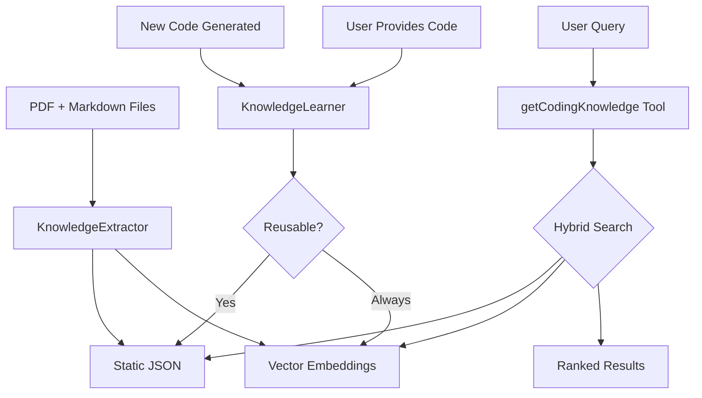

# Coding Knowledge Base Integration - Implementation Plan

## Goal
Create a hybrid coding knowledge base that:
1. Provides instant access to coding knowledge from `Code_Encyclopedia_Master.pdf` and `geminigeminstructions.md`
2. Supports on-demand retrieval via `getCodingKnowledge()` tool
3. Auto-learns from new code generated or provided by user

---

## Proposed Changes

### Component 1: Core Knowledge Base Module

#### [NEW] [CodingKnowledgeBase.ts](file:///c:/Users/Doc/Desktop/ChatBot/src/core/knowledge/CodingKnowledgeBase.ts)
- **Static Memory Layer**: Key snippets, patterns, and best practices loaded at startup
- **Vector Store Layer**: Full document embeddings for semantic search
- **Categories**: frontend, backend, database, deployment, ai, security, patterns
- **Methods**:
  - `initialize()` - Load static + generate embeddings
  - `search(query, category?)` - Semantic search
  - `getById(id)` - Direct retrieval
  - `addSnippet(code, metadata)` - Auto-learning
  - `getByCategory(category)` - Filter by domain

---

### Component 2: Knowledge Extraction Pipeline

#### [NEW] [KnowledgeExtractor.ts](file:///c:/Users/Doc/Desktop/ChatBot/src/core/knowledge/KnowledgeExtractor.ts)
- Uses existing `DocumentIngester` for PDF parsing
- Parses markdown sections into structured knowledge entries
- Categories detected from headers/content
- Outputs structured JSON for static memory

#### [NEW] [coding_knowledge_static.json](file:///c:/Users/Doc/Desktop/ChatBot/src/data/coding_knowledge_static.json)
- Pre-extracted key snippets and patterns
- Loaded at startup for instant access
- Categories, tags, code examples, explanations

---

### Component 3: getCodingKnowledge Tool

#### [NEW] [CodingKnowledgeTool.ts](file:///c:/Users/Doc/Desktop/ChatBot/src/core/tools/CodingKnowledgeTool.ts)
- Registered in ToolRegistry
- Parameters: `query`, `category?`, `limit?`
- Returns: Relevant code snippets, patterns, best practices
- Uses hybrid search (static + vector)

---

### Component 4: Auto-Learning System

#### [NEW] [KnowledgeLearner.ts](file:///c:/Users/Doc/Desktop/ChatBot/src/core/learning/KnowledgeLearner.ts)
- Triggered when:
  - Chatbot generates new code for user
  - User provides code to chatbot
- Extracts: function signatures, patterns, explanations
- Adds to both static (if reusable) and vector store
- Deduplication against existing knowledge
- Categories auto-detected via NLP

---

### Component 5: Integration Points

#### [MODIFY] [ToolRegistry.ts](file:///c:/Users/Doc/Desktop/ChatBot/src/core/tools/ToolRegistry.ts)
- Register `getCodingKnowledge` tool

#### [MODIFY] [Orchestrator.ts](file:///c:/Users/Doc/Desktop/ChatBot/src/core/orchestrator/Orchestrator.ts) *(if exists)*
- Hook auto-learning after code generation responses

---

## Data Flow



---

## User Review Required

> [!IMPORTANT]
> **PDF Extraction**: I'll use `pdf-parse` (already installed) to extract the PDF content. The quality depends on PDF structure - please confirm if the PDF is text-based or scanned images.

> [!NOTE]
> **Storage**: The static JSON will be ~500KB-2MB depending on content. Vector embeddings stored in memory during runtime. Should I add persistent vector storage (SQLite/PostgreSQL)?

---

## File Structure

```
src/
├── core/
│   ├── knowledge/
│   │   ├── CodingKnowledgeBase.ts    [NEW]
│   │   └── KnowledgeExtractor.ts     [NEW]
│   ├── learning/
│   │   └── KnowledgeLearner.ts       [NEW]
│   └── tools/
│       └── CodingKnowledgeTool.ts    [NEW]
└── data/
    └── coding_knowledge_static.json   [NEW - extracted content]
```

---

## Verification Plan

### Automated Tests
Extend existing test file: `src/server/__tests__/knowledge-base.test.ts`

```bash
npm test -- --testPathPattern="knowledge-base"
```

New test cases:
1. PDF extraction produces valid chunks
2. Static knowledge loads correctly
3. `getCodingKnowledge` tool returns relevant results
4. Auto-learning adds new entries without duplicates
5. Category filtering works

### Manual Verification
1. **Startup test**: Run server, verify knowledge base initializes
2. **Query test**: Ask coding questions, verify relevant snippets returned
3. **Learning test**: Generate code, check if auto-added to knowledge base

---

## Questions Before Proceeding

1. **PDF Format**: Is `Code_Encyclopedia_Master.pdf` text-based (copy-paste works) or scanned images (requires OCR)?

2. **Persistent Storage**: Should vector embeddings persist between restarts? Options:
   - In-memory only (faster, but rebuilds on restart)
   - SQLite (simple, local persistence)
   - PostgreSQL pgvector (production-grade, requires setup)

3. **Auto-Learning Trigger**: When should new code be added?
   - Automatically after every code generation
   - Only when user explicitly says "save this" or "remember this"
   - Both (auto-add + explicit save for important ones)

4. **Deduplication Threshold**: What similarity threshold for duplicate detection?
   - Suggested: 0.85 cosine similarity = duplicate
