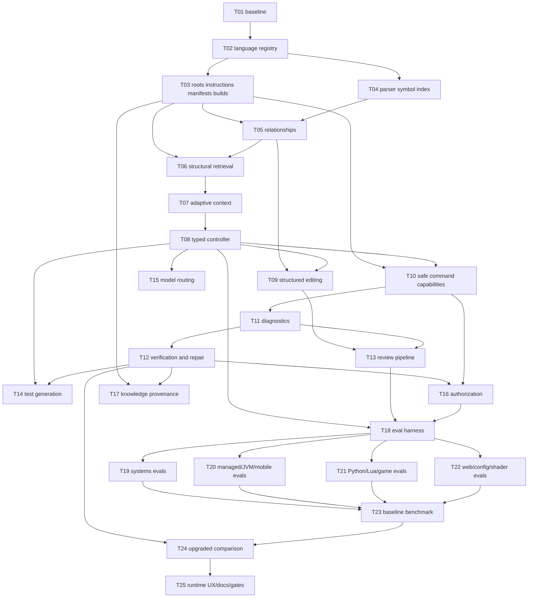

# Polyglot Coding Capability Upgrade Plan

**Repository:** `DocDamage/chatbot`
**Plan status:** Plan-only first deliverable; no implementation task is claimed complete by this document.
**Prepared:** 2026-08-10
**Baseline checkout inspected:** `main` at `dbeaa14` (`Add advanced capability workspaces`)
**Release-governance sources inspected:** `docs/implementation/MASTER_PRODUCTION_COMPLETION_TRACKER.md`, `docs/implementation/PRODUCTION_FEATURE_MANIFEST.md`, `docs/implementation/RELEASE_EVIDENCE_INDEX.md`, and `docs/implementation/handoffs/CURRENT_HANDOFF.md`

## 1. Purpose and completion boundary

This plan upgrades Coding mode from a TypeScript-oriented inspection scaffold into a repository-aware software-engineering subsystem. The target is real repository work across C, C++, C#, Objective-C, Go, Rust, Python, Lua/Luau, Java, Kotlin, Swift, JavaScript, TypeScript, Svelte/SvelteKit, HTML, CSS, Tailwind CSS, React, Node.js, SQL, Bash, PowerShell, GDScript, GLSL/HLSL/WGSL, JSON, YAML, TOML, XML, Markdown, Dockerfiles, Makefiles, CMake, Meson, Cargo, Go modules, Python packaging, and npm/pnpm/yarn projects.

The upgrade is complete only when the upgraded implementation demonstrates measurable improvement against a fixed repository-level evaluation set, while existing safety and production gates remain green. A larger prompt, a list of language names, passing helper tests, or plausible generated code is not completion evidence.

All implementation work is split into individually verifiable tasks. Each task must use a new issue, a `codex/` branch, a new Codex task/thread, a focused change set, a focused verification record, a committed evidence bundle, and an archived handoff. No task may silently begin the next task in the same thread.

## 2. Verified current-state architecture

### 2.1 Request and coding flow

```text
Express routes / chat request
  -> ServiceInitializer creates ToolRegistry, CodingAgent, CommandRunner, and optional CodingKnowledgeBase
  -> EnhancedOrchestrator classifies the message with string patterns
  -> TaskType.CODE_GENERATION delegates to CodingAgent when one is injected
  -> CodingAgent uses CodePlanner, RepoTools, CodeIndexer, CodeContextBudgeter,
     PatchGenerator, VerificationRunner, and CodeReviewer
  -> code routes expose ask/plan/patch/review/verify/files/symbols endpoints
  -> response is formatted as prose containing inspected files, plan, patch, and verification status
```

### 2.2 Components inspected

| Component | Verified current responsibility | Relevant evidence |
|---|---|---|
| `src/core/agents/CodingAgent.ts` | Coordinates evidence gathering, a fixed context budget, an empty patch in `handle`, optional verification, and review. `createPatch` is a separate direct call. | `CodingAgent.handle`, `gatherEvidence`, `createPatch` |
| `src/core/agents/CodePlanner.ts` | Uses ordered substring checks to classify ten intents and returns fixed workflow text. | `classifyIntent`, `createPlan` |
| `src/core/agents/PatchGenerator.ts` | Supports only explicit single-file `replace ... with ... in ...` and `append ... to ...` instructions; creates a whole-file synthetic diff. | `createPatchFromInstruction` |
| `src/core/agents/CodeReviewer.ts` | Scans diff text for a few command-execution strings and optionally checks for test-looking filenames. | `review` |
| `src/core/agents/CodeIndexer.ts` | Uses line regular expressions for TypeScript-like classes, functions, methods, imports, exports, routes, and tests. | `getFileSymbols` |
| `src/core/agents/CodeContextBudgeter.ts` | Uses a constructor-fixed budget of 4,000 estimated tokens and takes candidates in insertion order, truncating by character count. | `new CodeContextBudgeter(4000)`, `build` |
| `src/core/agents/VerificationRunner.ts` | Runs a fixed npm type-check/lint/test suite sequentially and stops at the first failure. | `runStandardSuite`, `runCommands` |
| `src/core/tools/RepoTools.ts` | Provides workspace-relative listing, literal text search, file reads, `package.json` scripts, git diff, regex symbols, literal references, a TypeScript import graph, command execution, and disabled patch application. | `isTextFile`, `search_repo`, `get_import_graph`, `apply_patch` |
| `src/core/tools/CommandRunner.ts` | Exact-string allowlist for five npm commands, `spawn` with `shell: false`, a 120-second timeout, bounded output, and inherited environment. | `allowedCommands`, `run` |
| `src/core/knowledge/CodingKnowledgeBase.ts` | Loads static and user JSON, embeds entries, cosine-searches them, and persists user snippets and an embedding cache. | `initialize`, `search`, `addSnippet` |
| `src/core/knowledge/KnowledgeExtractor.ts` | Extracts Markdown sections and heuristically chunks a PDF; IDs and tags are generated with timestamps/random values. | `extractFromMarkdown`, `extractFromPdf` |
| `src/core/learning/KnowledgeLearner.ts` | Auto-captures code blocks from responses when trigger words are present and writes them as learned snippets. | `learnFromInteraction` |
| `src/core/orchestrator/EnhancedOrchestrator.ts` | Uses keyword-based task routing; coding delegation occurs before model routing, RAG, and normal generation. | `inferTaskType`, lines 179–194 |
| `src/core/providers/LLMAdapter.ts` and `ModelRouter.ts` | Provide provider adapters and hard-coded model capabilities, but no coding-specific capability contract or structured coding generation path. | `LLMAdapter`, `ModelRouter.initializeCapabilities` |
| `src/core/nlu/phrasebooks/coding.phrasebook.ts` | Contains only two small phrase groups: debugging and feature wiring. | `codingPhrasebook` |
| `src/server/routes/code.ts` | Exposes coding APIs and enforces work-mode policy for plan, patch, and verify; `/api/code/ask` does not apply the same explicit action gate. | `createCodeRouter` |
| `src/core/modes/ExecutionModePolicy.ts` | Separates plan, implement, debug, and chat actions at route level. | `allowedActions` |
| `src/core/tools/CodeExecutor.ts` | Runs Python/JavaScript in a temporary directory using regex blocking; it is not a hardened OS sandbox, does not clean the temp directory, and is separate from repository verification. | `execute`, `checkSecurity`, `spawnCode` |
| `src/core/initialization/ServiceInitializer.ts` | Registers coding knowledge, code execution, repo tools, and the CodingAgent during startup; coding knowledge load is optional/background by environment setting. | `initializeTools` |

### 2.3 Current integration and release boundary

The production feature manifest classifies the coding workflow (`SPEC-002`), code workflow UI (`UI-007`), implement/debug modes, and coding knowledge bootstrap as `LOCAL_ONLY_EXPERIMENTAL`. The release tracker has verified governance/CI tasks through `P03-T04`, but the coding workflow remains a later feature-completion task (`P07-T05`) and is not production-supported. This plan describes the implementation baseline and its local-only boundary; current status is maintained in [`docs/PROJECT_STATUS.md`](../PROJECT_STATUS.md) and [`docs/implementation/handoffs/CURRENT_HANDOFF.md`](handoffs/CURRENT_HANDOFF.md).

### 2.4 Baseline verification actually run

The following focused command passed on the inspected checkout:

```text
npm test -- --runInBand --runTestsByPath \
  src/core/agents/CodingAgent.test.ts \
  src/core/agents/CodeContextBudgeter.test.ts \
  src/core/agents/PatchGenerator.test.ts \
  src/core/agents/VerificationRunner.test.ts \
  src/core/tools/RepoTools.test.ts \
  src/core/tools/CommandRunner.test.ts \
  src/core/orchestrator/EnhancedOrchestrator.coding.test.ts \
  src/server/routes/__tests__/code-routes.test.ts \
  src/core/modes/ModePolicy.test.ts \
  src/core/modes/ExecutionModePolicy.test.ts \
  src/server/__tests__/coding-knowledge.test.ts
```

Result: 11 suites passed, 33 tests passed. This verifies the existing scaffolding and mode/tool boundaries only; it does not verify polyglot discovery, natural-language editing, build-aware verification, compiler repair, or repository-level correctness.

## 3. Concrete shortcomings found

1. **Language coverage is accidental.** Repository search recognizes a small TypeScript/JavaScript/configuration set. C/C++, C#, Go, Rust, Python, Lua, Svelte, Java/Kotlin, Swift, GDScript, shader, shell, Docker, Make, CMake, Meson, and package/build files are not first-class discovery targets.
2. **No language capability registry exists.** Extension checks, package scripts, and command assumptions are distributed in helpers. Adding a language would require editing multiple unrelated components.
3. **Retrieval is filename-first and capped.** `CodingAgent.gatherEvidence` scores filenames, selects at most five files, reads up to 20,000 bytes each, and does not retrieve definitions, references, importers, callers, tests, manifests, build variants, or diagnostics structurally.
4. **The import graph is TypeScript-only and shallow.** It parses only `import ... from` lines and does not resolve paths, includes, package boundaries, workspaces, generated files, or cross-language relationships.
5. **Symbol indexing is regex-based.** It can produce false positives/negatives and has no AST, parser version, source range, scope, namespace, reference, implementation, or test relationship model.
6. **Repository instructions are not discovered or applied.** There is no resolver for `AGENTS.md`, `CLAUDE.md`, `.cursorrules`, Copilot instructions, contributing guides, architecture docs, or nearest-package rules.
7. **The context budget is hard-coded and order-biased.** A 4,000-token estimate truncates by character count and does not account for model capacity, task complexity, repository size, language, error evidence, or mandatory context sections.
8. **Coding requests do not perform model-backed engineering.** The `CodingAgent` does not accept an LLM adapter and its normal `handle` path returns an empty patch. The model router is bypassed for delegated coding requests.
9. **Patch generation is not natural-language editing.** It handles two explicit string syntaxes, one file at a time, replaces only the first match, and emits a whole-file synthetic diff. It cannot create/delete justified files, edit multiple files, preserve preconditions, or reason about related symbols.
10. **Verification is npm-specific.** It does not inspect manifests or build systems, select ecosystem-native commands, parse diagnostics, run a narrow-to-broad sequence, or perform bounded repair iterations.
11. **The command policy is too narrow for polyglot work and too coarse for safe expansion.** Exact npm strings do not represent Cargo, Go, dotnet, CMake, Meson, pytest, or project scripts; there is no command capability model, project-derived allowlist, process-tree cleanup, or structured diagnostic output.
12. **Review is string scanning.** It does not inspect changed behavior, requirements, API compatibility, concurrency, memory/resource safety, security context, performance evidence, tests, or language conventions.
13. **Test generation is not wired to risk or behavior.** The planner mentions tests, but there is no behavior model, framework detector, generated-test validation, or regression-focused test strategy.
14. **Coding knowledge has weak authority boundaries.** User/generated snippets are persisted as `learned` material without verification or approval gates, while metadata lacks version/date/provenance detail required for dependency-sensitive answers.
15. **Evaluation coverage is not a coding benchmark.** `evals/coding/security_block_bad_exec.json` is one security case. `scripts/run-evals.ts` has no coding suite, and `EvalHarness` grades textual terms/retrieval rather than compile, test, diff, hidden regression, file-selection, or verification honesty.
16. **Route/mode boundaries need an explicit coding controller.** Plan/implement/debug policies exist, but the ask path, legacy chat path, patch application, command execution, and future repair loop do not share one structured authorization and approval record.
17. **The current code executor is not a safe polyglot execution substrate.** Regex blocking is not a sandbox, temporary workspaces are not cleaned up, and execution is not connected to repository-specific verification or process/resource isolation.

## 4. Target architecture

```text
Request + selected work mode
  -> CodingRequestRouter
  -> EngineeringTask (intent, languages, roots, files, symbols, constraints, acceptance criteria)
  -> WorkspacePolicyResolver + RepositoryInstructionResolver
  -> RepositoryIntelligence snapshot
       (tree, manifests, languages, build systems, symbols, imports/includes,
        references, tests, git state, instructions, dependency versions)
  -> StructuralRetriever + DocumentationRetriever
  -> AdaptiveContextAllocator
  -> Planner / specialist roles
       (explorer, planner, coder, debugger, test engineer, reviewer,
        security reviewer, performance reviewer)
  -> StructuredEditEngine
       (AST-aware where supported, anchored text edits otherwise, preconditioned multi-file patch)
  -> ReviewPipeline
  -> VerificationOrchestrator
       (manifest-aware commands -> parsed diagnostics -> bounded repair controller)
  -> final diff/review/evidence report
```

The controller remains responsible for scope, mode authorization, workspace confinement, iteration limits, approval requirements, and truthful reporting. Specialists exchange typed artifacts rather than unconstrained prose.

### 4.1 Core typed artifacts

```ts
interface EngineeringTask {
  taskId: string;
  intent: CodingIntent;
  languages: string[];
  frameworks: string[];
  projectRoots: string[];
  affectedFiles: string[];
  affectedSymbols: string[];
  manifests: string[];
  relatedTests: string[];
  constraints: string[];
  acceptanceCriteria: string[];
  mode: 'plan' | 'implement' | 'debug' | 'chat';
}

interface Diagnostic {
  tool: string;
  file?: string;
  line?: number;
  column?: number;
  severity: 'error' | 'warning' | 'info';
  code?: string;
  message: string;
  raw: string;
}

interface VerificationResult {
  command: string;
  argv: string[];
  exitCode: number | null;
  durationMs: number;
  diagnostics: Diagnostic[];
  stdout: string;
  stderr: string;
  status: 'passed' | 'failed' | 'timed_out' | 'blocked' | 'skipped';
}
```

### 4.2 Language capability registry

Add a registry under `src/core/coding/languages/` with immutable capability descriptors. Detection must combine extensions, common filenames, manifests, lockfiles, directory layout, project files, and user/error evidence. A descriptor must contain at least:

- stable language ID, aliases, extensions, common filenames, and generated-file patterns;
- manifest/package/lock files and project-root rules;
- build systems, compiler/interpreter, formatter, linter, type checker, test runners, and dependency inspection commands;
- symbol parser/provider and supported relationship types;
- verification command factories that inspect repository state before selecting commands;
- safe auto-fix commands, documentation sources, version detectors, and review rules;
- confidence and conflict behavior when multiple ecosystems are present.

Initial registry entries:

| Family | Registry entries and detection | Verification examples, selected from detected project state |
|---|---|---|
| C/C++/Objective-C | `c`, `cpp`, `objective-c`; `.c`, `.h`, `.cc`, `.cpp`, `.cxx`, `.hpp`, `.m`, `.mm`; CMake, Make, Meson, Ninja, `.sln`, Visual Studio files | configured CMake/Ninja/MSBuild target, compiler warnings, `ctest`, `make`/`meson test`; include paths/macros must come from the build configuration |
| C# / F# | `csharp`, `fsharp`; `.cs`, `.fs`; `.sln`, `.csproj`, `.fsproj`, `global.json`, `Directory.Build.*` | `dotnet restore` only when needed, `dotnet build`, `dotnet test`, analyzers and nullable settings from project files |
| Go | `go`; `.go`; `go.mod`, `go.sum`, `go.work` | module/workspace-aware `go test`, `go vet`, `gofmt`, optional race tests when project policy permits |
| Rust | `rust`; `.rs`; `Cargo.toml`, `Cargo.lock`, workspace members | `cargo check`, package/workspace-aware `cargo test`, `cargo clippy`, `cargo fmt --check`; inspect features/targets first |
| Python | `python`; `.py`, `.pyi`; `pyproject.toml`, `requirements*.txt`, `poetry.lock`, `uv.lock`, `Pipfile`, `setup.py`, `tox.ini` | detected pytest/unittest, Ruff/Black/Pylint, mypy/Pyright, environment manager, Python version and package boundary |
| Lua/Luau | `lua`, `luau`; `.lua`, `.luau`; `*.rockspec`, Love2D project files, Neovim plugin layout, Roblox markers | ecosystem-specific Lua/LuaJIT/Love2D/Neovim/Roblox checks; never apply one ecosystem’s APIs to another |
| Java/Kotlin | `java`, `kotlin`; `.java`, `.kt`, `.kts`; Gradle/Maven settings and lock files | Gradle/Maven module-aware build/test/check, compiler target and test framework from build files |
| Swift | `swift`; `.swift`; `Package.swift`, Xcode project/workspace files | SwiftPM/Xcode scheme-aware build/test, formatter/linter only when configured |
| JS/TS/React/Node | `javascript`, `typescript`, `react`, `node`; `.js`, `.jsx`, `.ts`, `.tsx`; `package.json`, lockfile, workspace config | npm/pnpm/yarn/bun selected from lockfile and scripts; package-boundary tests, type-check, lint, build; local installed typings are authoritative |
| Svelte/SvelteKit | `svelte`, `sveltekit`; `.svelte`, `+page`, `+layout`, `+server`, `svelte.config.*`, Vite config | version-aware Svelte checker, package scripts, SSR/client boundary checks, adapter/build/test configuration |
| Web styles/markup | `html`, `css`, `scss`, `tailwind`; `.html`, `.css`, `.scss`, Tailwind config and package version | configured formatter/linter/build; Tailwind utilities must match installed major version; accessibility and responsive checks are review rules |
| SQL | `sql`; `.sql`, migration directories, database config | dialect detected from project dependencies/config; migration/query validation and query-plan checks only when safe and configured |
| Shell | `bash`, `powershell`; `.sh`, `.bash`, `.ps1`, common shell filenames | ShellCheck/PSScriptAnalyzer when configured; never use shell execution as a generic command transport |
| Game/shader | `gdscript`; `.gd`, Godot project; `glsl`, `hlsl`, `wgsl`; shader extensions and engine markers | Godot project checks and engine-specific shader/language validation, not generic GLSL assumptions |
| Data/build/docs | `json`, `yaml`, `toml`, `xml`, `markdown`, `dockerfile`, `make`, `cmake`, `meson`, `cargo`, `go-modules`, `python-packaging`, `npm`, `pnpm`, `yarn` | syntax/format/schema checks, manifest consistency, lockfile policy, Docker/build configuration checks, and project-defined commands |

New languages must add one descriptor, parser/relationship adapters where available, verification fixtures, review rules, and eval cases; discovery, context, command policy, and reporting must not be rewritten.

### 4.3 Repository intelligence and retrieval

`RepositoryIntelligence` builds a versioned snapshot for a workspace root. It records:

- canonical root, nested package/workspace roots, file tree, language distribution, ignored/generated/binary files, and git status/current diff;
- repository-local instructions with scope and precedence; untrusted repository text can guide coding style but cannot override platform safety;
- manifests, lockfiles, dependency versions, build systems, CI files, architecture docs, and package scripts;
- resolved imports/includes/modules, exports, symbols, references, implementations/inheritance where supported, callers/importers where supported, and test-to-symbol relationships;
- error-stack/compiler paths and user-mentioned paths as high-priority evidence.

Retrieval is hybrid but structured: exact path/error search, symbol definition/reference search, import/include neighborhood, dependency/build retrieval, related-test retrieval, changed-file retrieval, and only then bounded lexical/embedding search. Each result carries authority, path, range, relationship, language, project root, and retrieval reason.

Use maintained parsers through a provider interface (Tree-sitter or an equivalent multi-language parser selected in a dedicated implementation task). Regex is permitted only as a fallback for unsupported formats and must be labeled low-confidence. Do not make a separate fragile parser for every language.

### 4.4 Adaptive context management

`AdaptiveContextAllocator` receives model context capacity, output budget, task intent, repository size, languages, evidence confidence, and error count. It assigns explicit budgets to user request, instructions, architecture snapshot, affected implementation, interfaces/types, tests, dependencies, diff, diagnostics, and documentation. It returns hierarchical summaries for large repositories, preserves source/range citations, and never allows low-authority general knowledge to displace repository truth or diagnostics.

### 4.5 Natural-language editing

`StructuredEditEngine` accepts a typed change proposal with file operations, anchors, expected preconditions, symbol/range targets, and rationale. It supports create/modify/delete only when authorized, multi-file edits, minimal diffs, conflict detection, and workspace confinement. AST-aware transforms are preferred where a parser supports the operation; anchored unified/text edits remain a fallback. Before applying anything, compare file hashes/working-tree state and preserve unrelated user changes. The public route must continue to return a reviewable patch artifact before any write approval.

### 4.6 Verification and repair

`BuildSystemDetector` chooses commands from the registry and repository configuration; it must not run a common command merely because it exists in documentation. `VerificationOrchestrator` runs narrow checks first, parses GCC/Clang/MSVC/rustc/Cargo/Go/dotnet/TypeScript/ESLint/Svelte/Pytest/Ruff/mypy/Pyright/Lua diagnostics, attaches diagnostics to files/symbols, and performs bounded repair iterations. Default maximum repair iterations: three, configurable per task but never unbounded. A repair iteration must explain the hypothesis, change scope, command, diagnostic delta, and remaining risk.

### 4.7 Review and coding system prompt

`ReviewPipeline` runs requirement, correctness, regression, security, concurrency, resource/lifetime, performance, compatibility, maintainability, test, and language-specific checks. Findings are concrete and prioritized as critical/high/medium/low, with file, location, consequence, and correction.

The dedicated coding system prompt must state that repository truth and verified local APIs outrank memory; the agent must inspect before editing, respect local instructions, preserve unrelated work, use the actual language/build system, treat tool output as evidence, repair within bounds, review the final diff, and report unverified items. It must explicitly prohibit stubs, disabled tests, fake success, and invented APIs. Prompt text is a supporting control, not the capability implementation.

### 4.8 Knowledge authority and provenance

Split coding knowledge into:

1. repository truth (highest authority);
2. authoritative official language/framework/dependency documentation with version metadata;
3. curated engineering/security references;
4. learned project fixes (lowest authority unless promoted).

Every entry records language, ecosystem, dependency/project version, source, source date, authority, project scope, tags, verification status, provenance, and expiration/revalidation policy. Generated code is never promoted merely because it was generated. Promotion requires successful relevant verification, explicit user approval, trusted-source confirmation, or a regression test that establishes the behavior.

## 5. Affected existing components and new components

### Existing components to evolve

- `src/core/agents/CodingAgent.ts`, `CodePlanner.ts`, `PatchGenerator.ts`, `CodeReviewer.ts`, `CodeIndexer.ts`, `CodeContextBudgeter.ts`, and `VerificationRunner.ts`.
- `src/core/tools/RepoTools.ts`, `CommandRunner.ts`, `CodeExecutor.ts`, `ToolRegistry.ts`, and `FunctionCaller.ts`.
- `src/core/orchestrator/EnhancedOrchestrator.ts`, `Orchestrator.ts`, `src/core/router/IntentRouter.ts`, and `src/core/nlu/phrasebooks/coding.phrasebook.ts`.
- `src/core/providers/LLMAdapter.ts`, `ModelRouter.ts`, and provider configuration/types.
- `src/core/knowledge/CodingKnowledgeBase.ts`, `KnowledgeExtractor.ts`, `KnowledgeLearner.ts`, and coding knowledge bootstrap in `ServiceInitializer.ts`.
- `src/server/routes/code.ts`, `legacy-chat.ts`, route registration, mode policy, and coding route tests.
- `src/core/evaluation/EvalHarness.ts`, `scripts/run-evals.ts`, package scripts, coding tests, and release evidence documentation.

### New components proposed

```text
src/core/coding/
  types.ts                         # EngineeringTask, diagnostics, patch, evidence contracts
  CodingRequestRouter.ts           # Intent/mode/task normalization
  CodingController.ts              # bounded engineering loop and specialist coordination
  languages/
    LanguageCapabilityRegistry.ts
    LanguageCapability.ts
    builtins/*                     # one descriptor per language/ecosystem family
  repository/
    RepositoryIntelligence.ts
    WorkspaceInstructionResolver.ts
    ProjectRootDetector.ts
    ManifestDetector.ts
    BuildSystemDetector.ts
    DependencyInspector.ts
  index/
    SymbolIndex.ts
    ParserProvider.ts
    RelationshipStore.ts
  retrieval/
    StructuralRetriever.ts
    DocumentationRetriever.ts
    AdaptiveContextAllocator.ts
  editing/
    StructuredEditEngine.ts
    PatchConflictDetector.ts
    WorkspaceWriteGate.ts
  verification/
    VerificationOrchestrator.ts
    DiagnosticParser.ts
    RepairController.ts
  review/
    ReviewPipeline.ts
    LanguageReviewRules.ts
  knowledge/
    CodingKnowledgeAuthority.ts
    ProvenancePolicy.ts
```

The names are a target boundary, not permission to add every file in one change. Each task below should add only the smallest slice needed for its acceptance criteria.

## 6. Migration strategy

1. Freeze a reproducible baseline before changing coding behavior: commit SHA, dependency lock state, environment profile, provider/model, current focused tests, and baseline eval fixtures.
2. Preserve current public route shapes where possible. Add versioned fields rather than silently changing existing response semantics; retain compatibility adapters during migration.
3. Introduce the registry, repository snapshot, and structural retrieval in read-only/shadow mode first. Compare old and new selected files and record disagreements without changing user-visible behavior.
4. Migrate `CodingAgent` behind a controller interface. Keep the old explicit replace/append path as a compatibility fallback until structured editing passes fixture tests.
5. Migrate verification from fixed npm commands to detected command plans behind a feature flag. Do not remove existing release commands until equivalent or stronger gates pass.
6. Add the new review and diagnostic pipeline before enabling repair loops. Repair remains bounded, mode-authorized, and disabled in plan/chat mode.
7. Add provenance/knowledge promotion gates before changing auto-learning behavior. Existing learned JSON must be reclassified or quarantined; no historical snippet is silently upgraded to canonical authority.
8. Enable language families incrementally, starting with TypeScript/JavaScript compatibility, then Python, Go, Rust, C/C++, C#, JVM/Swift, web/config, Lua/Godot, and shader ecosystems. Each family requires fixtures and eval evidence.
9. Keep changes task-sized. Every task updates its own tests/docs/evidence and handoff; the final integration task only composes verified slices.
10. Roll back by disabling the new controller/registry flags and restoring the prior route/controller adapter. No migration may require deleting user workspace files or learned data.

## 7. Numbered implementation tasks

Each item below is a separate issue and separate Codex task. Suggested identifiers are `POLY-CODE-T01` etc.; suggested branches are `codex/polyglot-coding-t01` etc. The task must end with a handoff under `docs/implementation/handoffs/` and an evidence bundle under `docs/implementation/evidence/coding-upgrade/` or the task-specific path recorded in the tracker.

### POLY-CODE-T01 — Freeze baseline and reconcile production handoff

- **Depends on:** none.
- **Deliver:** baseline manifest, fixture repository set, provider/model/config record, focused coding test report, and an explicit boundary that coding remains local-only experimental until later release gates.
- **Acceptance:** baseline can be rerun from a clean checkout; tracker/handoff discrepancies are documented; no production status is changed.
- **Verification:** `git status --short --branch`; focused coding test command in §2.4; `npm run type-check:server`; `npm run test:release-tools`.
- **Evidence:** commit SHA, command logs, fixture hashes, environment redaction, and baseline report inputs.

### POLY-CODE-T02 — Implement the language capability registry

- **Depends on:** T01.
- **Deliver:** registry interfaces, detection precedence, built-in descriptors for all language/framework/build families in §4.2, and extension/filename/manifest tests.
- **Acceptance:** adding a language requires a descriptor and tests only; no TypeScript-only extension filter remains in the coding path; conflicts expose confidence and reasons.
- **Verification:** registry unit tests; extension/filename/manifest matrix; `npm run type-check:server`; `npm run lint:server`.
- **Evidence:** detection matrix, unsupported-tool behavior, and no false-positive fixture report.

### POLY-CODE-T03 — Add workspace roots, instructions, manifests, and build detection

- **Depends on:** T02.
- **Deliver:** canonical workspace confinement, nested project detection, local instruction resolver, manifest/lockfile inventory, generated/binary classification, and build-system detector.
- **Acceptance:** nearest applicable instructions are ordered by scope; unsafe instructions cannot override platform policy; CMake/Make/Meson/Cargo/Go/.NET/Python/JS workspaces are detected without inventing commands.
- **Verification:** hostile path/symlink tests; multi-root fixture tests; command-plan snapshot tests; `npm run type-check:server`.
- **Evidence:** repository snapshot JSON and command-plan artifacts for every fixture family.

### POLY-CODE-T04 — Replace regex-only indexing with a parser-provider symbol index

- **Depends on:** T02, T03.
- **Deliver:** parser-provider interface, maintained multi-language parser integration where available, fallback parser labeling, source ranges, scopes, symbols, imports/includes, exports, tests, and parser health metadata.
- **Acceptance:** definitions and symbols are discoverable for priority fixture languages; regex fallback is never reported as AST certainty; unsupported syntax degrades explicitly.
- **Verification:** per-language symbol fixtures; malformed-file tests; index rebuild/incremental update tests; `npm run type-check:server`.
- **Evidence:** symbol snapshots, parser versions, precision/recall sample, and fallback report.

### POLY-CODE-T05 — Build relationship and dependency graph queries

- **Depends on:** T04.
- **Deliver:** resolved definitions/references, importers/callers where supported, implementations/inheritance, test associations, package boundaries, and dependency/build relationships.
- **Acceptance:** queries exist for definition, references, implementations, tests, importers, callers, dependent modules, and error-related symbols; results include confidence and source ranges.
- **Verification:** cross-file fixture tests for C/C++, Go, Rust, Python, C#/JVM, and JS/TS; graph invalidation tests.
- **Evidence:** graph query examples and fixture result files.

### POLY-CODE-T06 — Add structural retrieval and repository summaries

- **Depends on:** T03, T05.
- **Deliver:** retrieval planner that ranks user paths, diagnostics, changed files, symbols, dependencies, tests, instructions, architecture docs, and lexical/vector evidence; hierarchical summaries for large repositories.
- **Acceptance:** a repository task retrieves related definitions/tests/build files rather than only filename matches; every context item has a retrieval reason and authority.
- **Verification:** retrieval precision fixtures; changed-file and error-stack cases; no-irrelevant-file budget tests.
- **Evidence:** old-vs-new retrieval traces and selected-context JSON.

### POLY-CODE-T07 — Implement adaptive context allocation

- **Depends on:** T06.
- **Deliver:** model-capacity-aware allocator with task/language/repository/error weighting and explicit budgets for request, instructions, architecture, source, interfaces, tests, dependencies, diff, diagnostics, and docs.
- **Acceptance:** no hard-coded 4,000-token limit controls production behavior; large repositories use summaries; mandatory evidence cannot be evicted by generic knowledge.
- **Verification:** budget/property tests across context sizes and task intents; token-estimation calibration; truncation boundary tests.
- **Evidence:** context allocation traces and budget regression comparison.

### POLY-CODE-T08 — Introduce typed engineering tasks and the bounded controller

- **Depends on:** T02, T03, T06, T07.
- **Deliver:** `EngineeringTask`, evidence, patch, review, verification, and handoff contracts plus `CodingController` for inspect → plan → edit → review → verify → repair → report.
- **Acceptance:** plan, implement, and debug modes have distinct allowed transitions; controller has a configurable finite iteration limit and records each stage.
- **Verification:** state-machine tests; mode transition tests; controller fixture tests with fake tools/providers.
- **Evidence:** structured task and loop traces, including blocked actions.

### POLY-CODE-T09 — Add natural-language multi-file structured editing

- **Depends on:** T04, T05, T08.
- **Deliver:** preconditioned create/modify/delete edit operations, anchored/AST-aware edits, minimal unified diffs, conflict detection, and preservation of unrelated changes.
- **Acceptance:** natural-language requests can add a Rust service, repair a Go package, add a Svelte component, or modify several related files in fixtures; no silent overwrite; delete requires explicit justification and authorization.
- **Verification:** multi-file fixture tests; clean/dirty/unrelated-change tests; path/symlink/concurrency tests; diff apply/reject tests.
- **Evidence:** before/after trees, diffs, conflict records, and workspace confinement logs.

### POLY-CODE-T10 — Add manifest-aware command capabilities and safe execution

- **Depends on:** T03, T08.
- **Deliver:** argv-based command plans, project-derived allowlists, explicit approval classes, bounded timeout/output/process-tree cancellation, environment redaction, and auditable command records.
- **Acceptance:** commands are selected from detected project state; `shell: false` remains mandatory for repository commands; plan/chat cannot execute; unsafe or unknown commands are blocked with a reason.
- **Verification:** allowlist/approval tests, timeout/output tests, process cleanup tests, shell-metacharacter tests, hosted/local policy tests.
- **Evidence:** command plans, blocked-command records, and security regression output.

### POLY-CODE-T11 — Add diagnostic parsers and feedback attachment

- **Depends on:** T10.
- **Deliver:** normalized diagnostics for GCC, Clang, MSVC, rustc/Cargo, Go, dotnet, TypeScript, ESLint, Svelte checker, pytest, Ruff, mypy, Pyright, and configured Lua tooling.
- **Acceptance:** file/line/column/severity/code/message are parsed where present; raw output is retained; diagnostics map back to relevant symbols/context items.
- **Verification:** golden diagnostic fixtures for each tool family; malformed-output and truncated-output tests.
- **Evidence:** parsed diagnostic JSON and parser coverage matrix.

### POLY-CODE-T12 — Implement language-aware verification orchestration and bounded repair

- **Depends on:** T08, T10, T11.
- **Deliver:** narrow-to-broad verification plan, test/build/lint/type checks from registry/project state, diagnostic-driven repair loop, and final verification honesty rules.
- **Acceptance:** Rust/Go/Python/C#/C++/JS/Svelte fixture projects run their native checks; first failure is not the end of the workflow; repair stops at the maximum and reports remaining risks.
- **Verification:** pass/fail/repair fixtures; original bug reproduction tests; no-false-success tests; `npm run type-check:server`, targeted Jest.
- **Evidence:** per-iteration command/diagnostic deltas and final verification summary.

### POLY-CODE-T13 — Replace string review with the review pipeline

- **Depends on:** T09, T11.
- **Deliver:** requirement/correctness/regression/security/concurrency/resource/performance/API/test/language review stages and concrete severity findings.
- **Acceptance:** findings include file/location, consequence, and correction; reviewer does not report “no blocking findings” solely because keyword scans are clean.
- **Verification:** seeded defect fixtures for memory safety, ownership, async, injection, SSR/client boundaries, accessibility, and dependency misuse.
- **Evidence:** review findings with expected/actual comparisons and false-positive notes.

### POLY-CODE-T14 — Add behavior- and risk-based test generation

- **Depends on:** T08, T12, T13.
- **Deliver:** framework detector, acceptance-to-test mapping, boundary/error/security/concurrency/regression test strategy, and generated-test verification.
- **Acceptance:** generated tests exercise behavior and risk, not merely touched lines or implementation copies; existing test conventions are preserved.
- **Verification:** hidden regression fixtures; mutation or defect-seeding sample where feasible; native test commands for supported ecosystems.
- **Evidence:** test rationale, generated diff, and test execution results.

### POLY-CODE-T15 — Integrate coding-specific model/provider capability routing

- **Depends on:** T08, T12.
- **Deliver:** coding capability metadata for context size, structured output/tool calling, code quality, latency, cost, local availability, and model/version; route complex repository tasks to an appropriate configured adapter.
- **Acceptance:** coding requests no longer bypass provider routing without an explicit reason; unsupported capability is surfaced; fallback behavior is truthful.
- **Verification:** routing matrix, missing-provider, cost-limit, and structured-output contract tests.
- **Evidence:** routing decisions, model metadata, and no-provider fallback report.

### POLY-CODE-T16 — Harden coding mode authorization and local execution boundaries

- **Depends on:** T08, T10.
- **Deliver:** one shared authorization/approval record for ask/plan/implement/debug, code routes, legacy chat, patch apply, commands, and repair; isolate or disable general code execution unless a real sandbox is available.
- **Acceptance:** plan cannot mutate or execute; implement requires write authorization; debug requires debug authorization; workspace paths, symlinks, secrets, and generated state are confined; no safety weakening.
- **Verification:** route-level hostile requests, path traversal/symlink tests, dirty-worktree tests, secret-redaction tests, and release-security tests.
- **Evidence:** policy matrix, blocked-action logs, and `npm run test:security` output.

### POLY-CODE-T17 — Upgrade coding knowledge authority and learning provenance

- **Depends on:** T03, T12, T15.
- **Deliver:** repository/version-aware documentation retrieval, authority metadata, verification/promotion workflow, deduplication, revalidation, and quarantine of unverified generated snippets.
- **Acceptance:** repository truth outranks learned material; generated code is never auto-canonical; source/version/date/authority/provenance are queryable.
- **Verification:** promotion denial/approval tests, stale-version tests, repository-overrides-learned tests, persistence migration tests.
- **Evidence:** provenance records, promotion decisions, and migrated-data report.

### POLY-CODE-T18 — Extend the coding evaluation harness

- **Depends on:** T08, T12, T13, T16.
- **Deliver:** coding task runner and scorer that can inspect patches/worktrees and collect build/test/hidden-regression results, not only text terms.
- **Acceptance:** scores correctness, build/test, hidden regressions, minimality, API hallucination, file/symbol selection, root-cause accuracy, security defects, unnecessary changes, and verification honesty.
- **Verification:** scorer unit tests with known pass/fail cases; deterministic fixture execution; report schema validation.
- **Evidence:** scorer fixtures, per-metric JSON, and failure explanations.

### POLY-CODE-T19 — Add systems-language eval pack

- **Depends on:** T18.
- **Deliver:** C, C++, Objective-C, Go, and Rust fixtures covering memory/lifetime, RAII, CMake/build repair, goroutine/context, borrow/ownership, unsafe review, and multi-file changes.
- **Acceptance:** each fixture has visible and hidden tests, expected affected symbols/files, build commands, security risks, and minimality expectations.
- **Verification:** clean baseline and upgraded runs through T18 harness.
- **Evidence:** fixture manifest, baseline results, upgraded-ready schema.

### POLY-CODE-T20 — Add managed/JVM/mobile eval pack

- **Depends on:** T18.
- **Deliver:** C#, F#, Java, Kotlin, and Swift fixtures covering async/nullability/disposal, multi-project changes, Gradle/Maven module behavior, and SwiftPM/Xcode boundaries.
- **Acceptance/verification/evidence:** same contract as T19, with tool availability explicitly recorded and missing toolchains never counted as a false pass.

### POLY-CODE-T21 — Add Python/Lua/game-language eval pack

- **Depends on:** T18.
- **Deliver:** Python packaging/typing/pytest/async fixtures; plain Lua/LuaJIT/Love2D/Neovim or Luau distinctions; GDScript state/coroutine fixtures.
- **Acceptance/verification/evidence:** same contract as T19, including ecosystem-specific convention checks.

### POLY-CODE-T22 — Add web/config/build/shader eval pack

- **Depends on:** T18.
- **Deliver:** JS/TS/React/Node, Svelte/SvelteKit, HTML/CSS/Tailwind, SQL, Bash/PowerShell, GLSL/HLSL/WGSL, JSON/YAML/TOML/XML/Markdown, Docker/Make/CMake/Meson/package-manager fixtures.
- **Acceptance/verification/evidence:** same contract as T19, including SSR/client, accessibility, installed Tailwind major, shell safety, and manifest/lockfile correctness.

### POLY-CODE-T23 — Run and publish the baseline benchmark

- **Depends on:** T01, T18, T19, T20, T21, T22.
- **Deliver:** baseline runs against the current implementation with fixed prompts, model/provider, fixtures, timeouts, and tool availability.
- **Acceptance:** results are reproducible and stored under `docs/implementation/evidence/coding-upgrade/baseline/`; failures are categorized rather than hidden.
- **Verification:** rerun one clean subset and compare hashes/metadata.
- **Evidence:** raw requests/responses, patches, command logs, diagnostics, scores, environment manifest.

### POLY-CODE-T24 — Run and publish the upgraded benchmark comparison

- **Depends on:** T02–T22 as applicable, T23.
- **Deliver:** identical benchmark run against the upgraded implementation and `docs/implementation/evidence/coding-upgrade/comparison.md`.
- **Acceptance:** report gains and regressions for every metric; no “massively improved” claim is made without comparable evidence; unsupported toolchains are reported separately.
- **Verification:** same fixture hashes/prompts/provider settings; independent reviewer checks report arithmetic and sampled traces.
- **Evidence:** upgraded raw artifacts, comparison table, regression triage, and exact implementation SHA.

### POLY-CODE-T25 — Integrate runtime UX, documentation, and release gates

- **Depends on:** T12, T16, T17, T24.
- **Deliver:** coding system prompt, route/API response updates, UI status for plan/implement/debug, docs, package scripts, release checks, and final evidence index/handoff integration.
- **Acceptance:** users see affected scope, patch, verification, review findings, repair attempts, and unverified risks; existing production/security gates remain green; coding feature remains local-only until the production tracker later verifies its vertical slice.
- **Verification:** focused tests, `npm run type-check`, `npm run lint`, `npm run build`, `npm run test:e2e:services`, `npm run test:browser` where applicable, `npm run check:phase2`, and release-security tests.
- **Evidence:** final task bundle, route/API contract, UI/browser notes, benchmark comparison, tracker/index updates, and archived handoff.

## 8. Dependency graph and workstream mapping



Workstreams from the master prompt map as follows: registry (T02), repository intelligence (T03–T06), symbol/indexing (T04–T05), dynamic context (T07), editing (T08–T09), diagnostics/verification (T10–T12), reviewer/tests (T13–T14), model routing (T15), security/runtime integration (T16 and T25), knowledge/provenance (T17), evals/benchmarks (T18–T24), and documentation/evidence (T01/T23–T25).

## 9. Security implications and invariant controls

The upgrade expands the agent’s understanding and potential command surface, so safety is a release requirement, not a later cleanup task.

- Resolve every path against a canonical workspace root; reject traversal, absolute escape, symlink escape, `.git` mutation, secret files, and generated/runtime stores unless an explicit task policy allows read-only access.
- Keep plan mode read-only; require explicit implement approval for writes; require debug approval for diagnostic commands; require separate approval for patch application and any local execution.
- Represent commands as executable plus argv, never shell-built strings. Keep `shell: false`, exact project-derived allowlists, timeouts, output caps, cancellation, process-tree cleanup, and redacted audit records.
- Do not treat `CodeExecutor` regex checks as a sandbox. Keep it disabled for repository work unless a real isolated runtime with filesystem/network/resource policy is introduced and independently tested.
- Treat repository instructions, retrieved documentation, generated code, and tool output as untrusted data for policy purposes. They can inform implementation but cannot override platform restrictions or authorization.
- Apply patches with file hashes/preconditions and three-way/conflict detection. Never overwrite unrelated user changes or silently delete files.
- Keep network documentation retrieval behind the existing approval/SSRF controls. Prefer official, version-matched documentation; preserve provenance into RAG.
- Redact credentials, tokens, private keys, environment values, and command output secrets from context, logs, benchmark artifacts, and evidence bundles.
- Add security fixtures for command injection, path traversal, symlink escape, shell interpolation, SQL injection, SSRF, XSS/CSRF, unsafe deserialization, secret exposure, dependency misuse, C/C++ memory hazards, unsafe Rust, and authorization bypass.

## 10. Evaluation and benchmark methodology

### 10.1 Fixture design

Use small clean fixture repositories plus dirty-worktree variants. Each fixture must include repository instructions, manifests/lockfiles where relevant, implementation files, related tests, build/CI files, and a hidden regression check. Fixtures must exercise single-file, multi-file, cross-module, debugging, review, test-generation, security, and dependency-version tasks.

### 10.2 Baseline versus upgraded protocol

1. Pin the fixture commit/hash, prompt, model/provider/version, temperature, output budget, environment, tool availability, timeout, and network policy.
2. Run the same task set against the current implementation before enabling upgraded components.
3. Record exact selected files/symbols, proposed/applied diff, commands, diagnostics, review findings, verification claims, latency, and cost.
4. Reset to a clean fixture between tasks; run dirty-worktree preservation cases from a controlled starting state.
5. Run the identical task set against the upgraded implementation at its exact implementation SHA.
6. Grade with repository evidence: compile/build success, visible and hidden tests, patch minimality, file/symbol selection, root-cause accuracy, security, API hallucination, unnecessary changes, and verification honesty.
7. Publish raw artifacts and a comparison that includes regressions, unsupported-toolchain cases, and confidence/limitations. A textual answer containing plausible code is never a pass by itself.

Required artifact layout:

```text
docs/implementation/evidence/coding-upgrade/
  baseline/
    manifest.json
    cases/<case-id>/request.json
    cases/<case-id>/response.json
    cases/<case-id>/diff.patch
    cases/<case-id>/commands.json
    cases/<case-id>/diagnostics.json
    report.json
  upgraded/
    manifest.json
    cases/<case-id>/...
    report.json
  comparison.md
```

### 10.3 Minimum scoring dimensions

| Dimension | Measurement |
|---|---|
| Task correctness | hidden behavior tests and acceptance checks |
| Build/test success | native build/test result and diagnostic status |
| Regression resistance | hidden tests and pre-existing test preservation |
| Patch minimality | changed files/lines and unrelated-change detector |
| Retrieval quality | expected definitions/tests/build files selected; irrelevant context rate |
| API/version accuracy | local typings/manifest/docs agreement; fabricated API count |
| Debugging quality | reproduction, root cause, fix, and original-case verification |
| Security | seeded vulnerability escape/false-positive rate |
| Review quality | concrete defect recall and false-positive rate |
| Verification honesty | claims match recorded commands/results and remaining risks |

## 11. Commands and gates

Existing commands confirmed in `package.json` and appropriate to this plan include:

```text
npm run type-check
npm run type-check:server
npm run type-check:tests
npm run lint:server
npm test -- --runInBand
npm run build
npm run test:e2e:services
npm run test:browser
npm run test:security
npm run check:phase2
npm run release:check
```

Task-specific commands must be added only after inspecting the relevant project manifest or registry descriptor. New polyglot commands are executed in fixture repositories through the same safe command capability and are skipped as unsupported—not treated as passed—when the toolchain is absent.

Every implementation task must record command, exact argv, exit code, duration, stdout/stderr artifact paths, tool availability, and diagnostic parse status. Any failed gate requires a follow-up repair within the same task or a documented blocker; it must not be hidden by weakening a threshold or omitting the command.

## 12. Evidence and handoff requirements

Every task handoff must include:

- task ID, issue, branch, exact implementation commit, parent/base commit, and date/time;
- scope completed and explicitly out of scope;
- files/components changed and whether public contracts changed;
- commands run with exit codes and environment/toolchain availability;
- focused tests, regression tests, security tests, and benchmark artifacts applicable to the task;
- known limitations, unverified behavior, and blockers;
- rollback/feature-flag path;
- tracker/evidence-index/manifest updates required by the production governance rules.

No task may say “verified” without an evidence bundle. No benchmark report may claim improvement without baseline and upgraded runs on the same cases. The final integration task must leave existing production/security gates green and keep the coding workflow’s current local-only classification until the separate production feature-completion process certifies it.

## 13. First implementation thread handoff

The next thread should implement only `POLY-CODE-T01 — Freeze baseline and reconcile production handoff`.

Suggested new-thread prompt:

```text
Repository: DocDamage/chatbot
Task: POLY-CODE-T01 — Freeze baseline and reconcile production handoff

Read before editing:
1. docs/implementation/POLYGLOT_CODING_CAPABILITY_UPGRADE_PLAN.md
2. docs/implementation/MASTER_PRODUCTION_COMPLETION_TRACKER.md
3. docs/implementation/PRODUCTION_FEATURE_MANIFEST.md
4. docs/implementation/handoffs/CURRENT_HANDOFF.md
5. .mex/AGENTS.md and .mex/ROUTER.md

Work only on T01. Establish the reproducible coding baseline and fixture manifest,
run the focused coding gates, record exact environment/provider/tool availability,
and document the local-only production boundary. Do not implement the registry,
retrieval, editing, verification, or eval upgrades in this thread. Create focused
evidence and a handoff, then end the thread.
```
